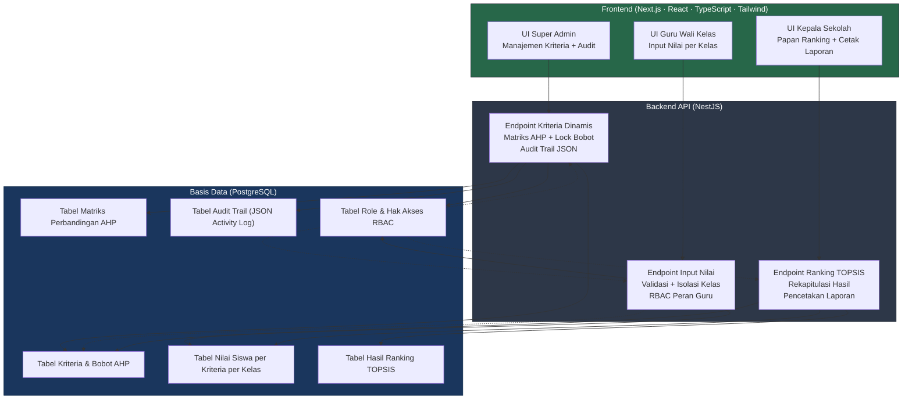

<p align="center">
  <h1>Sistem Penunjang Keputusan<br>Menentukan Siswa Berprestasi Metode AHP-TOPSIS</h1>
  <p><em>Implementasi Sistem Berbasis Website pada SMKS Jaya Buana Kabupaten Tangerang</em></p>
</p>

<p align="center">

[](https://nodejs.org/)
[](https://nestjs.com/)
[](https://nextjs.org/)
[](https://www.postgresql.org/)
[](https://www.prisma.io/)
[](https://www.docker.com/)
[](LICENSE)

</p>

---

## Ringkasan Produk

Sistem Penunjang Keputusan (SPK) ini mengotomatisasi penilaian siswa berprestasi melalui integrasi dua metode multikriteria: **Analytical Hierarchy Process (AHP)** untuk penentuan bobot kriteria yang konsisten, dan **Technique for Order Preference by Similarity to Ideal Solution (TOPSIS)** untuk perangkingan alternatif. Sistem hadir dalam bentuk website yang dapat diakses secara real-time oleh pemangku kepentingan yang berhak.

Arsitektur sistem dirancang secara dinamis dan tidak bergantung pada kriteria yang dihardcode. Apabila jumlah atau nama kriteria berubah, matriks perbandingan berpasangan N × N dan seluruh alur kalkulasi beradaptasi secara otomatis.

## Fitur Utama

| Ikon | Fitur | Keterangan |
|------|-------|------------|
| ⚙️ | **Mesin SPK Dinamis** | Kalkulasi matriks AHP (N × N) dan perangkingan TOPSIS yang otomatis beradaptasi tanpa hardcoded kriteria. |
| 🛡️ | **3-Role Kontrol Akses (RBAC)** | Pembagian hak akses terisolasi untuk Super Admin, Guru (Wali Kelas), dan Kepala Sekolah. |
| 📑 | **Laporan Ber-KOP Resmi** | Modul ekspor laporan PDF Kepala Sekolah yang dilengkapi dengan placeholder layout KOP Surat fisik instansi. |
| 🪵 | **Log Audit Transparan** | Rekam jejak digital mutasi nilai dan bobot berbasis enkapsulasi format JSON. |

## Teknologi Stack

| Komponen | Teknologi | Keterangan |
|----------|-----------|------------|
| Backend Framework | NestJS | Kerangka kerja modular untuk API dan logika bisnis AHP-TOPSIS. |
| Frontend Framework | Next.js + React + TypeScript | Antarmuka pengguna web yang responsif dan berbasis komponen. |
| Basis Data | PostgreSQL 16 | Penyimpanan relasional untuk kriteria, matriks, nilai siswa, dan audit trail. |
| ORM | Prisma | Pengelolaan skema dan migrasi basis data secara terdokumentasi. |
| Container | Docker + Docker Compose | Instansiasi layanan basis data dan dependensi sistem agar konsisten. |
| Gaya Antarmuka | Tailwind CSS | Utilitas kelas untuk tata letak dan konsistensi visual. |
| Lisensi | MIT | Distribusi sumber terbuka dengan ketentuan lisensi standar. |

## Diagram Visual

### Alur Algoritma Perhitungan SPK (AHP-TOPSIS)

```mermaid
flowchart TD
    Start([Mulai]) --> InputC[Super Admin: Input Kriteria Dinamis]
    InputC --> InputP[Super Admin: Input Matriks Perbandingan Berpasangan AHP]
    InputP --> NHitung[Hitung Normalisasi Matriks AHP]
    NHitung --> Bobot[Hitung Vektor Prioritas / Bobot Kriteria]
    Bobot --> Lambda[Hitung λ maksimum]
    Lambda --> CI[Hitung Consistency Index CI]
    CI --> CR[Hitung Consistency Ratio CR = CI / RI]

    CR --> CEK{CR ≤ 0,10}
    CEK -->|TIDAK| Kembali[Kembali ke Input Matriks]
    CEK -->|YA| Lock[Sistem: Kunci Bobot ke Basis Data]

    Lock --> InputN[Guru: Input Nilai Mentah Siswa per Kelas]
    InputN --> MatriksX[Formasi Matriks Keputusan X]
    MatriksX --> NormTOPSIS[Normalisasi Vektor TOPSIS]
    NormTOPSIS --> BobotTOPSIS[Matriks Terbobot Vij = rij × wij]

    BobotTOPSIS --> Ideal[Menentukan Solusi Ideal Positif A+ dan Solusi Ideal Negatif A-]
    Ideal --> Jarak[Hitung Jarak Euclidean D+ dan D- per Siswa]
    Jarak --> Skor[Hitung Skor Keputusan Ci = D- / (D+ + D-)]
    Skor --> Ranking[Rangking Akhir Siswa]

    Ranking --> Kepala[UI Kepala Sekolah: Tampilkan Peringkat + Laporan Cetak]
    Kepala --> Selesai([Selesai])

    classDef startend fill:#2d3748,color:#fff,stroke:#1a202c
    classDef decisi fill:#38a169,color:#fff,stroke:#276749
    classDef action fill:#2d3748,color:#fff,stroke:#1a202c
    classDef hasil fill:#805ad5,color:#fff,stroke:#6b46c1

    class Start,Selesai startend
    class CEK decisi
    class InputC,InputP,NHitung,Bobot,Lambda,CI,CR,Kembali,Lock,InputN,MatriksX,NormTOPSIS,BobotTOPSIS,Ideal,Jarak,Skor action
    class Ranking,Kepala hasil
```

### Alur Hak Akses 3-Role (RBAC)



## Panduan Instalasi & Menjalankan Sistem

### Prasyarat

Pastikan perangkat yang digunakan sudah memiliki:

- Docker dan Docker Compose
- Node.js versi 20 ke atas (untuk pengembangan lokal)

### Langkah Instalasi

1. **Klon repositori**
   ```bash
   git clone https://github.com/wrvnnull/spk-ahp-topsis-smkjayabuana.git
   cd spk-ahp-topsis-smkjayabuana
   ```

2. **Siapkan variabel lingkungan**
   ```bash
   cp .env.example .env
   ```
   Buka berkas `.env` dan sesuaikan nilai yang diperlukan, khususnya sandi basis data.

3. **Jalankan sistem**
   ```bash
   docker compose up -d --build
   ```

Sistem dasar dengan basis data siap digunakan. Lakukan konfigurasi awal melalui antarmuka Super Admin setelah login.

## Status Pengembangan & Lisensi

> **Proyek Tugas Akhir / Skripsi resmi**

Proyek ini dikembangkan secara penuh sebagai proyek Tugas Akhir / Skripsi resmi mahasiswa atas nama:

- **Nama:** Irvan Fauzi
- **NIM:** 211011450005
- **Program Studi:** Teknik Informatika
- **Fakultas:** Ilmu Komputer
- **Universitas:** Universitas Pamulang (UNPAM)

> **Status Hubungan Instansi**

Sistem ini dirancang secara matang dan dihibahkan secara sukarela sebagai bentuk kontribusi teknologi informasi kepada SMKS Jaya Buana Kabupaten Tangerang. Sistem ini siap diimplementasikan secara penuh (production-ready). Apabila di kemudian hari pihak sekolah memanfaatkannya sebagai instrumen percontohan internal atau arsip akademis, hal tersebut tidak mengurangi keabsahan kualitas arsitektur sistem ini.

> **Lisensi Kode**

Didistribusikan di bawah Lisensi MIT. Seluruh data yang ditampilkan pada repositori publik ini bersifat samaran (dummy) demi privasi instansi.

<p align="center">

[Dashboard GitHub](https://github.com/wrvnnull/spk-ahp-topsis-smkjayabuana) &nbsp;·&nbsp; [SMK Jaya Buana](https://www.smkjayabuana.sch.id/)

</p>
