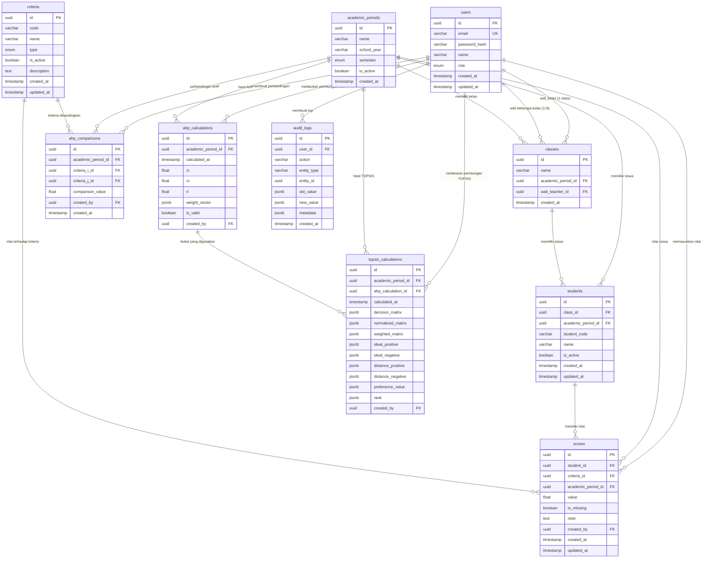
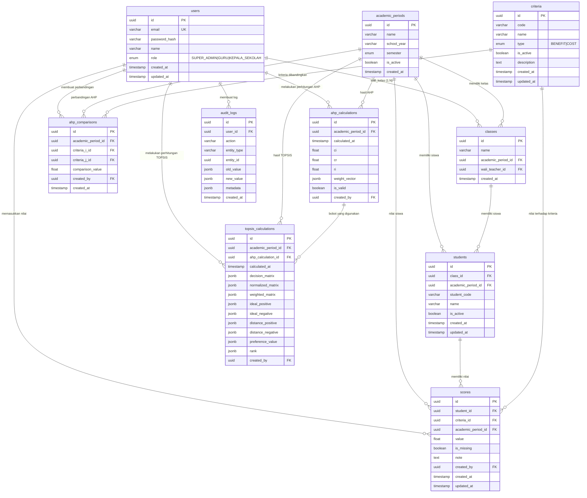

# FINAL DISCOVERY & ARCHITECTURE REVIEW
## SPK-AHP-TOPSIS-SMKS-JAYA-BUANA

**Project:** ANALISIS DAN PERANCANGAN SISTEM PENUNJANG KEPUTUSAN DALAM MENENTUKAN SISWA BERPRESTASI MENGGUNAKAN METODE AHP-TOPSIS BERBASIS WEBSITE PADA SMK JAYA BUANA KABUPATEN TANGERANG

**Mahasiswa:** Irvan Fauzi (211011450005)
**Universitas:** Universitas Pamulang (UNPAM)
**Program Studi:** Teknik Informatika

**Status Sprint 1:** Discovery → Audit → Architecture Review → Documentation → Repository Initialization

---

## A. REQUIREMENT FUNCTIONAL

### A1. SUPER_ADMIN

| No | Fitur | Keterangan |
|----|-------|------------|
| 1 | Manajemen Pengguna | CRUD User, assign role (SUPER_ADMIN / GURU / KEPALA SEKOLAH) |
| 2 | Manajemen Kelas | CRUD Class: nama kelas, wali_kelas (reference ke User GURU) |
| 3 | Manajemen Siswa | CRUD Student per kelas, input NIS (optional), nama siswa |
| 4 | Manajemen Kriteria Dinamis | CRUD Criteria: nama, kode, tipe (BENEFIT / COST), aktif/nonaktif |
| 5 | Konfigurasi AHP | Input pairwise comparison (N×N), lihat bobot, CI, CR, validasi konsistensi |
| 6 | Perhitungan AHP | Jalankan kalkulasi AHP, kunci bobot ke database |
| 7 | Perhitungan TOPSIS | Jalankan kalkulasi ranking, lihat hasil |
| 8 | Audit Trail | Lihat log perubahan data dan perhitungan |
| 9 | Pengelolaan Periode Akademik | CRUD AcademicPeriod |

### A2. GURU (Wali Kelas)

| No | Fitur | Keterangan |
|----|-------|------------|
| 1 | Lihat kelas yang menjadi tanggung jawab | Hanya kelas di mana user adalah wali_kelas |
| 2 | Lihat daftar siswa kelas sendiri | Isolasi data — tidak lihat kelas lain |
| 3 | Input nilai siswa per kriteria | Input nilai untuk setiap kriteria aktif |
| 4 | Validasi input | Cek range, missing value, duplikasi |
| 5 | Simpan nilai | Simpan ke database dengan audit trail |

### A3. KEPALA SEKOLAH

| No | Fitur | Keterangan |
|----|-------|------------|
| 1 | Lihat ranking siswa | Berdasarkan perhitungan TOPSIS terakhir |
| 2 | Lihat hasil AHP | Bobot kriteria, CI, CR |
| 3 | Lihat hasil TOPSIS | Matriks keputusan, solusi ideal, jarak, nilai preferensi |
| 4 | Detail siswa | Klik siswa untuk lihat detail nilai |
| 5 | Cetak laporan PDF | Ekspor ranking + hasil perhitungan + KOP placeholder + tanda tangan |

### A4. Periode Akademik

- Setiap data siswa, nilai, dan perhitungan dikaitkan dengan AcademicPeriod
- Satu periode dapat memiliki multiple kelas
- Perhitungan AHP dapat dilakukan per periode (bobot bisa berbeda antar periode)

### A5. Isolasi Data

- GURU hanya dapat mengakses data kelas yang menjadi tanggung jawabnya
- SUPER_ADMIN dapat mengakses semua data
- KEPALA SEKOLAH dapat melihat semua hasil tetapi tidak mengubah data input

---

## B. REQUIREMENT NON-FUNCTIONAL

### B1. Security

- JWT-based authentication
- Password hashing (bcrypt/argon2)
- HTTPS di production
- Proteksi terhadap SQL injection (gunakan Prisma parameterized query)
- Proteksi XSS di frontend (React/Next.js auto-escape)

### B2. RBAC

- 3 role: SUPER_ADMIN, GURU, KEPALA SEKOLAH
- Gatekeeper di backend (NestJS Guard) + di frontend (hanya render halaman yang diizinkan)
- Setiap endpoint API memeriksa role dan ownership

### B3. Data Isolation

- GURU: scope kelas via `wali_teacher_id`
- Setiap query siswa/nilai harus difilter berdasarkan kelas
- SUPER_ADMIN: tidak ada filter
- KEPALA SEKOLAH: read-only semua datahasil

### B4. Validation

- Validasi input nilai: range, type, format
- Validasi matriks AHP: simetris, diagonal = 1, reciprocal
- Validasi CR: jika CR > 0.10 → invalid, tidak boleh dipakai untuk TOPSIS
- Validasi missing value: beri tanda, jangan diikutkan dalam perhitungan tanpa konfirmasi

### B5. Auditability

- Setiap perubahan data (nilai, kriteria, bobot) dicatat di tabel audit_log
- Audit log berisi: yang melakukan, kapan, apa yang diubah, nilai lama, nilai baru
- Format JSON untuk fleksibilitas

### B6. Maintainability

- Codebase terstruktur modular (NestJS modules, Next.js components)
- Dokumentasi API (OpenAPI/Swagger nanti)
- Prisma schema sebagai single source of truth database

### B7. Scalability

- Arsitektur dipisah frontend/backend memungkinkan scale terpisah
- PostgreSQL siap scale-up
- API REST siap di-wrap di GraphQL/Graphile nanti jika perlu

### B8. Reproducibility Perhitungan

- Setiap hasil perhitungan TOPSIS disimpan dengan:
  - period_id
  - timestamp
  - semua input (bobot AHP, nilai siswa, kriteria aktif)
  - hasil (nilai preferensi, ranking)
- Ini memungkinkan verifikasi ulang dan audit

---

## C. ARSITEKTUR APLIKASI

```
┌─────────────────────────────────────────────────────────────┐
│                    FRONTEND (Next.js)                       │
│  ┌──────────┐ ┌──────────┐ ┌──────────┐ ┌───────────────┐  │
│  │ Dashboard│ │  AHP     │ │  Nilai   │ │  Ranking +    │  │
│  │ SUPER_AD │ │  Matrix  │ │  GURU    │ │  PDF Laporan  │  │
│  │ -LOG     │ │  CRUD    │ │  CRUD    │ │  KEPALA SE.   │  │
│  └──────────┘ └──────────┘ └──────────┘ └───────────────┘  │
│  Authentication: JWT stored di sessionStorage/httpOnly      │
└───────────────────────────┬─────────────────────────────────┘
                            │ REST API (JSON)
┌───────────────────────────┴─────────────────────────────────┐
│                   BACKEND (NestJS)                          │
│  ┌──────────┐ ┌──────────┐ ┌──────────┐ ┌───────────────┐  │
│  │ Auth     │ │ AHP      │ │ TOPSIS   │ │ Student/Score │  │
│  │ Module   │ │ Module   │ │ Module   │ │ Module        │  │
│  │ JWT      │ │ Pairwise │ │ Matriks  │ │ CRUD, Isolasi │  │
│  │ Guard    │ │ Matrix   │ │ Keputusan│ │ Kelas         │  │
│  └──────────┘ │          │ │ Normalize │ │               │  │
│  ┌──────────┐ │          │ │ Ideal ±  │ │               │  │
│  │ User     │ │          │ │ Jarak    │ │               │  │
│  │ Module   │ │          │ │ Preferensi│ │               │  │
│  │ CRUD     │ │          │ │ Rank     │ │               │  │
│  └──────────┘ └──────────┘ └──────────┘ └───────────────┘  │
│  ┌─────────────────────────────────────────────────────────┐│
│  │                     Prisma ORM                          ││
│  └───────────────────────────┬─────────────────────────────┘│
└───────────────────────────────┴──────────────────────────────┘
                                │
                    ┌───────────┴───────────┐
                    │   PostgreSQL 16        │
                    │   (Dockerized)         │
                    └────────────────────────┘
```

### C1. REST API Endpoints

| Module | Method | Endpoint | Keterangan |
|--------|--------|----------|------------|
| Auth | POST | `/auth/login` | Login, return JWT |
| Auth | POST | `/auth/register` | Register (SUPER_ADMIN only) |
| User | GET | `/users` | List user (SUPER_ADMIN) |
| User | POST | `/users` | Create user (SUPER_ADMIN) |
| User | PATCH | `/users/:id` | Update user (SUPER_ADMIN) |
| Class | GET | `/classes` | List kelas (dengan filter jika GURU) |
| Class | POST | `/classes` | Create kelas (SUPER_ADMIN) |
| Student | GET | `/students?classId=X` | List siswa per kelas |
| Student | POST | `/students` | Create siswa |
| Score | GET | `/scores?studentId=X` | Lihat nilai siswa |
| Score | POST | `/scores` | Input nilai |
| Criteria | GET | `/criteria` | List kriteria aktif |
| Criteria | POST/PATCH/DELETE | `/criteria/:id` | CRUD kriteria |
| AHP | POST | `/ahp/comparison` | Input pairwise comparison |
| AHP | GET | `/ahp/result` | Lihat bobot, CI, CR |
| AHP | POST | `/ahp/calculate` | Jalankan kalkulasi AHP |
| TOPSIS | POST | `/topsis/calculate` | Jalankan ranking |
| TOPSIS | GET | `/topsis/result` | Lihat ranking |
| PDF | GET | `/reports/ranking` | Generate PDF report |

### C2. Authentication Flow

1. User login → POST `/auth/login` dengan email + password
2. Backend verifikasi → jika benar, return JWT (access token)
3. Frontend menyimpan JWT di cookie/httpOnly atau memory
4. Setiap request ke API protected menyertakan header `Authorization: Bearer <token>`
5. Backend JWT Guard verifikasi token → extract user_id + role
6. Endpointchester ownership (misal: GURU hanya boleh akses kelas sendiri)

---

## D. ARSITEKTUR DATABASE

### D1. Tabel dan Relasi (Revisi dari Draft Awal)

#### Tabel: `users`

| Kolom | Tipe | Keterangan |
|-------|------|------------|
| id | UUID PK | Identifier unik |
| email | VARCHAR(255) UNIQUE NOT NULL | Email login |
| password_hash | VARCHAR(255) NOT NULL | Hash password |
| name | VARCHAR(255) NOT NULL | Nama lengkap |
| role | ENUM('SUPER_ADMIN','GURU','KEPALA_SEKOLAH') NOT NULL | Role |
| created_at | TIMESTAMP DEFAULT NOW() | |
| updated_at | TIMESTAMP | |

**Cardinality:** 1 user memiliki 1 role (bukan 1:1 tabel role terpisah karena role statis dan enum-based). Tapi role bisa juga di-extract ke tabel terpisah jika requirement meminta dynamic role addition.

**Keputusan:** Role di-embed sebagai enum di users karena 3 role sudah final dan tidak perlu dinamis. Namun kita sediakan `roles` table optional untuk future-proofing.

**Alternatif yang dipertimbangkan:** Jika ingin lebih flexible, buat tabel `roles` terpisah dengan relasi many-to-many `user_roles`. Tapi untuk sprint ini, enum lebih sederhana dan memenuhi requirement 3 role fixed.

#### Tabel: `academic_periods`

| Kolom | Tipe | Keterangan |
|-------|------|------------|
| id | UUID PK | |
| name | VARCHAR(255) NOT NULL | Misal "2024/2025 Genap" |
| school_year | VARCHAR(50) | "2024/2025" |
| semester | ENUM('GANJIL','GENAP') | |
| is_active | BOOLEAN DEFAULT false | |
| created_at | TIMESTAMP | |

#### Tabel: `classes`

| Kolom | Tipe | Keterangan |
|-------|------|------------|
| id | UUID PK | |
| name | VARCHAR(100) NOT NULL | Misal "XI TKJ 6" |
| academic_period_id | UUID FK → academic_periods | |
| wali_teacher_id | UUID FK → users (role=GURU) | Wali kelas |
| created_at | TIMESTAMP | |

**Cardinality:** 1 kelas milik 1 academic_period (1:N). 1 kelas memiliki 1 wali_kelas (1:1 ke users). 1 user (GURU) bisa wali kelas dari multiple kelas? 

- Jika seorang guru hanya mengajar 1 kelas → 1:1 kelas→guru
- Jika guru bisa mengajar multiple kelas → 1:N kelas→guru

**Keputusan:** Desain mendukung 1:N (guru bisa wali beberapa kelas) karena lebih umum. Kolom `wali_teacher_id` di `classes` menunjukkan wali utama, tapi bisa diperluas dengan join table jika perlu multiple guru per kelas.

#### Tabel: `students`

| Kolom | Tipe | Keterangan |
|-------|------|------------|
| id | UUID PK | Identifier internal |
| class_id | UUID FK → classes | |
| academic_period_id | UUID FK → academic_periods | |
| student_code | VARCHAR(50) | Kode anonymisasi (bukan NIS asli) — untuk dummy data |
| name | VARCHAR(255) NOT NULL | Nama siswa (asli di production, anonymized di repo) |
| is_active | BOOLEAN DEFAULT true | Apakah siswa masih aktif diklase |
| created_at | TIMESTAMP | |
| updated_at | TIMESTAMP | |

**Cardinality:** 1 siswa milik 1 kelas (1:N dari classes→students). 1 siswa milik 1 periode.

**Catatan:** NIS asli TIDAK disimpan di database production untuk kemanan data. Gunakan `student_code` sebagai identifier internal anonim. NIS asli hanya ada di sistem terpisah sekolah atau dijadikan identifier internal rahasia jika memang diperlukan untuk integrasi — ini OPEN QUESTION.

#### Tabel: `criteria`

| Kolom | Tipe | Keterangan |
|-------|------|------------|
| id | UUID PK | |
| code | VARCHAR(10) NOT NULL | Misal "C1", "C2" — untuk identifikasi |
| name | VARCHAR(255) NOT NULL | Nama kriteria |
| type | ENUM('BENEFIT','COST') NOT NULL | Benefit: semakin tinggi semakin baik. Cost: semakin rendah semakin baik |
| is_active | BOOLEAN DEFAULT true | Kriteria aktif/nonaktif |
| description | TEXT | Keterangan optional |
| created_at | TIMESTAMP | |
| updated_at | TIMESTAMP | |

**Cardinality:** N kriteria (dinamis). UI dan kalkulasi membaca hanya kriteria dengan `is_active = true`.

#### Tabel: `ahp_comparisons`

| Kolom | Tipe | Keterangan |
|-------|------|------------|
| id | UUID PK | |
| academic_period_id | UUID FK | Periode berjalan |
| criteria_i_id | UUID FK → criteria | Kriteria baris |
| criteria_j_id | UUID FK → criteria | Kriteria kolom |
| comparison_value | FLOAT NOT NULL | Nilai perbandingan berpasangan (1,3,5,7,9, atau kompromi 2,4,6,8) |
| created_by | UUID FK → users | Siapa yang input |
| created_at | TIMESTAMP | |

**Primary Key alternative:** (academic_period_id, criteria_i_id, criteria_j_id) unique.

**Keterangan:** 
- `comparison_value` adalah nilai a_ij dalam matriks perbandingan: seberapa penting kriteria i dibanding j
- Diagonal: a_ii selalu 1 (tidak perlu disimpan, tapi bisa di-_fill_ saat membentuk matriks)
- Reciprocal: a_ji = 1 / a_ij (bisa dihitung saat runtime atau disimpan juga — disarankan hitung saat runtime untuk konsistensi)
- JPA/JPA-style: simpan a_ij, hitung a_ji = 1/a_ij saat membentuk matriks

#### Tabel: `ahp_calculations`

| Kolom | Tipe | Keterangan |
|-------|------|------------|
| id | UUID PK | |
| academic_period_id | UUID FK | |
| calculated_at | TIMESTAMP DEFAULT NOW() | |
| consistency_index (ci) | FLOAT | |
| consistency_ratio (cr) | FLOAT | |
| random_index (ri) | FLOAT | RI untuk N kriteria saat perhitungan |
| weight_vector | JSONB NOT NULL | { "C1": 0.5, "C2": 0.3, ... } |
| is_valid | BOOLEAN | CR <= 0.10? |
| created_by | UUID FK → users | |

**Keterangan:** Simpan bobot sebagai JSONB agar fleksibel untuk N kriteria. Saat ini PostgreSQL 16 + Prisma support JSONB.

#### Tabel: `scores`

| Kolom | Tipe | Keterangan |
|-------|------|------------|
| id | UUID PK | |
| student_id | UUID FK → students | |
| criteria_id | UUID FK → criteria | |
| academic_period_id | UUID FK | |
| value | FLOAT | Nilai siswa terhadap kriteria |
| is_missing | BOOLEAN DEFAULT false | Tandai jika data tidak lengkap |
| note | TEXT | Keterangan optional (misal "data tidak tersedia") |
| created_by | UUID FK → users | Guru yang input |
| created_at | TIMESTAMP | |
| updated_at | TIMESTAMP | |

**Primary Key:** (student_id, criteria_id, academic_period_id) unique — satu siswa tidak boleh punya 2 nilai untuk 1 kriteria di 1 periode.

**Keterangan:** 
- `is_missing = true` artinya nilai tidak diinput/dikosong — TIDAK ikut dalam kalkulasi TOPSIS
- `value = 0` berarti siswa benar-benar mendapat nilai 0 (bukan missing)
- Keduanya berbeda secara konseptual

#### Tabel: `topsis_calculations`

| Kolom | Tipe | Keterangan |
|-------|------|------------|
| id | UUID PK | |
| academic_period_id | UUID FK | |
| ahp_calculation_id | UUID FK → ahp_calculations | |
| calculated_at | TIMESTAMP | |
| decision_matrix | JSONB | Matriks keputusan X (snapshot) |
| normalized_matrix | JSONB | Matriks ternormalisasi |
| weighted_matrix | JSONB | Matriks terbobot |
| ideal_positive | JSONB | A+ |
| ideal_negative | JSONB | A- |
| distance_positive | JSONB | D+ per siswa |
| distance_negative | JSONB | D- per siswa |
| preference_value | JSONB | V_i per siswa |
| rank | JSONB | { "student_code": rank } |
| created_by | UUID FK → users | |

**Keterangan:** Menyimpan snapshot semua matriks memungkinkan reproducibility. JSONB karena ukuran dan struktur bervariasi tergantung jumlah siswa dan kriteria.

#### Tabel: `audit_logs`

| Kolom | Tipe | Keterangan |
|-------|------|------------|
| id | UUID PK | |
| user_id | UUID FK → users | |
| action | VARCHAR(100) NOT NULL | Misal "UPDATE_SCORE", "CREATE_CRITERIA" |
| entity_type | VARCHAR(100) | Misal "score", "criteria", "ahp" |
| entity_id | UUID | |
| old_value | JSONB | Nilai sebelum perubahan |
| new_value | JSONB | Nilai setelah perubahan |
| metadata | JSONB | Info tambahan |
| created_at | TIMESTAMP DEFAULT NOW() | |

---

### D2. ERD Mermaid



---

### D3. LRS (Logikal Relation Schema) — Tabel Referensi

| # | Entitas | Tabel | PK | FK | Relasi | Kardinalitas |
|---|---------|-------|----|----|--------|--------------|
| 1 | User | `users` | id | — | — | — |
| 2 | AcademicPeriod | `academic_periods` | id | — | — | — |
| 3 | Class | `classes` | id | academic_period_id → academic_periods.id, wali_teacher_id → users.id | 1 AcademicPeriod memiliki banyak Class; 1 User (GURU) dapat wali banyak Class | 1:N dari academic_periods→classes, 1:N dari users→classes |
| 4 | Student | `students` | id | class_id → classes.id, academic_period_id → academic_periods.id | 1 Class memiliki banyak Student; 1 AcademicPeriod memiliki banyak Student | 1:N dari classes→students, 1:N dari academic_periods→students |
| 5 | Criteria | `criteria` | id | — | — | — |
| 6 | AHPComparison | `ahp_comparisons` | id | academic_period_id → academic_periods.id, criteria_i_id → criteria.id, criteria_j_id → criteria.id, created_by → users.id | 1 AcademicPeriod memiliki banyak perbandingan; N criteria membentuk N×(N-1) perbandingan (diagonal tidak disimpan) | 1:N dari academic_periods→ahp_comparisons, N:M dari criteria→ahp_comparisons (melalui 2 FK) |
| 7 | AHPCalculation | `ahp_calculations` | id | academic_period_id → academic_periods.id, created_by → users.id | 1 AcademicPeriod memiliki 1 (atau beberapa) hasil AHP | 1:N dari academic_periods→ahp_calculations |
| 8 | Score | `scores` | id | student_id → students.id, criteria_id → criteria.id, academic_period_id → academic_periods.id, created_by → users.id | 1 Student memiliki banyak Score (per kriteria); 1 Criteria memiliki banyak Score; unique constraint (student_id, criteria_id, academic_period_id) | 1:N dari students→scores, 1:N dari criteria→scores |
| 9 | TOPSISCalculation | `topsis_calculations` | id | academic_period_id → academic_periods.id, ahp_calculation_id → ahp_calculations.id, created_by → users.id | 1 AHPCalculation dapat 1 TOPSISCalculation; 1 AcademicPeriod memiliki 1 (atau beberapa) hasil TOPSIS | 1:1 dari ahp_calculations→topsis_calculations (satu hasil AHP digunakan untuk satu run TOPSIS), 1:N dari academic_periods→topsis_calculations |
| 10 | AuditLog | `audit_logs` | id | user_id → users.id | 1 User memiliki banyak log | 1:N dari users→audit_logs |

---

### D4. Kardinalitas Detail yang Perlu Keputusan

#### Isu 1: Apakah seorang GURU bisa menjadi wali kelas dari beberapa kelas?

- **Opsi A:** 1 GURU → 1 kelas (satu kelas saja)
- **Opsi B:** 1 GURU → N kelas (beberapa kelas)

**Keputusan sementara:** Desain mendukung Opsi B (lebih umum). `wali_teacher_id` di `classes` menunjukkan wali utama. Jika suatu saat 1 kelas butuh 2 guru (ko-wali), bisa ditambahkan join table `class_teachers`.

**OPEN QUESTION:** Apakah di SMK Jaya Buana, seorang guru selalu hanya bertanggung jawab 1 kelas? Jika ya, kita bisa sederhanakan validasi.

#### Isu 2: Apakah `student_code` menggantikan NIS sepenuhnya?

- **Opsi A:** Gunakan UUID sebagai identifier utama, `student_code` opsional untuk label manusia-baca-baca
- **Opsi B:** Gunakan NIS anonim (di-hash atau di-encrypt) sebagai identifier
- **Opsi C:** NIS disimpan di sistem sekolah lain, sistem ini hanya pakai UUID + nama

**Keputusan:** UUID sebagai PK, `student_code` sebagai identifier manusia-baca-baca (bisa diisi NIS anonim atau kode unik lain). NIS asli TIDAK disimpan di database ini.

**OPEN QUESTION:** Apakah perlu sinkronisasi dengan sistem sekolah yang sudah ada? Jika ya, apakah ada API/webhook/natural sync?

#### Isu 3: Apakah bobot AHP disimpan per periode atau hanya 1x untuk semua periode?

- **Opsi A:** 1 bobot AHP untuk semua periode (kalau kriteria sama, bobot sama)
- **Opsi B:** Bobot AHP per periode (masing-masing periode bisa punya bobot berbeda)

**Keputusan:** `ahp_calculations` memiliki `academic_period_id` → bobot per periode. Ini memberi fleksibilitas: periode berbeda bisa punya penilaian berbeda. Tapi jika kriteria dan bobot sama, admin bisa meng-copy atau membuat ulang.

---

## E. AHP DINAMIS

### E1. Prinsip Dasar

AHP dinamis berarti:
- Jumlah kriteria aktif = N (dibaca dari database, bukan hard-code)
- Matriks perbandingan adalah N × N
- Semua perhitungan berbasis N, bukan 4

### E2. Penyimpanan Pairwise Comparison

Tabel `ahp_comparisons` menyimpan nilai a_ij untuk setiap pasangan (i, j) dengan i ≠ j.

**Query membaca semua perbandingan untuk periode tertentu:**

```sql
SELECT 
    c1.code AS criteria_i_code,
    c2.code AS criteria_j_code,
    ac.comparison_value AS aij
FROM ahp_comparisons ac
JOIN criteria c1 ON ac.criteria_i_id = c1.id
JOIN criteria c2 ON ac.criteria_j_id = c2.id
WHERE ac.academic_period_id = ?
  AND c1.is_active = true
  AND c2.is_active = true
ORDER BY c1.code, c2.code;
```

### E3. Membentuk Matriks N×N Saat Runtime

1. Ambil semua kriteria aktif → urutkan, dapat N
2. Buat matriks N×N kosong
3. Fill diagonal dengan 1 (a_ii = 1 untuk semua i)
4. Fill a_ij dari `ahp_comparisons` (jika ada)
5. Fill a_ji = 1 / a_ij (reciprocal) — Karena sistem menyimpan hanya a_ij, hitung a_ji saat runtime. Atau simpan kedua-duanya (lebih redundan tapi lebih cepat).

**Rekomendasi:** Simpan a_ij dan a_ji secara terpisah di tabel untuk memudahkan validasi. Tapi saat ini kita simpan hanya a_ij dan hitung reciprocal saat runtime untuk konsistensi.

### E4. Validasi Matriks

Setiap input pairwise comparison harus memenuhi:
1. **a_ij > 0** (positif)
2. **a_ji = 1 / a_ij** (reciprocal) — Jika a_ij disimpan, a_ji harus konsisten
3. **a_ii = 1** — Diagonal selalu 1 (tidak perlu disimpan)

Jika pengguna memasukkan a_ij = 5, maka a_ji harus 0.2. Sistem harus memvalidasi ini atau menghitung a_ji secara otomatis.

### E5. Alur Perhitungan AHP (Dinamis N)

```
Input: matriks perbandingan A berukuran N×N

Langkah 1: Normalisasi matriks
  Untuk setiap kolom j:
    jumlah_kolom_j = Σ(a_ij untuk semua i)
    n_ij = a_ij / jumlah_kolom_j

Langkah 2: Vektor prioritas (bobot)
  w_i = (Σ n_ij untuk semua j) / N
  → Bobot kriteria: w = [w_1, w_2, ..., w_N]

Langkah 3: Eigenvalue approksimasi (λ_max)
  Hitung A × w (matriks N×N dikali vektor N×1) → vektor λw
  λ_max = (Σ (λw_i / w_i) untuk semua i) / N

Langkah 4: Consistency Index
  CI = (λ_max - N) / (N - 1)

Langkah 5: Consistency Ratio
  CR = CI / RI(N)

  RI(N) — Random Index berdasarkan N:
    N=1: RI=0.00
    N=2: RI=0.00
    N=3: RI=0.58
    N=4: RI=0.90
    N=5: RI=1.12
    N=6: RI=1.24
    N=7: RI=1.32
    N=8: RI=1.41
    N=9: RI=1.45
    N=10: RI=1.49
    ... (untuk N>10, RI bisa dihitung atau menggunakan tabel extended)

Langkah 6: Validasi
  Jika CR ≤ 0.10 → valid, bobot siap dipakai
  Jika CR > 0.10 → invalid, matriks perlu direvisi (notifikasi ke admin)

Keluaran: vektor bobot w (N elemen), CI, CR, RI
```

### E6. RI (Random Index) untuk N Berbeda

Kita sediakan tabel RI dalam kode (bukan hard-code 0.90):

```typescript
const RANDOM_INDEX: Record<number, number> = {
  1: 0.00,
  2: 0.00,
  3: 0.58,
  4: 0.90,
  5: 1.12,
  6: 1.24,
  7: 1.32,
  8: 1.41,
  9: 1.45,
  10: 1.49,
  // Untuk N > 10, bisa menggunakan interpolasi atau tabel extended Saaty
};
```

Jika N > 10, sistem bisa:
- Menggunakan interpolasi linear dari RI yang tersedia
- Atau menampilkan peringatan bahwa RI untuk N tersebut tidak tersedia dan memerlukan konsultasi ahli

**OPEN QUESTION:** Apakah sekolah akan menambah kriteria di luar 4 kriteria sekarang? Jika ya, berapa N maksimal yang direncanakan? Ini penting untuk menentukan apakah kita butuh RI extended.

### E7. Kondisi Khusus

1. **N = 1:** Hanya 1 kriteria → CR tidak terdefinisi (CI = 0/0). Sistem harus menangani ini: jika N=1, bobot otomatis 100% (tidak perlu pairwise comparison).
2. **N = 2:** Matriks 2×2, CR masih bisa dihitung tapi RI=0 → CR = CI/0 → undefined. Beberapa implementasi skip CR untuk N<3. Sistem harus mendokumentasikan ini.
3. **Kriteria nonaktif:** Hanya kriteria dengan `is_active = true` yang masuk ke perhitungan. Jika ada kriteria nonaktif, N berkurang.

**Keputusan:** Sistem mendukung N ≥ 3 untuk perhitungan CR. Jika N < 3, notifikasi bahwa CR tidak dapat dihitung dan bobot dianggap valid secara default (wajib konfirmasi admin).

---

## F. TOPSIS DINAMIS

### F1. Prinsip Dasar

TOPSIS dinamis berarti:
- Jumlah alternatif (siswa) = M (dibaca dari database)
- Jumlah kriteria = N (dibaca dari database, aktif saja)
- Tipe benefit/cost dari database

### F2. Data yang Dibutuhkan

1. **Matriks keputusan X berukuran M × N:**
   - M = jumlah siswa yang memiliki nilai lengkap untuk semua kriteria aktif
   - N = jumlah kriteria aktif
   - X_ij = nilai siswa i untuk kriteria j

2. **Vektor bobot w berukuran N:**
   - Dari hasil AHP perhitungan

3. **Tipe setiap kriteria:**
   - BENEFIT: semakin tinggi semakin baik
   - COST: semakin rendah semakin baik

### F3. Alur Perhitungan TOPSIS (Dinamis M dan N)

```
Input: 
  - Matriks keputusan X (M × N)
  - Vektor bobot w (1 × N)
  - Tipe kriteria: type[j] = BENEFIT atau COST untuk setiap j

Langkah 1: Normalisasi vektor (Vector Normalization)
  Untuk setiap kolom j:
    r_ij = x_ij / √(Σ(x_kj²) untuk semua k)
  → Matriks ternormalisasi R (M × N)

Langkah 2: Matriks terbobot
  v_ij = w_j × r_ij
  → Matriks terbobot V (M × N)

Langkah 3: Solusi ideal positif (A+)
  Untuk setiap kolom j:
    Jika type[j] = BENEFIT: A+_j = max(v_ij untuk semua i)
    Jika type[j] = COST: A+_j = min(v_ij untuk semua i)
  → Vektor A+ (1 × N)

Langkah 4: Solusi ideal negatif (A-)
  Untuk setiap kolom j:
    Jika type[j] = BENEFIT: A-_j = min(v_ij untuk semua i)
    Jika type[j] = COST: A-_j = max(v_ij untuk semua i)
  → Vektor A- (1 × N)

Langkah 5: Jarak Euclidean
  D+_i = √(Σ(v_ij - A+_j)² untuk semua j)
  D-_i = √(Σ(v_ij - A-_j)² untuk semua j)
  → Vektor D+ (M × 1), D- (M × 1)

Langkah 6: Nilai preferensi
  V_i = D-_i / (D+_i + D-_i)
  → Vektor V (M × 1), range [0, 1]

Langkah 7: Ranking
  Urutkan berdasarkan V_i descending → rank 1, 2, 3, ...
  Siswa dengan V_i tertinggi = ranking 1 (siswa berprestasi)

Keluaran: 
  - Ranking lengkap (M siswa)
  - Nilai preferensi setiap siswa
  - Snapshot semua matriks untuk reproducibility
```

### F4. Penanganan Siswa dengan Missing Value

**Masalah:** Jika siswa memiliki missing value untuk salah satu kriteria aktif, ia tidak bisa masuk ke matriks keputusan karena perhitungan TOPSIS memerlukan nilai lengkap.

**Opsi penanganan:**

| Opsi | Mekanisme | Keterangan |
|------|-----------|------------|
| A | Exclude | Siswa dengan missing value tidak masuk perhitungan. Ditampilkan terpisah dengan status "Data tidak lengkap" | |
| B | Imputasi | Isi nilai missing dengan nilai tertentu (misal mean, median, atau 0) | Memerlukan keputusan akademik |
| C | Konfirmasi | Tampilkan warning, minta admin/GURU mengisi atau menandai "tidak ikut" | Paling transparan |

**Keputusan sementara:** Opsi A (exclude) sebagai default, dengan notifikasi jelas bahwa siswa dengan missing value tidak masuk ranking. **OPEN QUESTION:** Apakah ini sesuai dengan praktik di SMK Jaya Buana?

### F5. Reproducibility

Setiap hasil TOPSIS disimpan di `topsis_calculations` dengan semua matriks sebagai JSONB. Ini memungkinkan:
- Verifikasi ulang perhitungan
- Audit trace jika ada pertanyaan tentang ranking
- Perbandingan antar periode

---

## G. DATA QUALITY

### G1. Missing Value

**Definisi:** Nilai yang tidak diinput oleh GURU untuk siswa tertentu pada kriteria tertentu.

**Penandaan:** Kolom `is_missing = true` di tabel `scores`.

**Dampak:**
- Siswa dengan missing value untuk kriteria aktif TIDAK masuk ke perhitungan TOPSIS
- Tampilkan status "Data tidak lengkap" di UI

**Keputusan:** Sistem tidak membuat keputusan akademik tentang bagaimana menangani missing value. Sistem hanya mendeteksi, menandai, dan men-exclude dari perhitungan.

**OPEN QUESTION:** Bagaimana sekolah menangani siswa dengan nilai tidak lengkap? Apakah dianggap tidak ikut, atau ada imputed value?

### G2. Nilai 0

**Definisi:** Siswa benar-benar mendapat nilai 0 — bukan missing.

**Penandaan:** `is_missing = false`, `value = 0`.

**Dampak:** Nilai 0 diikutkan dalam perhitungan TOPSIS. Ini valid secara matematis.

**Catatan:** Untuk kriteria COST seperti KETIDAKHADIRAN, nilai 0 ada artinya (tidak ada ketidakhadiran — sangat baik). Untuk kriteria BENEFIT, nilai 0 artinya siswa tidak mendapatkan poin untuk kriteria tersebut.

### G3. Nilai Di Luar Range

**Validasi input:**
- PENGETAHUAN: range 0–100 (atau rentang yang berlaku)
- PRAKERIN: range 0–100
- KETIDAKHADIRAN: range 0–N (N tergantung kebijakan sekolah, misal 30 hari)
- EKSTRAKURIKULER: range 0–100 (atau skor tertentu)

**Validasi:** Sistem harus memiliki konfigurasi range per kriteria (bisa di tabel `criteria` atau tabel konfigurasi terpisah).

**OPEN QUESTION:** Apakah ada range nilai yang baku untuk setiap kriteria di SMK Jaya Buana? Apakah ada nilai maksimum/minimum khusus?

### G4. Siswa Tanpa Identifier

**Masalah:** Dari data Excel, ditemukan siswa tanpa NIS (contoh: KHAILATUL MUAMALAH di 11 TKJ 7).

**Penanganan:**
- Sistem harus tetap bisa menerima siswa tanpa NIS
- Gunakan `student_code` yang di-generate otomatis (UUID atau sequential code)
- Tampilkan warning bahwa identifier tidak lengkap

**Keputusan:** UUID sebagai PK utama, `student_code` opsional.

### G5. Duplicate Student

**Pencegahan:** Unique constraint di `students` berdasarkan kombinasi yang unik (misal: `(class_id, student_code)` atau `(class_id, name, academic_period_id)`).

**Deteksi:** Sistem bisa mendeteksi nama yang mirip di kelas yang sama dan menandai potential duplicate.

**OPEN QUESTION:** Bagaimana sekolah memastikan tidak ada siswa terdaftar dua kali? Apakah ada field NIS/NISN yang menjadi unique identifier di sistem sekolah?

### G6. Duplicate Score

**Pencegahan:** Unique constraint `(student_id, criteria_id, academic_period_id)` di tabel `scores`.

**Dampak:** Jika guru mencoba memasukkan nilai untuk kriteria yang sudah ada, sistem bisa:
- Update nilai yang existing (dengan audit trail)
- Atau tampilkan error "nilai sudah ada"

**Keputusan:** Update dengan audit trail — simpan nilai lama di `old_value` di audit_log, masukkan nilai baru.

### G7. Kriteria Nonaktif

**Mekanisme:** 
- Admin bisa nonaktifkan kriteria (`is_active = false`)
- Saat perhitungan AHP/TOPSIS, hanya kriteria aktif yang dipakai
- Nilai siswa untuk kriteria nonaktif tetap tersimpan di database tapi tidak masuk perhitungan

**Dampak:**
- N berkurang → matriks lebih kecil
- Bobot AHP dihitung ulang untuk kriteria aktif saja

**OPEN QUESTION:** Apakah kriteria bisa ditambahkan di masa depan (misal: "Prestasi non-akademik", "Kepemimpinan")? Jika ya, sistem harus mendukung add criteria tanpa migrasi database.

### G8. Data Tidak Lengkap secara Umum

**Validasi saat perhitungan AHP:**
- Semua pasangan kriteria harus diisi (Matriks lengkap)
- Jika ada sel yang kosong → notifikasi ke admin

**Validasi saat perhitungan TOPSIS:**
- Setiap siswa harus memiliki nilai untuk semua kriteria aktif
- Siswa dengan missing value → exclude dengan notifikasi

---

## H. ERD DAN LRS FINAL

### H1. ERD Final



### H2. LRS Final

| # | Entity | Tabel | PK | FK | Relasi | Kardinalitas |
|---|--------|-------|----|----|--------|--------------|
| 1 | User | `users` | id | — | — | — |
| 2 | AcademicPeriod | `academic_periods` | id | — | — | — |
| 3 | Class | `classes` | id | academic_period_id → academic_periods.id, wali_teacher_id → users.id (role=GURU) | 1 AcademicPeriod memiliki banyak Class; 1 User (GURU) dapat wali banyak Class | 1:N |
| 4 | Student | `students` | id | class_id → classes.id, academic_period_id → academic_periods.id | 1 Class memiliki banyak Student; 1 AcademicPeriod memiliki banyak Student | 1:N |
| 5 | Criteria | `criteria` | id | — | — | — |
| 6 | AHPComparison | `ahp_comparisons` | id | academic_period_id → academic_periods.id, criteria_i_id → criteria.id, criteria_j_id → criteria.id, created_by → users.id | 1 AcademicPeriod memiliki banyak perbandingan; N criteria membentuk N×(N-1) perbandingan | 1:N |
| 7 | AHPCalculation | `ahp_calculations` | id | academic_period_id → academic_periods.id, created_by → users.id | 1 AcademicPeriod memiliki 1 (atau beberapa) hasil AHP | 1:N |
| 8 | Score | `scores` | id | student_id → students.id, criteria_id → criteria.id, academic_period_id → academic_periods.id, created_by → users.id | 1 Student memiliki banyak Score (per kriteria); Unique (student_id, criteria_id, academic_period_id) | 1:N |
| 9 | TOPSISCalculation | `topsis_calculations` | id | academic_period_id → academic_periods.id, ahp_calculation_id → ahp_calculations.id, created_by → users.id | 1 AHPCalculation dapat 1 TOPSISCalculation (1:1); 1 AcademicPeriod memiliki 1 (atau beberapa) hasil TOPSIS | 1:1 dari ahp_calculations→topsis_calculations, 1:N dari academic_periods→topsis_calculations |
| 10 | AuditLog | `audit_logs` | id | user_id → users.id | 1 User memiliki banyak log | 1:N |

---

## I. RANCANGAN_SISTEM.md

File dibuat secara terpisah dengan isi lengkap sesuai request.

---

## J. README.md

File dibuat secara terpisah dengan isi lengkap sesuai request.

---

## K. INFRASTRUCTURE INITIAL

### K1. docker-compose.yml

```yaml
version: "3.9"

services:
  db:
    image: postgres:16-alpine
    container_name: spk-ahp-topsis-db
    restart: unless-stopped
    environment:
      POSTGRES_DB: ${DB_NAME:-spk_ahp_topsis}
      POSTGRES_USER: ${DB_USER:-spk_admin}
      POSTGRES_PASSWORD: ${DB_PASSWORD:-changeme_immediately}
    ports:
      - "${DB_PORT:-5432}:5432"
    volumes:
      - pgdata:/var/lib/postgresql/data
    healthcheck:
      test: ["CMD-SHELL", "pg_isready -U ${DB_USER:-spk_admin} -d ${DB_NAME:-spk_ahp_topsis}"]
      interval: 10s
      timeout: 5s
      retries: 5
      start_period: 30s

volumes:
  pgdata:
    name: spk-ahp-topsis-pgdata
```

### K2. .env.example

```bash
# Database PostgreSQL
DB_HOST=localhost
DB_PORT=5432
DB_NAME=spk_ahp_topsis
DB_USER=spk_admin
DB_PASSWORD=changeme_immediately

# Aplikasi
APP_HOST=0.0.0.0
APP_PORT=3000
FRONTEND_PORT=3001

# JWT
JWT_SECRET=changeme_jwt_secret_immediately
JWT_EXPIRATION=24h

# CORS
ALLOWED_ORIGINS=http://localhost:3001

# Catatan: Ganti semua nilai default sebelum production.
# Jangan commit file .env yang sesungguhnya ke repository.
```

### K3. .gitignore (Reviewed)

Sudah ada dan terlihat baik. Saya akan review dan pastikan tidak ada celah.

---

## L. SECURITY AUDIT SEBELUM COMMIT

### L1. File yang HARUS TIDAK masuk ke commit

- [ ] `/home/ubuntu/SKRIPSI/SKRIPSI.docx` — DOKUMEN SKRIPSI (Bab 1-5)
- [ ] `/home/ubuntu/SKRIPSI/11 TKJ 6.xlsx` — Data nilai asli
- [ ] `/home/ubuntu/SKRIPSI/11 TKJ 7.xlsx` — Data nilai asli
- [ ] `/home/ubuntu/SKRIPSI/11 TKJ 8.xlsx` — Data nilai asli
- [ ] `/home/ubuntu/SKRIPSI/SMK Jaya Buana Logo.png` — Logo resmi sekolah
- [ ] `/home/ubuntu/SKRIPSI/spk-ahp-topsis-app/assets/logo/SMK Jaya Buana Logo.png` — Logo yang disalin ke project (jika ada)
- [ ] Semua file PDF di `Referensi/...` — Referensi skripsi
- [ ] `/home/ubuntu/SKRIPSI/spk-ahp-topsis-app/.env` — File env asli (sudah di-gitignore)
- [ ] `node_modules/` — Dependencies (sudah di-gitignore)

### L2. File yang AKAN masuk ke commit

- [x] `README.md` (baru)
- [x] `RANCANGAN_SISTEM.md` (baru)
- [x] `docker-compose.yml` (sudah ada, perlu review)
- [x] `.env.example` (sudah ada, perlu review)
- [x] `.gitignore` (sudah ada, perlu review)
- [x] `LICENSE` (baru)

### L3. Pemeriksaan Secret

- [ ] Tidak ada password di file selain `.env.example` dengan nilai placeholder
- [ ] Tidak ada token di file
- [ ] Tidak ada kredensial di file
- [ ] Tidak ada connection string dengan password asli

### L4. Pemeriksaan Data Siswa

- [ ] Tidak ada nama siswa asli
- [ ] Tidak ada NIS/NISN asli
- [ ] Tidak ada nilai asli

### L5. Pemeriksaan Logo dan Data sensitif sekolah

- [ ] Tidak ada logo resmi sekolah
- [ ] Tidak ada dokumen internal sekolah

---

## M. CHECKLIST GIT WORKFLOW

1. [ ] `git init` — jika belum dijalankan (sudah ada folder .git)
2. [ ] Set branch ke `main`
3. [ ] Tambah remote `origin` ke `https://github.com/wrvnnull/spk-ahp-topsis-smkjayabuana.git`
4. [ ] Check `git status`
5. [ ] Review file yang akan di-commit
6. [ ] Pastikan tidak ada secret/data sensitif
7. [ ] Commit dengan pesan profesional
8. [ ] Push ke `main`

---

## N. OPEN QUESTIONS (Perlu Keputusan Akademik dari Anda)

| # | Pertanyaan | Kategori |
|---|-----------|----------|
| 1 | Apakah seorang guru bisa menjadi wali kelas dari beberapa kelas? | RBAC/Isolasi |
| 2 | Apakah NIS/NISN perlu disimpan di database produksi sebagai identifier internal, atau cukup UUID + nama? | Database |
| 3 | Apakah ada range nilai baku untuk setiap kriteria (misal KETIDAKHADIRAN maksimal berapa hari)? | Validasi |
| 4 | Bagaimana sekolah menangani siswa dengan missing value? Apakah dianggap tidak ikut, diimputasi, atau dikonfirmasi? | Data Quality |
| 5 | Apakah kriteria bisa ditambahkan di masa depan (di luar 4 kriteria sekarang)? Jika ya, apakah perlu dukungan RI extended untuk N > 10? | AHP Dinamis |
| 6 | Apakah bobot AHP bisa berbeda per periode, atau cukup 1 bobot untuk semua periode? | AHP |
| 7 | Apakah perlu sinkronisasi dengan sistem sekolah yang sudah ada? | Integrasi |
| 8 | Apakah logo sekolah bisa dipublikasi di repository publik dengan izin tertulis dari sekolah? | Logo |
| 9 | Apakah perlu fitur import data dari Excel untuk memudahkan migrasi data? | Fitur |
| 10 | Apakah Kepala Sekolah perlu login terpisah atau cukup 1 akun dengan role KEPALA_SEKOLAH? | RBAC |

---

## O. RINGKASAN KEPUTUSAN YANG DIAMBIL

| Keputusan | Pilihan |
|-----------|---------|
| Role storage | Enum di tabel users (bukan tabel role terpisah) |
| Wali kelas | 1:N (guru bisa wali banyak kelas) |
| Student identifier | UUID (PK) + student_code (opsional) |
| NIS | TIDAK disimpan di database ini |
| AHP RI | Tabel dinamis berdasarkan N, bukan hard-code 0.90 |
| CR validation | Hanya untuk N ≥ 3; N < 3 → notifikasi |
| Missing value | Exclude dari perhitungan, tidak diimputasi |
| Logo sekolah | TIDAK masuk repo publik |
| Data siswa asli | TIDAK masuk repo publik |

---

## P. STRUKTUR PROJECT SETELAH SPRINT 1

```
spk-ahp-topsis-app/
├── LICENSE                    ← MIT License
├── README.md                  ← Dokumentasi project
├── RANCANGAN_SISTEM.md        ← Rancangan sistem lengkap
├── docker-compose.yml         ← PostgreSQL development
├── .env.example               ← Contoh environment variables
├── .gitignore                 ← Git ignore rules
├── .git/                      ← Git repository (sudah ada)
└── ... (folder lain yang ada tetap ada, tidak dihapus)
```

---

## Q. REKOMENDASI SPRINT 2

1. **Setup backend NestJS:**
   - Inisialisasi project NestJS
   - Konfigurasi Prisma + schema.prisma berdasarkan rancangan database di atas
   - Setup PostgreSQL via Docker
   - Migrate database

2. **Implementasi Auth:**
   - Register/Login user
   - JWT token
   - Role Guard

3. **CRUD Kriteria:**
   - Create, Read, Update, Delete kriteria
   - Aktif/nonaktif

4. **CRUD Klas dan Siswa:**
   - Class CRUD
   - Student CRUD dengan isolasi kelas

5. **Input Nilai:**
   - Score CRUD dengan validasi
   - Missing value flag

6. **AHP Calculation Service:**
   - Pairwise comparison input
   - Matriks N×N dinamis
   - Perhitungan bobot, CI, CR, RI
   - Validasi CR

7. **TOPSIS Calculation Service:**
   - Matriks keputusan dinamis
   - Normalisasi, bobot, ideal ±, jarak, preferensi, ranking
   - Reproducibility

8. **Frontend:**
   - Dashboard per role
   - Form input kriteria AHP
   - Form input nilai guru
   - Ranking dashboard kepala sekolah
   - PDF laporan

---

## R. SELESAI

Laporan ini mendokumentasikan final discovery dan architecture review untuk Sprint 1. File dokumen dan infrastruktur akan dibuat berikutnya, kemudian di-commit dan di-push ke GitHub.

**Next step:** Buat file LICENSE, update README.md, buat RANCANGAN_SISTEM.md lengkap, review docker-compose.yml dan .gitignore, lalu push ke GitHub.
