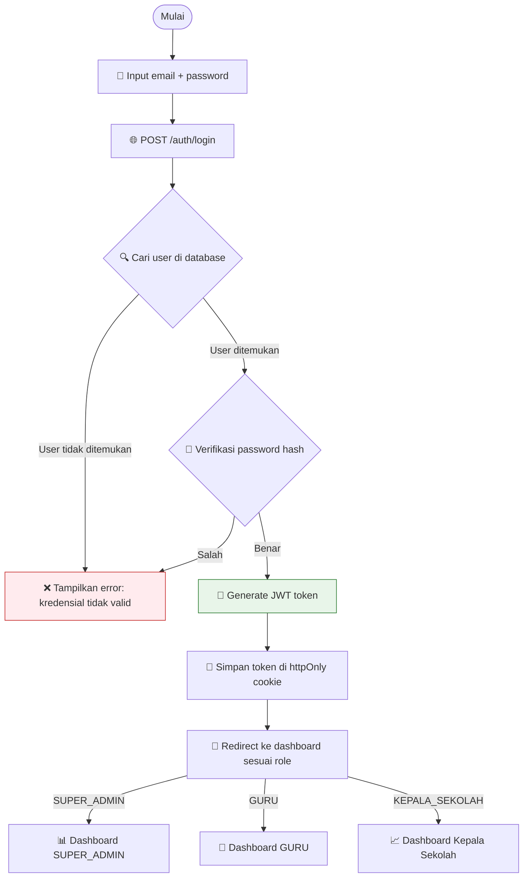
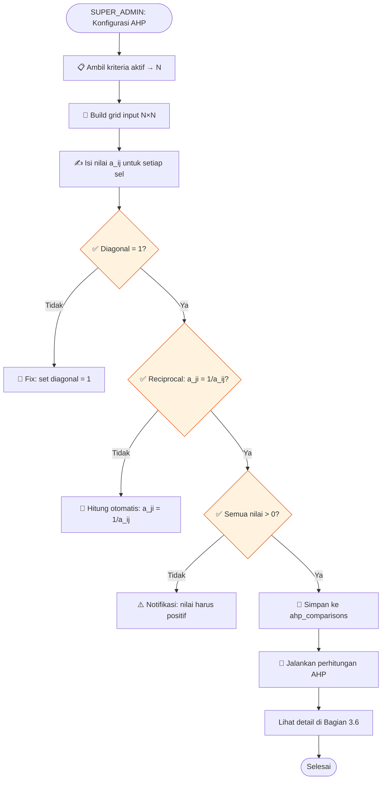
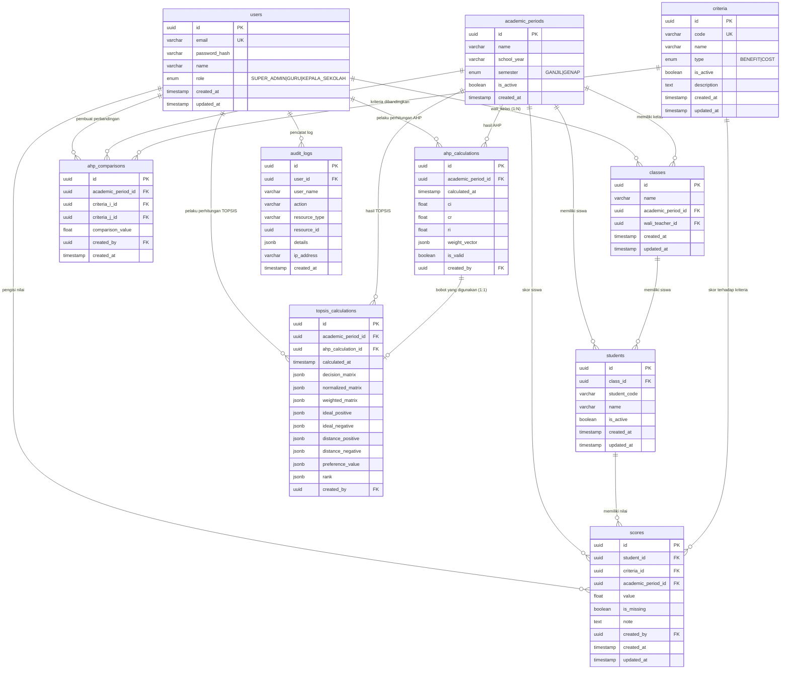

# RANCANGAN SISTEM
## Sistem Penunjang Keputusan Menentukan Siswa Berprestasi Metode AHP-TOPSIS
### SMK Jaya Buana Kabupaten Tangerang

**Proyek:** Tugas Akhir — Teknik Informatika, Universitas Pamulang
**Mahasiswa:** Irvan Fauzi (211011450005)
**Status Dokumen:** Rancangan Sistem — Sprint 1
**Versi:** 1.0 — Initial Architecture

---

## 1. GAMBARAN UMUM

### 1.1 Latar Belakang Singkat

Sistem Penunjang Keputusan (SPK) ini dirancang untuk membantu SMK Jaya Buana dalam menentukan siswa berprestasi secara objektif, terukur, dan dapat diaudit. Sistem mengintegrasikan dua metode multikriteria:

- **AHP (Analytical Hierarchy Process)** — menentukan bobot kriteria melalui perbandingan berpasangan (pairwise comparison) dengan uji konsistensi.
- **TOPSIS (Technique for Order Preference by Similarity to Ideal Solution)** — menghasilkan ranking siswa berdasarkan kedekatan dengan solusi ideal positif.

Sistem dikembangkan sebagai website berbasis teknologi modern dengan memisahkan frontend dan backend secara jelas, serta menggunakan basis data relasional untuk menjamin integritas dan auditability.

### 1.2 Scope Sistem

Sistem mencakup:

- Manajemen pengguna dengan 3 role: SUPER_ADMIN, GURU, KEPALA SEKOLAH
- Manajemen periode akademik, kelas, dan siswa
- Manajemen kriteria dinamis (bukan hard-code untuk 4 kriteria tertentu; dapat menambah/kurangi kriteria)
- Input dan validasi nilai siswa oleh guru wali kelas sesuai isolasi data kelas
- Perhitungan AHP dinamis dengan N kriteria (matriks N×N beradaptasi otomatis)
- Perhitungan TOPSIS dinamis dengan M siswa dan N kriteria (tidak hard-code)
- Dashboard ranking untuk kepala sekolah
- Laporan PDF dengan placeholder KOP surat (logo resmi tidak masuk repository publik)

### 1.3 Prinsip Desain Utama

1. **Dinamis, bukan statis.** Sistem menangani N kriteria, bukan hanya 4. Jika kriteria berubah, Matriks AHP dan perhitungan TOPSIS beradaptasi otomatis.
2. **Data isolation.** GURU hanya melihat data kelas yang menjadi tanggung jawabnya; tidak bisa melihat kelas lain.
3. **Audit trail.** Setiap perubahan tercatat dalam log audit.
4. **Reproducibility.** Hasil perhitungan dapat diverifikasi ulang.
5. **Proteksi data sensitif.** Nama siswa asli, NIS/NISN, dan data pribadi tidak dimasukkan ke repository publik; file Excel asli tidak masuk repo.

### 1.4 Definisi Istilah Kunci

| Istilah | Definisi |
|---------|----------|
| **Alternatif** | Siswa yang dinilai/dirangking dalam TOPSIS |
| **Kriteria** | Aspek penilaian (misal: Pengetahuan, PRAKERIN, Ketidakhadiran, Ekstrakurikuler) |
| **Benefit** | Kriteria di mana nilai lebih tinggi = lebih baik |
| **Cost** | Kriteria di mana nilai lebih rendah = lebih baik |
| **Pairwise Comparison** | Perbandingan berpasangan antar kriteria untuk AHP (skala 1–9) |
| **Consistency Ratio (CR)** | Uji konsistensi hasil AHP; harus ≤ 0.10 |
| **Random Index (RI)** | Nilai referensi untuk menghitung CR; bergantung pada N (jumlah kriteria) |
| **Matriks Keputusan (X)** | Matriks berukuran M×N berisi nilai siswa terhadap kriteria |
| **Normalisasi Vektor** | Proses menyamakan skala nilai dalam TOPSIS |
| **Solusi Ideal Positif (A+)** | Kombinasi terbaik dari seluruh kriteria |
| **Solusi Ideal Negatif (A-)** | Kombinasi terburuk dari seluruh kriteria |
| **Nilai Preferensi (Vi)** | Skor preferensi TOPSIS; range 0–1 |
| **Kriteria Dinamis** | Kriteria yang jumlah dan jenisnya dapat berubah tanpa hard-code |

### 1.5 Status Pengembangan

Saat ini sistem masih dalam tahap rancangan (Sprint 1). Belum ada implementasi frontend/backend yang lengkap. Dokumen ini merupakan rancangan arsitektur, basis data, dan alur perhitungan yang akan menjadi acuan implementasi pada Sprint berikutnya.

---

* Dokumen ini merupakan bagian dari RANCANGAN_SISTEM.md yang dibuat secara bertahap.
* Sumber referensi utama: FINAL_DISCOVERY_AND_ARCHITECTURE_REVIEW.md
## 2. ARSITEKTUR SISTEM

### 2.1 Gambaran Tingkat Tinggi

Sistem terdiri dari tiga lapisan utama yang dipisahkan secara jelas: frontend, backend, dan basis data. Frontend bertanggung jawab atas antarmuka pengguna dan routing berbasis peran. Backend menangani logika bisnis, validasi, perhitungan AHP-TOPSIS, dan keamanan. Basis data menyimpan seluruh entitas utama dengan integritas referensial.

```
┌─────────────────────────────────────────────────────────────┐
│                    FRONTEND (Next.js)                       │
│  - Next.js 14+ / React / TypeScript                         │
│  - Shadcn UI / Tailwind CSS                                 │
│  - Role-based routing & UI                                  │
│  - JWT stored in httpOnly cookie (recommended)              │
└───────────────────────────┬─────────────────────────────────┘
                            │ REST API (JSON)
┌───────────────────────────┴─────────────────────────────────┐
│                   BACKEND (NestJS)                          │
│  ┌─────────────────────────────────────────────────────────┐│
│  │  Modules:                                                ││
│  │  - AuthModule (JWT, password hashing, refresh)         ││
│  │  - UserModule (CRUD user, role management)             ││
│  │  - AcademicPeriodModule                                 ││
│  │  - ClassModule (CRUD kelas, wali_kelas assignment)     ││
│  │  - StudentModule (CRUD siswa, isolasi per kelas)       ││
│  │  - CriteriaModule (CRUD kriteria, aktif/nonaktif)      ││
│  │  - ScoreModule (input nilai, validasi, audit)          ││
│  │  - AHPMatrixModule (pairwise comparison CRUD)          ││
│  │  - AHPCalculationModule (hitung bobot, CI, CR, RI)     ││
│  │  - TOPSISCalculationModule (hitung ranking)            ││
│  │  - ReportModule (generate PDF laporan)                 ││
│  │  - AuditLogModule (log semua perubahan)                ││
│  └─────────────────────────────────────────────────────────┘│
│  ┌─────────────────────────────────────────────────────────┐│
│  │  Guards:                                                ││
│  │  - JwtAuthGuard — verifikasi token                     ││
│  │  - RolesGuard — cek role (SUPER_ADMIN/GURU/KEPALA)    ││
│  │  - OwnershipGuard — cek ownership (wali kelas)         ││
│  └─────────────────────────────────────────────────────────┘│
│  ┌─────────────────────────────────────────────────────────┐│
│  │  Prisma ORM → PostgreSQL 16                             ││
│  └─────────────────────────────────────────────────────────┘│
└─────────────────────────────────────────────────────────────┘
```

Diagram alur teknologi secara visual:

```mermaid
flowchart TD
    subgraph FE ["Frontend: Next.js + React + TypeScript + Shadcn UI"]
        FE_Dash["Dashboard per Role (SUPER_ADMIN, GURU, KEPALA_SEKOLAH)"]
        FE_AHP["Form Input Matriks AHP (N×N Dinamis)"]
        FE_Nilai["Halaman Input Nilai Guru (dengan Isolasi Kelas)"]
        FE_Ranking["Dashboard Ranking + Cetak PDF"]
    end
    
    subgraph BE ["Backend: NestJS + TypeScript"]
        direction TB
        BE_Auth["AuthModule (JWT, Password Hashing, Refresh)"]
        BE_User["UserModule (CRUD User, Role)"]
        BE_Class["ClassModule (CRUD Kelas, Wali Kelas)"]
        BE_Student["StudentModule (CRUD Siswa, Isolasi Per Kelas)"]
        BE_Criteria["CriteriaModule (CRUD Kriteria Dinamis, Aktif/Nonaktif)"]
        BE_Score["ScoreModule (Input Nilai, Validasi, Audit Trail)"]
        BE_AHP["AHPMatrixModule + AHPCalculationModule (Perbandingan N×N, Bobot, CI, CR, RI)"]
        BE_TOPSIS["TOPSISCalculationModule (Matriks Keputusan, Normalisasi, Solusi Ideal, Ranking)"]
        BE_Report["ReportModule (Generate PDF Laporan dengan KOP Placeholder)"]
        BE_Audit["AuditLogModule (Log Seluruh Perubahan)"]
    end
    
    subgraph DB ["Basis Data: PostgreSQL 16 + Prisma ORM"]
        DB_Table["Tabel Utama:
        - users
        - academic_periods
        - classes
        - students
        - criteria
        - ahp_comparisons
        - ahp_calculations
        - scores
        - topsis_calculations
        - audit_logs"]
    end
    
    FE_Dash -->|REST API + JWT| BE_Auth
    FE_Dash -->|REST API| BE_User
    FE_Dash -->|REST API| BE_Class
    FE_Dash -->|REST API| BE_Student
    FE_Dash -->|REST API| BE_Criteria
    FE_Dash -->|REST API| BE_Score
    FE_Dash -->|REST API| BE_AHP
    FE_Dash -->|REST API| BE_TOPSIS
    FE_Dash -->|REST API| BE_Report
    
    FE_AHP -->|REST API POST| BE_AHP
    FE_Nilai -->|REST API POST| BE_Score
    FE_Ranking -->|REST API GET| BE_TOPSIS
    
    BE_Auth -->|Prisma ORM| DB_Table
    BE_User -->|Prisma ORM| DB_Table
    BE_Class -->|Prisma ORM| DB_Table
    BE_Student -->|Prisma ORM| DB_Table
    BE_Criteria -->|Prisma ORM| DB_Table
    BE_Score -->|Prisma ORM| DB_Table
    BE_AHP -->|Prisma ORM| DB_Table
    BE_TOPSIS -->|Prisma ORM| DB_Table
    BE_Report -->|Prisma ORM| DB_Table
    BE_Audit -->|Prisma ORM| DB_Table
    
    style FE fill:#e3f2fd,stroke:#1565c0,color:#000
    style BE fill:#fff3e0,stroke:#e65100,color:#000
    style DB fill:#e8f5e9,stroke:#2e7d32,color:#000
    style FE_Dash fill:#bbdefb,stroke:#1565c0
    style FE_AHP fill:#bbdefb,stroke:#1565c0
    style FE_Nilai fill:#bbdefb,stroke:#1565c0
    style FE_Ranking fill:#bbdefb,stroke:#1565c0
    style BE_Auth fill:#ffe0b2,stroke:#e65100
    style BE_AHP fill:#ffe0b2,stroke:#e65100
    style BE_TOPSIS fill:#ffe0b2,stroke:#e65100
    style BE_Report fill:#ffe0b2,stroke:#e65100
    style DB_Table fill:#c8e6c9,stroke:#2e7d32
```



### 2.2 Alasan Pemilihan Stack

| Komponen | Teknologi | Alasan |
|----------|-----------|--------|
| Frontend | Next.js + TypeScript | SSR/SSG, ekosistem matang, Shadcn UI untuk komponen cepat, routing berbasis role mudah diimplementasikan |
| Backend | NestJS + TypeScript | Modular, dependency injection, cocok untuk logika bisnis kompleks seperti AHP-TOPSIS, testing terstruktur |
| Database | PostgreSQL 16 | JSONB untuk fleksibilitas menyimpan matriks dinamis, relational integrity kuat, mendukung enum dan constraint |
| ORM | Prisma | Type-safe, migrasi terdokumentasi, schema sebagai source of truth, developer experience baik |
| Container | Docker + Docker Compose | Development environment konsisten, PostgreSQL mudah di-spawn, reproducible |

### 2.3 Komunikasi Layanan

- **Frontend ↔ Backend:** REST API dengan JWT yang disimpan di HttpOnly cookie. Browser mengirim cookie secara otomatis dalam setiap request ke backend (lihat Bagian 9 dan Bagian 8).
- **Backend ↔ Database:** Prisma ORM menggunakan native PostgreSQL driver, query terparameterisasi untuk mencegah SQL injection
- **Tidak ada komunikasi langsung frontend ↔ database** — semua akses basis data melalui backend

### 2.4 Deployment Model (Development)

- PostgreSQL berjalan dalam Docker container via `docker-compose.yml`
- Backend dan frontend dapat dijalankan di localhost secara terpisah atau bersamaan
- Environment variables diatur melalui `.env` dan direferensikan oleh `docker-compose.yml`
- Sebelum production, lakukan penggantian credential, aktivasikan HTTPS, dan kunci CORS yang tepat

### 2.5 REST API Endpoints Utama

Semua endpoint menggunakan prefix `/api/`. Daftar berikut disinkronkan dengan Bagian 8 (Perancangan REST API).

|| Modul | Method | Endpoint | Role | Keterangan |
||-------|--------|----------|------|------------|
|| Auth | POST | `/api/auth/login` | Semua | Login, set HttpOnly cookie |
|| Auth | POST | `/api/auth/refresh` | Semua | Refresh access token (dari cookie) |
|| Auth | POST | `/api/auth/logout` | Semua | Logout, hapus cookie |
|| Auth | GET | `/api/auth/me` | Semua | Get current user |
|| Users | GET | `/api/users` | SUPER_ADMIN | List users |
|| Users | POST | `/api/users` | SUPER_ADMIN | Create user |
|| Users | PATCH | `/api/users/:id` | SUPER_ADMIN | Update user |
|| Users | DELETE | `/api/users/:id` | SUPER_ADMIN | Soft delete |
|| AcademicPeriods | GET | `/api/academic-periods` | Semua | List periods |
|| AcademicPeriods | POST | `/api/academic-periods` | SUPER_ADMIN | Create period |
|| AcademicPeriods | PATCH | `/api/academic-periods/:id` | SUPER_ADMIN | Update period |
|| AcademicPeriods | DELETE | `/api/academic-periods/:id` | SUPER_ADMIN | Delete period |
|| AcademicPeriods | POST | `/api/academic-periods/:id/set-active` | SUPER_ADMIN | Set active period |
|| Classes | GET | `/api/classes` | Semua | List classes (GURU: filter) |
|| Classes | POST | `/api/classes` | SUPER_ADMIN | Create class |
|| Classes | PATCH | `/api/classes/:id` | SUPER_ADMIN | Update class |
|| Classes | DELETE | `/api/classes/:id` | SUPER_ADMIN | Delete class |
|| Students | GET | `/api/students` | Semua | List students (GURU: filter) |
|| Students | POST | `/api/students` | SUPER_ADMIN, GURU | Create student |
|| Students | PATCH | `/api/students/:id` | SUPER_ADMIN, GURU | Update student |
|| Students | GET | `/api/students/:id` | Semua | Get student detail |
|| Students | GET | `/api/students/:id/scores` | Semua | Get scores for student |
|| Criteria | GET | `/api/criteria` | Semua | List criteria |
|| Criteria | POST | `/api/criteria` | SUPER_ADMIN | Create criteria |
|| Criteria | PATCH | `/api/criteria/:id` | SUPER_ADMIN | Update criteria |
|| Criteria | DELETE | `/api/criteria/:id` | SUPER_ADMIN | Soft delete |
|| Scores | GET | `/api/scores` | Semua | List scores |
|| Scores | POST | `/api/scores` | GURU, SUPER_ADMIN | Create single score |
|| Scores | POST | `/api/scores/bulk` | GURU, SUPER_ADMIN | Bulk create/update scores |
|| AHP | GET | `/api/ahp/comparisons` | SUPER_ADMIN | List comparisons |
|| AHP | POST | `/api/ahp/comparisons` | SUPER_ADMIN | Create single comparison |
|| AHP | POST | `/api/ahp/comparisons/bulk` | SUPER_ADMIN | Bulk create comparisons |
|| AHP | GET | `/api/ahp/comparisons/matrix` | SUPER_ADMIN | Get comparison matrix |
|| AHP | POST | `/api/ahp/calculate` | SUPER_ADMIN | Run AHP calculation |
|| AHP | GET | `/api/ahp/calculations` | SUPER_ADMIN, KEPALA_SEKOLAH | List AHP calculations |
|| AHP | GET | `/api/ahp/calculations/:id` | SUPER_ADMIN, KEPALA_SEKOLAH | Get AHP calculation |
|| TOPSIS | POST | `/api/topsis/calculate` | SUPER_ADMIN | Run TOPSIS calculation |
|| TOPSIS | GET | `/api/topsis/calculations/:id` | SUPER_ADMIN, KEPALA_SEKOLAH | Get TOPSIS calculation |
|| TOPSIS | GET | `/api/topsis/ranking` | Semua | Get latest ranking (GURU: filter) |
|| Reports | POST | `/api/reports/generate` | KEPALA_SEKOLAH, SUPER_ADMIN | Generate PDF report |
|| Reports | GET | `/api/reports/download/:id` | KEPALA_SEKOLAH, SUPER_ADMIN | Download PDF |
|| Reports | GET | `/api/reports` | KEPALA_SEKOLAH, SUPER_ADMIN | List reports |
|| AuditLogs | GET | `/api/audit-logs` | SUPER_ADMIN | List audit logs |

### 2.6 Alur Autentikasi dan Authorization

1. User login dengan email dan password melalui `POST /api/auth/login`
2. Backend memvalidasi kredensial, menghasilkan JWT yang berisi `sub` (user ID), `role`, dan klaim lainnya
3. Backend mengembalikan user object (tanpa token di response body) dan meng-set access token serta refresh token sebagai HttpOnly cookie via `Set-Cookie` header. Browser menyimpan cookie dan mengirimkannya secara otomatis untuk request selanjutnya
4. Setiap request ke endpoint yang dilindungi — browser mengirim cookie secara otomatis. Backend memvalidasi JWT dari cookie melalui `JwtAuthGuard`, mengekstrak `sub` dan `role`
5. Endpoint melakukan pengecekan ownership (misal: GURU hanya boleh mengakses kelas yang menjadi tanggung jawabnya)
6. Role-based access control (RBAC) diterapkan baik di backend (NestJS Guards) maupun di frontend (hanya merender halaman yang diizinkan)

---

*Dokumen ini merupakan Bagian 2 dari RANCANGAN_SISTEM.md yang dibuat secara bertahap. Sumber referensi utama: FINAL_DISCOVERY_AND_ARCHITECTURE_REVIEW.md dan keputusan teknis proyek.*
## 3. FLOWCHART SISTEM

### 3.1 Diagram Alur Utama Sistem

Flowchart berikut menggambarkan alur end-to-end sistem mulai dari autentikasi hingga laporan PDF.

```mermaid
flowchart TD
    Start([Mulai]) --> Login[🔐 Login: email + password]
    Login --> AuthCheck{Validasi Kredensial}
    AuthCheck -->|Gagal| Login
    AuthCheck -->|Berhasil| RoleDetect{🕵️ Deteksi Role}
    
    RoleDetect -->|SUPER_ADMIN| AdminFlow[📊 Alur SUPER_ADMIN]
    RoleDetect -->|GURU| GuruFlow[📝 Alur GURU Wali Kelas]
    RoleDetect -->|KEPALA_SEKOLAH| KepalaFlow[📈 Alur KEPALA SEKOLAH]
    
    AdminFlow --> AdminMenu{📋 Pilihan Menu}
    AdminMenu -->|Manajemen Data| AdminData[CRUD: Pengguna, Kelas, Siswa, Kriteria]
    AdminMenu -->|Konfigurasi AHP| AdminAHP[Input Matriks Perbandingan N×N]
    AdminMenu -->|Jalankan Perhitungan| AdminCalc[Hitung AHP & TOPSIS]
    AdminMenu -->|Lihat Laporan| AdminReport[Lihat Hasil & Log Audit]
    
    GuruFlow --> GuruMenu{📋 Pilihan Menu}
    GuruMenu -->|Input Nilai| GuruInput[Input Nilai Siswa{per Kriteria}]
    GuruMenu -->|Lihat Kelas| GuruView[Lihat Kelas & Siswa]
    
    KepalaFlow --> KepalaMenu{📋 Pilihan Menu}
    KepalaMenu -->|Lihat Ranking| KepalaView[🏆 Tampilkan Ranking Siswa]
    KepalaMenu -->|Cetak PDF| KepalaPDF[🖨️ Cetak Laporan PDF + KOP Placeholder]
    
    AdminData --> AdminAHP
    AdminAHP --> AHPValidate{✅ Validasi Matriks?}
    AHPValidate -->|Tidak Valid| AdminAHP
    AHPValidate -->|Valid| AHPCalculate[🧮 Hitung AHP: Bobot, CI, CR, RI]
    AHPCalculate --> CRCheck{CR ≤ 0.10?}
    CRCheck -->|Tidak| ReviseAHP[⚠️ Notifikasi: Matrix tidak konsisten]
    ReviseAHP --> AdminAHP
    CRCheck -->|Ya| SaveAHP[💾 Simpan Bobot ke ahp_calculations]
    SaveAHP --> GuruInput
    GuruInput --> ScoreSave{✅ Simpan Nilai?}
    ScoreSave -->|Gagal| GuruInput
    ScoreSave -->|Berhasil| AdminCalc
    AdminCalc --> TOPSISCalculate[🧮 Hitung TOPSIS: Matriks, Normalisasi, Solusi Ideal, Ranking]
    TOPSISCalculate --> SaveResult[💾 Simpan Hasil + Snapshot ke topsis_calculations]
    SaveResult --> KepalaView
    KepalaView --> KepalaPDF
    KepalaPDF --> End([Selesai])
```

### 3.2 Flowchart Login dan Authorization



### 3.3 Flowchart Alur SUPER_ADMIN

```mermaid
flowchart TD
    Start([SUPER_ADMIN Login]) --> Dashboard[📊 Dashboard SUPER_ADMIN]
    Dashboard --> Menu{📋 Menu Administrasi}
    
    Menu -->|Manajemen Pengguna| UserCRUD[👥 CRUD Pengguna]
    UserCRUD --> CreateUser[➕ Tambah User Baru]
    CreateUser --> AssignRole{🎭 Assign Role}
    AssignRole -->|SUPER_ADMIN| SaveAdmin[💾 Simpan]
    AssignRole -->|GURU| SaveGuru[💾 Simpan]
    AssignRole -->|KEPALA_SEKOLAH| SaveKepala[💾 Simpan]
    
    Menu -->|Manajemen Kelas| ClassCRUD[🏫 CRUD Kelas]
    ClassCRUD --> AddClass[➕ Tambah Kelas Baru]
    AddClass --> AssignWali{👨‍🏫 Assign Wali Kelas}
    AssignWali --> SaveClass[💾 Simpan Class]
    
    Menu -->|Manajemen Siswa| StudentCRUD[👨‍🎓 CRUD Siswa]
    StudentCRUD --> AddStudent[➕ Tambah Siswa]
    AddStudent --> SaveStudent[💾 Simpan Siswa]
    
    Menu -->|Manajemen Kriteria| CriteriaCRUD[📋 CRUD Kriteria Dinamis]
    CriteriaCRUD --> AddCriteria[➕ Tambah Kriteria]
    AddCriteria --> SetType{🎯 Tipe: BENEFIT / COST}
    SetType --> SaveCriteria[💾 Simpan Kriteria]
    SaveCriteria --> ActiveCriteria{✅ Aktifkan/Nonaktifkan}
    
    Menu -->|Input Matriks AHP| AHPInput[🔄 Input Pairwise Comparison N×N]
    AHPInput --> BuildMatrix[📐 Build Matriks N×N dari database]
    BuildMatrix --> InputPairs[✍️ Input nilai a_ij untuk setiap pasangan]
    InputPairs --> ValidateMatrix{✅ Validasi: diagonal=1, reciprocal, positif}
    ValidateMatrix -->|Gagal| AHPInput
    ValidateMatrix -->|Lulus| CalculateAHP[🧮 Hitung AHP]
    CalculateAHP --> CalcBobot[🎯 Hitung Priority Vector Bobot w]
    CalcBobot --> CalcLambda[📐 Hitung λ max]
    CalcLambda --> CalcCI[🎯 Hitung CI = (λ_max - N)/(N-1)]
    CalcCI --> CalcRI[📋 Pilih RI berdasarkan N]
    CalcRI --> CalcCR[🎯 Hitung CR = CI/RI]
    CalcCR --> CheckCR{CR ≤ 0.10?}
    CheckCR -->|TIDAK| ShowInvalid[⚠️ Notifikasi: CR > 0.10, matrix tidak konsisten]
    CheckCR -->|YA| SaveAHPResult[💾 Simpan ke ahp_calculations: weight_vector, CI, CR, RI, is_valid=true]
    ShowInvalid --> AHPInput
    SaveAHPResult --> Dashboard
    
    Menu -->|Jalankan Perhitungan| RunCalc[🚀 Jalankan AHP & TOPSIS]
    RunCalc --> CalculateTOPSIS[🧮 Hitung TOPSIS]
    CalculateTOPSIS --> CalcFlow[Lihat detail di Bagian 3.6]
    CalcFlow --> SaveResult[💾 Simpan ke topsis_calculations]
    SaveResult --> Dashboard
    
    Menu -->|Lihat Laporan| ViewReport[📊 Lihat Hasil & Log Audit]
    ViewReport --> ViewAHP[📈 Lihat Bobot AHP, CI, CR]
    ViewReport --> ViewTOPSIS[📊 Lihat Ranking TOPSIS]
    ViewReport --> ViewAudit[🪵 Lihat Log Audit]
    
    style CheckCR fill:#fff3e0,stroke:#e65100
    style ShowInvalid fill:#ffebee,stroke:#c62828
    style SaveAHPResult fill:#e8f5e9,stroke:#2e7d32
```

### 3.4 Flowchart Alur GURU (Wali Kelas)

```mermaid
flowchart TD
    Start([GURU Login]) --> Dashboard[📝 Dashboard GURU]
    Dashboard --> CheckClass{🔍 Cek kelas yang menjadi tanggung jawab}
    CheckClass -->|Belum ada kelas| NoClass[⚠️ Notifikasi: Belum ditugaskan kelas]
    CheckClass -->|Ada kelas| ViewClass[🏫 Tampilkan kelas dan siswa]
    
    ViewClass --> ListStudents[👨‍🎓 Daftar Siswa Kelas]
    ListStudents --> SelectStudent[👆 Pilih siswa]
    SelectStudent --> InputScore[📊 Input Nilai per Kriteria]
    
    InputScore --> ShowCriteria[📋 Tampilkan kriteria aktif + tipe]
    ShowCriteria --> FillValues[✍️ Isi nilai untuk setiap kriteria]
    FillValues --> ValidateInput{✅ Validasi Input}
    ValidateInput -->|Tidak Valid| ShowError[❌ Tampilkan error: range, format, dll.]
    ValidateInput -->|Valid| CheckDuplicate{🔍 Cek duplikat}
    CheckDuplicate -->|Sudah ada| UpdateScore[✏️ Update nilai (dengan audit trail)]
    CheckDuplicate -->|Belum ada| CreateScore[➕ Buat nilai baru]
    UpdateScore --> SaveScore
    CreateScore --> SaveScore
    SaveScore --> CreateAudit[🪵 Buat audit log: details (rekaman perubahan)]
    CreateAudit --> SaveDB[💾 Simpan ke database]
    SaveDB --> SuccessMsg[✅ Notifikasi: Nilai tersimpan]
    SuccessMsg --> ListStudents
    
    style ValidateInput fill:#fff3e0,stroke:#e65100
    style ShowError fill:#ffebee,stroke:#c62828
    style SuccessMsg fill:#e8f5e9,stroke:#2e7d32
```

### 3.5 Flowchart Alur KEPALA SEKOLAH

```mermaid
flowchart TD
    Start([KEPALA_SEKOLAH Login]) --> Dashboard[📈 Dashboard Kepala Sekolah]
    Dashboard --> ViewRanking{📊 Lihat Ranking}
    ViewRanking --> ShowRanking[🏆 Tampilkan ranking siswa dari hasil TOPSIS terakhir]
    ShowRanking --> ClickStudent{👆 Klik siswa?}
    ClickStudent -->|Ya| DetailSiswa[📋 Tampilkan detail nilai per kriteria]
    ClickStudent -->|Tidak| ContinueView
    DetailSiswa --> Dashboard
    ContinueView --> ViewAHP{📈 Lihat Hasil AHP}
    ViewAHP --> ShowAHP[📊 Tampilkan: bobot kriteria, CI, CR, status valid]
    ShowAHP --> Dashboard
    ContinueView --> ViewTOPSIS{📊 Lihat Detail TOPSIS}
    ViewTOPSIS --> ShowTOPSIS[📈 Tampilkan: matriks keputusan, normalisasi, solusi ideal, jarak, V_i]
    ShowTOPSIS --> Dashboard
    ContinueView --> PrintPDF{🖨️ Cetak Laporan PDF}
    PrintPDF --> RequestPDF[🌐 Request /reports/ranking?periodId=X]
    RequestPDF --> GenPDF[📄 Generate PDF dengan template]
    GenPDF --> PDFContent[Isi PDF:
        - KOP Surat (placeholder)
        - Identitas laporan
        - Tabel ranking
        - Hasil perhitungan
        - Ruang tanda tangan
    ]
    PDFContent --> DownloadPDF[💾 Download/tampilkan PDF]
    DownloadPDF --> End([Selesai])
    
    style PrintPDF fill:#e8f5e9,stroke:#2e7d32
```

### 3.6 Flowchart Perhitungan AHP (Dinamis N×N)

```mermaid
flowchart TD
    Start([Mulai Perhitungan AHP]) --> GetCriteria[📋 Ambil kriteria aktif dari database → N kriteria]
    GetCriteria --> BuildMatrix[📐 Build matriks N×N di runtime]
    BuildMatrix --> FillDiagonal[✅ Fill diagonal dengan 1 (a_ii = 1)]
    FillDiagonal --> FillPairs[✍️ Fill a_ij dari ahp_comparisons]
    FillPairs --> FillReciprocal[🔄 Fill a_ji = 1/a_ij (reciprocal)]
    FillReciprocal --> Validate{✅ Validasi matriks}
    Validate -->|Gagal| ErrorBuild[❌ Error: matriks tidak valid]
    Validate -->|Lulus| Normalize[📐 Normalisasi matriks: n_ij = a_ij / Σ(a_kj)]
    Normalize --> CalcWeight[🎯 Hitung Priority Vector: w_i = (Σ n_ij)/N]
    CalcWeight --> CalcLambda[📐 Hitung λ_max = (Σ(λw_i / w_i))/N]
    CalcLambda --> CalcCI[🎯 Hitung CI = (λ_max - N)/(N-1)]
    CalcCI --> SelectRI[📋 Pilih RI dari tabel berdasarkan N]
    SelectRI --> CalcCR[🎯 Hitung CR = CI / RI]
    CalcCR --> CheckCR{CR ≤ 0.10?}
    CheckCR -->|Tidak| ShowError[❌ Tampilkan error: CR > 0.10, matrix tidak konsisten]
    CheckCR -->|Ya| SaveResult[💾 Simpan ke ahp_calculations]
    SaveResult --> End([Selesai])
    
    style CheckCR fill:#fff3e0,stroke:#e65100
    style ErrorBuild fill:#ffebee,stroke:#c62828
    style SaveResult fill:#e8f5e9,stroke:#2e7d32
```

### 3.7 Flowchart Perhitungan TOPSIS (Dinamis M×N)

```mermaid
flowchart TD
    Start([Mulai Perhitungan TOPSIS]) --> GetActiveCriteria[📋 Ambil kriteria aktif + type dari database → N]
    GetActiveCriteria --> GetAHP[🔑 Ambil bobot AHP dari ahp_calculations → N bobot]
    GetAHP --> GetScores[📊 Ambil nilai siswa dari scores → M siswa × N kriteria]
    GetScores --> CheckMissing{❌ Cek missing value}
    CheckMissing -->|Ada| ExcludeMissing[⚠️ Eksklusi siswa dengan missing value]
    ExcludeMissing --> Continue
    CheckMissing -->|Tidak ada| Continue[✅ Lanjut]
    Continue --> BuildMatrixX[📐 Build Matriks Keputusan X (M×N)]
    BuildMatrixX --> Normalize[📐 Normalisasi Vektor: r_ij = x_ij / sqrt(Σ(x_kj²))]
    Normalize --> Weighted[📐 Matriks Terbobot: v_ij = r_ij × w_j]
    Weighted --> DetermineIdeal[🎯 Tentukan Solusi Ideal A+ dan A-]
    DetermineIdeal --> CalcDistances[📐 Hitung Jarak: D+ dan D- per siswa]
    CalcDistances --> CalcVi[🎯 Hitung Nilai Preferensi: V_i = D- / (D+ + D-)]
    CalcVi --> Ranking[📊 Ranking berdasarkan V_i descending]
    Ranking --> SaveResult[💾 Simpan snapshot semua matriks + ranking ke topsis_calculations]
    SaveResult --> End([Selesai])
    
    style CheckMissing fill:#fff3e0,stroke:#e65100
    style SaveResult fill:#e8f5e9,stroke:#2e7d32
```

### 3.8 Flowchart Input Nilai oleh GURU

```mermaid
flowchart TD
    Start([GURU: Input Nilai]) --> SelectClass[🏫 Pilih kelas tanggung jawab]
    SelectClass --> SelectStudent[👨‍🎓 Pilih siswa]
    SelectStudent --> SelectCriteria[📋 Pilih kriteria aktif untuk input]
    SelectCriteria --> InputValue[✍️ Input nilai untuk kriteria tersebut]
    InputValue --> Validate{✅ Validasi}
    Validate -->|Tidak valid| ShowError[❌ Tampilkan error]
    Validate -->|Valid| CheckExisting{🔍 Cek existing score}
    CheckExisting -->|Ada| Update[✏️ Update nilai + audit trail]
    CheckExisting -->|Belum ada| Create[➕ Create nilai baru]
    Update --> SaveDB[💾 Simpan ke database]
    Create --> SaveDB
    SaveDB --> LogAudit[🪵 Log audit: details (rekaman perubahan), user, timestamp]
    LogAudit --> Success[✅ Notifikasi: Nilai tersimpan]
    ShowError --> SelectCriteria
    
    style Validate fill:#fff3e0,stroke:#e65100
    style Success fill:#e8f5e9,stroke:#2e7d32
```

### 3.9 Flowchart Konfigurasi AHP Dinamis N×N oleh SUPER_ADMIN



### 3.10 Flowchart Pencetakan Laporan PDF

```mermaid
flowchart TD
    Start([KEPALA_SEKOLAH: Cetak PDF]) --> SelectPeriod{📅 Pilih periode akademik}
    SelectPeriod --> RequestReport[🌐 GET /reports/ranking?periodId=X]
    RequestReport --> AuthCheck{✅ Cek role KEPALA_SEKOLAH?}
    AuthCheck -->|Tidak| Deny[❌ 403 Forbidden]
    AuthCheck -->|Ya| FetchData[📊 Fetch data dari database]
    FetchData --> GetRanking[📊 Get ranking siswa dari topsis_calculations]
    GetRanking --> GetDetails[📋 Get detail: bobot AHP, CI, CR, solusi ideal, jarak, V_i]
    GetDetails --> GeneratePDF[📄 Generate PDF dengan template]
    GeneratePDF --> PDFContent[Isi PDF:
        - KOP Surat (placeholder teks/logo dummy)
        - Judul laporan
        - Identitas: nama sekolah, periode, tanggal
        - Tabel ranking: no, nama siswa, nilai per kriteria, V_i, ranking
        - Hasil AHP: bobot, CI, CR, status
        - Hasil TOPSIS: solusi ideal A+, A-, jarak D+, D-
        - Ruang tanda tangan
    ]
    PDFContent --> ReturnPDF[🌐 Return PDF buffer ke frontend]
    ReturnPDF --> Download[💾 Download/tampilkan PDF]
    Download --> End([Selesai])
    
    style AuthCheck fill:#fff3e0,stroke:#e65100
    style Deny fill:#ffebee,stroke:#c62828
```

### 3.11 Catatan Penting

1. **AHP Dinamis:** Seluruh perhitungan AHP bersifat dinamis berdasarkan N kriteria aktif dari database. Tidak ada hard-code untuk 4 kriteria.

2. **TOPSIS Dinamis:** Jumlah alternatif (M) dan kriteria (N) ditentukan saat runtime dari data siswa dan kriteria aktif.

3. **Validasi CR:** Hanya perhitungan AHP dengan CR ≤ 0.10 yang dianggap valid dan dapat digunakan untuk TOPSIS.

4. **Missing Value:** Siswa dengan missing value untuk kriteria aktif tidak dimasukkan ke perhitungan TOPSIS.

5. **KOP Surat:** Laporan PDF menggunakan placeholder KOP surat. Logo resmi sekolah tidak dimasukkan ke repository publik.

6. **RBAC:** Setiap alur hanya dapat diakses oleh pengguna dengan role yang sesuai.

---

*Dokumen ini merupakan Bagian 3 dari RANCANGAN_SISTEM.md yang dibuat secara bertahap. Sumber referensi utama: FINAL_DISCOVERY_AND_ARCHITECTURE_REVIEW.md.*
## 4. SPESIFIKASI BASIS DATA

### 4.1 Desain Basis Data Secara Umum

Basis data menggunakan PostgreSQL 16 dengan Prisma ORM. Seluruh tabel menggunakan UUID sebagai primary key (kecuali disebutkan lain). Timestamp `created_at` dan `updated_at` diatur secara otomatis oleh Prisma. Enum digunakan untuk field dengan nilai terbatas (role, tipe kriteria, semester). JSONB digunakan untuk menyimpan data dinamis seperti bobot AHP dan matriks perhitungan TOPSIS.

Prinsip desain:
- Normalized hingga 3NF untuk menghindari redundansi
- Setiap tabel memiliki primary key (UUID)
- Foreign key digunakan untuk hubungan antar entitas
- Constraint (UNIQUE, NOT NULL, CHECK) diterapkan sesuai kebutuhan bisnis
- JSONB digunakan untuk menyimpan data dinamis (bobot, matriks, ranking)

### 4.2 ERD dan Relasi Tabel

#### Diagram Relasi (ERD)



#### 4.2.1 Tabel `users`

| Nama Kolom | Tipe Data | Nullable | Default | PK | FK | Constraint | Keterangan |
|------------|-----------|----------|---------|----|----|------------|------------|
| id | UUID | NOT NULL | gen_random_uuid() | ✓ | — | PK | Identifier unik pengguna |
| email | VARCHAR(255) | NOT NULL | — | — | — | UK, NOT NULL | Email untuk login |
| password_hash | VARCHAR(255) | NOT NULL | — | — | — | NOT NULL | Hash password (bcrypt/argon2) |
| name | VARCHAR(255) | NOT NULL | — | — | — | NOT NULL | Nama lengkap |
| role | VARCHAR(50) | NOT NULL | — | — | — | CHECK (SUPER_ADMIN/GURU/KEPALA_SEKOLAH) | Role pengguna |
| created_at | TIMESTAMP | NOT NULL | NOW() | — | — | — | Waktu pencatatan |
| updated_at | TIMESTAMP | NOT NULL | NOW() | — | — | — | Waktu pembaruan terakhir |

**Keterangan:** Tabel pengguna dengan 3 role tetap. Email harus unik.

#### 4.2.2 Tabel `academic_periods`

| Nama Kolom | Tipe Data | Nullable | Default | PK | FK | Constraint | Keterangan |
|------------|-----------|----------|---------|----|----|------------|------------|
| id | UUID | NOT NULL | gen_random_uuid() | ✓ | — | PK | Identifier periode |
| name | VARCHAR(255) | NOT NULL | — | — | — | NOT NULL | Nama periode (misal: "2024/2025 Genap") |
| school_year | VARCHAR(50) | NOT NULL | — | — | — | NOT NULL | Tahun ajaran |
| semester | VARCHAR(10) | NOT NULL | — | — | — | CHECK (GANJIL/GENAP) | Semester |
| is_active | BOOLEAN | NOT NULL | false | — | — | — | Status aktif/tidak |
| created_at | TIMESTAMP | NOT NULL | NOW() | — | — | — | Waktu pencatatan |

**Keterangan:** Menentukan periode akademik. Seluruh data siswa, nilai, dan perhitungan dikaitkan dengan periode tertentu.

#### 4.2.3 Tabel `classes`

| Nama Kolom | Tipe Data | Nullable | Default | PK | FK | Constraint | Keterangan |
|------------|-----------|----------|---------|----|----|------------|------------|
| id | UUID | NOT NULL | gen_random_uuid() | ✓ | — | PK | Identifier kelas |
| name | VARCHAR(100) | NOT NULL | — | — | — | NOT NULL | Nama kelas |
| academic_period_id | UUID | NOT NULL | — | — | ✓ | FK ke academic_periods.id, NOT NULL | Periode akademik |
| wali_teacher_id | UUID | NOT NULL | — | — | ✓ | FK ke users.id (role=GURU), NOT NULL | Wali kelas |
| created_at | TIMESTAMP | NOT NULL | NOW() | — | — | — | Waktu pencatatan |
| updated_at | TIMESTAMP | NOT NULL | NOW() | — | — | — | Waktu pembaruan terakhir |

**Constraint:** UNIQUE (name, academic_period_id)

**Keterangan:** Kelas adalah unit organisasi siswa dalam satu periode. Setiap kelas memiliki satu wali kelas.

#### 4.2.4 Tabel `students`

| Nama Kolom | Tipe Data | Nullable | Default | PK | FK | Constraint | Keterangan |
|------------|-----------|----------|---------|----|----|------------|------------|
| id | UUID | NOT NULL | gen_random_uuid() | ✓ | — | PK | Identifier siswa |
| class_id | UUID | NOT NULL | — | — | ✓ | FK ke classes.id, NOT NULL | Kelas siswa |
| student_code | VARCHAR(50) | NULL | — | — | — | — | Kode anonim (bukan NIS asli) |
| name | VARCHAR(255) | NOT NULL | — | — | — | NOT NULL | Nama siswa (anonymized di repo publik) |
| is_active | BOOLEAN | NOT NULL | true | — | — | — | Status aktif/tidak aktif |
| created_at | TIMESTAMP | NOT NULL | NOW() | — | — | — | Waktu pencatatan |
| updated_at | TIMESTAMP | NOT NULL | NOW() | — | — | — | Waktu pembaruan terakhir |

**Constraint:** UNIQUE (class_id, student_code)

**Keterangan:** Siswa adalah alternatif dalam perhitungan TOPSIS. Periode akademik siswa ditentukan melalui `classes.academic_period_id`. `student_code` digunakan sebagai identifier manusia-baca-baca, bukan NIS asli.

#### 4.2.5 Tabel `criteria`

| Nama Kolom | Tipe Data | Nullable | Default | PK | FK | Constraint | Keterangan |
|------------|-----------|----------|---------|----|----|------------|------------|
| id | UUID | NOT NULL | gen_random_uuid() | ✓ | — | PK | Identifier kriteria |
| code | VARCHAR(10) | NOT NULL | — | — | — | UK, NOT NULL | Kode kriteria (misal: C1, C2) |
| name | VARCHAR(255) | NOT NULL | — | — | — | NOT NULL | Nama kriteria |
| type | VARCHAR(10) | NOT NULL | — | — | — | CHECK (BENEFIT/COST), NOT NULL | Tipe kriteria |
| is_active | BOOLEAN | NOT NULL | true | — | — | — | Status aktif/tidak aktif |
| description | TEXT | NULL | NULL | — | — | — | Keterangan tambahan |
| created_at | TIMESTAMP | NOT NULL | NOW() | — | — | — | Waktu pencatatan |
| updated_at | TIMESTAMP | NOT NULL | NOW() | — | — | — | Waktu pembaruan terakhir |

**Keterangan:** Kriteria adalah aspek penilaian. Dapat di-nonaktifkan tanpa menghapus dari database.

#### 4.2.6 Tabel `ahp_comparisons`

| Nama Kolom | Tipe Data | Nullable | Default | PK | FK | Constraint | Keterangan |
|------------|-----------|----------|---------|----|----|------------|------------|
| id | UUID | NOT NULL | gen_random_uuid() | ✓ | — | PK | Identifier perbandingan |
| academic_period_id | UUID | NOT NULL | — | — | ✓ | FK ke academic_periods.id, NOT NULL | Periode akademik |
| criteria_i_id | UUID | NOT NULL | — | — | ✓ | FK ke criteria.id, NOT NULL | Kriteria pertama |
| criteria_j_id | UUID | NOT NULL | — | — | ✓ | FK ke criteria.id, NOT NULL | Kriteria kedua |
| comparison_value | FLOAT | NOT NULL | — | — | — | NOT NULL, > 0 | Nilai perbandingan a_ij (skala 1–9 atau kompromi) |
| created_by | UUID | NOT NULL | — | — | ✓ | FK ke users.id, NOT NULL | Pengguna yang memasukkan |
| created_at | TIMESTAMP | NOT NULL | NOW() | — | — | — | Waktu pencatatan |

**Constraint:** UNIQUE (academic_period_id, criteria_i_id, criteria_j_id)

**Keterangan:** Menyimpan nilai perbandingan berpasangan a_ij untuk matriks AHP N×N. a_ii (diagonal) tidak disimpan karena selalu 1. a_ji dihitung sebagai 1/a_ij saat runtime.

#### 4.2.7 Tabel `ahp_calculations`

| Nama Kolom | Tipe Data | Nullable | Default | PK | FK | Constraint | Keterangan |
|------------|-----------|----------|---------|----|----|------------|------------|
| id | UUID | NOT NULL | gen_random_uuid() | ✓ | — | PK | Identifier perhitungan |
| academic_period_id | UUID | NOT NULL | — | — | ✓ | FK ke academic_periods.id, NOT NULL | Periode akademik |
| calculated_at | TIMESTAMP | NOT NULL | NOW() | — | — | — | Waktu perhitungan |
| ci | FLOAT | NOT NULL | — | — | — | NOT NULL | Consistency Index |
| cr | FLOAT | NOT NULL | — | — | — | NOT NULL | Consistency Ratio |
| ri | FLOAT | NOT NULL | — | — | — | NOT NULL | Random Index |
| weight_vector | JSONB | NOT NULL | — | — | — | NOT NULL | { "C1": 0.4, "C2": 0.3, ... } |
| is_valid | BOOLEAN | NOT NULL | false | — | — | — | Apakah CR ≤ 0.10 |
| created_by | UUID | NOT NULL | — | — | ✓ | FK ke users.id, NOT NULL | Pengguna yang melakukan perhitungan |

**Keterangan:** Hasil perhitungan AHP. `weight_vector` berisi bobot setiap kriteria dalam format JSONB.

#### 4.2.8 Tabel `scores`

| Nama Kolom | Tipe Data | Nullable | Default | PK | FK | Constraint | Keterangan |
|------------|-----------|----------|---------|----|----|------------|------------|
| id | UUID | NOT NULL | gen_random_uuid() | ✓ | — | PK | Identifier skor |
| student_id | UUID | NOT NULL | — | — | ✓ | FK ke students.id, NOT NULL | Siswa |
| criteria_id | UUID | NOT NULL | — | — | ✓ | FK ke criteria.id, NOT NULL | Kriteria |
| academic_period_id | UUID | NOT NULL | — | — | ✓ | FK ke academic_periods.id, NOT NULL | Periode akademik |
| value | FLOAT | NOT NULL | — | — | — | NOT NULL | Nilai siswa untuk kriteria |
| is_missing | BOOLEAN | NOT NULL | false | — | — | — | Apakah data tidak lengkap |
| note | TEXT | NULL | NULL | — | — | — | Keterangan |
| created_by | UUID | NOT NULL | — | — | ✓ | FK ke users.id, NOT NULL | Guru yang memasukkan |
| created_at | TIMESTAMP | NOT NULL | NOW() | — | — | — | Waktu pencatatan |
| updated_at | TIMESTAMP | NOT NULL | NOW() | — | — | — | Waktu pembaruan terakhir |

**Constraint:** UNIQUE (student_id, criteria_id, academic_period_id)

**Keterangan:** `is_missing = true` artinya nilai tidak diinput dan TIDAK ikut dalam perhitungan TOPSIS. `is_missing = false` dan `value = 0` artinya siswa mendapat nilai 0 (bukan missing).

#### 4.2.9 Tabel `topsis_calculations`

| Nama Kolom | Tipe Data | Nullable | Default | PK | FK | Constraint | Keterangan |
|------------|-----------|----------|---------|----|----|------------|------------|
| id | UUID | NOT NULL | gen_random_uuid() | ✓ | — | PK | Identifier perhitungan |
| academic_period_id | UUID | NOT NULL | — | — | ✓ | FK ke academic_periods.id, NOT NULL | Periode akademik |
| ahp_calculation_id | UUID | NOT NULL | — | — | ✓ | FK ke ahp_calculations.id, NOT NULL | Perhitungan AHP yang digunakan |
| calculated_at | TIMESTAMP | NOT NULL | NOW() | — | — | — | Waktu perhitungan |
| decision_matrix | JSONB | NULL | NULL | — | — | — | Matriks keputusan X (M×N) |
| normalized_matrix | JSONB | NULL | NULL | — | — | — | Matriks ternormalisasi R (M×N) |
| weighted_matrix | JSONB | NULL | NULL | — | — | — | Matriks terbobot V (M×N) |
| ideal_positive | JSONB | NULL | NULL | — | — | — | Solusi ideal positif A+ |
| ideal_negative | JSONB | NULL | NULL | — | — | — | Solusi ideal negatif A- |
| distance_positive | JSONB | NULL | NULL | — | — | — | Jarak D+ per siswa |
| distance_negative | JSONB | NULL | NULL | — | — | — | Jarak D- per siswa |
| preference_value | JSONB | NULL | NULL | — | — | — | Nilai preferensi V_i per siswa |
| rank | JSONB | NULL | NULL | — | — | — | Ranking { student_code: rank } |
| created_by | UUID | NOT NULL | — | — | ✓ | FK ke users.id, NOT NULL | Pengguna yang melakukan perhitungan |

**Constraint:** UNIQUE (academic_period_id, ahp_calculation_id)

**Keterangan:** Snapshot lengkap semua matriks dan hasil perhitungan TOPSIS untuk reproducibility.

#### 4.2.10 Tabel `audit_logs`

| Nama Kolom | Tipe Data | Nullable | Default | PK | FK | Constraint | Keterangan |
|------------|-----------|----------|---------|----|----|------------|------------|
| id | UUID | NOT NULL | gen_random_uuid() | ✓ | — | PK | Identifier log |
| user_id | UUID | NOT NULL | — | — | ✓ | FK ke users.id, NOT NULL | Pengguna yang melakukan aksi |
| user_name | VARCHAR(255) | NOT NULL | — | — | — | — | Nama pengguna penyusun log |
| action | VARCHAR(100) | NOT NULL | — | — | — | NOT NULL | Tipe aksi (misalnya LOGIN, LOGOUT, CREATE, UPDATE, DELETE) |
| resource_type | VARCHAR(50) | NOT NULL | — | — | — | NOT NULL | Tipe entitas sumber aksi (misalnya USER, CLASS, STUDENT, CRITERIA, AHP_CALCULATION, TOPSIS_CALCULATION) |
| resource_id | UUID | NULL | — | — | — | — | Identifier entitas spesifik yang terkait (jika ada) |
| details | JSONB | NULL | — | — | — | — | Detail tambahan atau payload aksi (tersimpan sebagai JSON, tidak menyimpan secret atau password) |
| ip_address | VARCHAR(45) | NULL | — | — | — | — | Alamat IP pengirim request (untuk keperluan audit keamanan) |
| created_at | TIMESTAMP | NOT NULL | NOW() | — | — | — | Waktu pencatatan log |

**Constraint:** FK ke users.id, indeks pada created_at dan user_id untuk query audit yang efisien.

**Keterangan:** Riwayat semua perubahan dan aktivitas penting di sistem. Memungkinkan audit trail, verifikasi siapa yang melakukan perubahan, dan investigasi keamanan. Tidak menyimpan password, token, atau secret dalam kolom details.

### 4.3 Kardinalitas dan Relasi

| Hubungan | Kardinalitas | Alasan |
|----------|--------------|--------|
| users → classes (wali_teacher_id) | 1:N | Satu guru bisa menjadi wali beberapa kelas |
| users → audit_logs | 1:N | Satu pengguna membuat banyak log |
| users → ahp_comparisons | 1:N | Satu pengguna membuat banyak perbandingan |
| users → ahp_calculations | 1:N | Satu pengguna melakukan banyak perhitungan AHP |
| users → topsis_calculations | 1:N | Satu pengguna melakukan banyak perhitungan TOPSIS |
| users → scores | 1:N | Satu pengguna memasukkan banyak nilai |
| academic_periods → classes | 1:N | Satu periode memiliki banyak kelas |
| academic_periods → students | 1:N | Satu periode memiliki banyak siswa |
| academic_periods → ahp_comparisons | 1:N | Satu periode memiliki banyak perbandingan |
| academic_periods → ahp_calculations | 1:N | Satu periode memiliki banyak hasil AHP |
| academic_periods → scores | 1:N | Satu periode memiliki banyak nilai |
| academic_periods → topsis_calculations | 1:N | Satu periode memiliki banyak hasil TOPSIS |
| classes → students | 1:N | Satu kelas memiliki banyak siswa |
| students → scores | 1:N | Satu siswa memiliki banyak nilai (per kriteria) |
| criteria → ahp_comparisons | N:M (via 2 FK) | Matriks perbandingan N×N: N×(N-1) baris |
| criteria → scores | 1:N | Satu kriteria dinilai oleh banyak siswa |
| ahp_calculations → topsis_calculations | 1:1 | Satu hasil AHP digunakan untuk satu run TOPSIS |

### 4.4 Normalisasi

#### 4.4.1 1NF

Semua tabel sudah memenuhi 1NF karena:
- Setiap kolom berisi nilai atomik (tidak ada array atau struct di dalam satu sel, kecuali JSONB yang diperlukan untuk fleksibilitas)
- Setiap baris diidentifikasi dengan primary key yang unik

JSONB pada `ahp_calculations` dan `topsis_calculations` adalah pengecualian yang disengaja karena:
- Struktur data dinamis (berbeda jumlah kriteria dan siswa)
- JSONB adalah tipe atomik di PostgreSQL untuk keperluan ini
- Alternatif yang lebih normal (memecah ke banyak tabel) akan membuat skema terlalu kompleks dan kurang fleksibel

#### 4.4.2 2NF

Semua tabel memenuhi 2NF:
- Tabel dengan primary key tunggal (UUID) otomatis memenuhi 2NF
- Tabel `scores` dengan composite unique key (student_id, criteria_id, academic_period_id): semua atribut non-key bergantung pada seluruh key, bukan sebagian
- Tabel `ahp_comparisons` dengan composite unique key: semua atribut non-key bergantung pada seluruh key

#### 4.4.3 3NF

Semua tabel memenuhi 3NF:
- Tidak ada transitive dependency
- Nama kelas tidak disimpan di tabel `students` (hanya class_id)
- Nama siswa tidak disimpan di tabel `scores` (hanya student_id)
- Nama kriteria tidak disimpan di tabel `ahp_comparisons` atau `scores` (hanya criteria_id)

### 4.5 Integritas Data

#### Constraint yang diterapkan

| Tabel | Constraint | Tujuan |
|-------|------------|--------|
| users | UNIQUE (email) | Mencegah duplikat akun |
| users | CHECK (role IN (...)) | Memastikan hanya role yang diizinkan |
| classes | UNIQUE (name, academic_period_id) | Mencegah duplikat kelas dalam satu periode |
| students | UNIQUE (class_id, student_code) | Mencegah duplikat siswa dalam satu kelas |
| criteria | UNIQUE (code) | Kode kriteria harus unik |
| ahp_comparisons | UNIQUE (academic_period_id, criteria_i_id, criteria_j_id) | Satu pasang kriteria hanya punya satu nilai perbandingan per periode |
| ahp_comparisons | CHECK (comparison_value > 0) | Nilai perbandingan harus positif |
| scores | UNIQUE (student_id, criteria_id, academic_period_id) | Satu siswa tidak punya dua nilai untuk satu kriteria di satu periode |
| topsis_calculations | UNIQUE (academic_period_id, ahp_calculation_id) | Satu hasil AHP hanya punya satu hasil TOPSIS per periode |

#### Aturan Bisnis Tambahan

1. **Missing value vs nilai 0:**
   - `is_missing = true`: nilai tidak diinput, TIDAK ikut dalam perhitungan TOPSIS
   - `is_missing = false` dan `value = 0`: siswa mendapat nilai 0, diikutkan dalam perhitungan

2. **Kriteria nonaktif:** Hanya kriteria dengan `is_active = true` yang digunakan dalam perhitungan AHP dan TOPSIS.

3. **Validasi AHP:** Jika CR > 0.10, hasil perhitungan tidak valid dan tidak boleh digunakan untuk TOPSIS.

4. **Isolasi data GURU:** Query untuk mengambil siswa dan nilai harus difilter berdasarkan kelas yang menjadi tanggung jawab GURU (melalui `wali_teacher_id` di tabel `classes`).

5. **Reproducibility:** Hasil perhitungan TOPSIS menyimpan snapshot semua matriks dalam JSONB sehingga dapat diverifikasi ulang kapan saja.

---

*Dokumen ini merupakan Bagian 4 dari RANCANGAN_SISTEM.md yang dibuat secara bertahap. Sumber referensi utama: FINAL_DISCOVERY_AND_ARCHITECTURE_REVIEW.md.*
## 5. NORMALISASI

### 5.1 Tujuan Normalisasi

Tujuan normalisasi basis data dalam sistem ini adalah:
1. Menghindari redundansi data yang dapat menyebabkan inkonsistensi
2. Memastikan integritas referensial antar tabel
3. Memudahkan pemeliharaan dan pengembangan skema di masa depan
4. Mendukung struktur dinamis (jumlah kriteria dapat berubah tanpa migrasi skema)

### 5.2 Definisi Singkat

| Normalisasi | Deskripsi |
|-------------|-----------|
| **1NF** | Setiap kolom berisi nilai atomik (tidak dapat diuraikan lagi). Tidak ada kelompok nilai atau array dalam satu sel. Setiap baris diidentifikasi secara unik dengan primary key. |
| **2NF** | Memenuhi 1NF dan semua atribut non-key bergantung pada **seluruh** primary key (bukan hanya sebagian), untuk tabel dengan composite key. |
| **3NF** | Memenuhi 2NF dan tidak ada **transitive dependency**, yaitu tidak ada atribut non-key yang bergantung pada atribut non-key lain. |

### 5.3 Analisis 1NF

#### 5.3.1 Tabel `users`

| Kolom | Nilai Atomik? | Alasan |
|-------|---------------|--------|
| id | ✓ | UUID tunggal, tidak dapat diuraikan |
| email | ✓ | Satu string email, tidak ada daftar email |
| password_hash | ✓ | Satu string hash, bukan multiple hash |
| name | ✓ | Satu nama lengkap, bukan nama depan + belakang terpisah |
| role | ✓ | Satu nilai enum, bukan daftar role |
| created_at | ✓ | Satu timestamp |
| updated_at | ✓ | Satu timestamp |

**Kesimpulan:** Tabel `users` memenuhi 1NF ✓

#### 5.3.2 Tabel `academic_periods`

| Kolom | Nilai Atomik? | Alasan |
|-------|---------------|--------|
| id | ✓ | UUID tunggal |
| name | ✓ | Satu string nama periode |
| school_year | ✓ | Satu string tahun ajaran |
| semester | ✓ | Satu nilai enum (GANJIL/GENAP) |
| is_active | ✓ | Satu boolean |
| created_at | ✓ | Satu timestamp |

**Kesimpulan:** Tabel `academic_periods` memenuhi 1NF ✓

#### 5.3.3 Tabel `classes`

| Kolom | Nilai Atomik? | Alasan |
|-------|---------------|--------|
| id | ✓ | UUID tunggal |
| name | ✓ | Satu nama kelas |
| academic_period_id | ✓ | Satu UUID periode |
| wali_teacher_id | ✓ | Satu UUID pengguna |
| created_at, updated_at | ✓ | Satu timestamp masing-masing |

**Kesimpulan:** Tabel `classes` memenuhi 1NF ✓

#### 5.3.4 Tabel `students`

| Kolom | Nilai Atomik? | Alasan |
|-------|---------------|--------|
| id | ✓ | UUID tunggal |
| class_id | ✓ | Satu UUID kelas |
| academic_period_id | ✓ | Satu UUID periode |
| student_code | ✓ | Satu string kode (atau NULL) |
| name | ✓ | Satu nama siswa |
| is_active | ✓ | Satu boolean |
| created_at, updated_at | ✓ | Satu timestamp masing-masing |

**Kesimpulan:** Tabel `students` memenuhi 1NF ✓

#### 5.3.5 Tabel `criteria`

| Kolom | Nilai Atomik? | Alasan |
|-------|---------------|--------|
| id | ✓ | UUID tunggal |
| code | ✓ | Satu kode (misal: C1) |
| name | ✓ | Satu nama kriteria |
| type | ✓ | Satu nilai enum (BENEFIT/COST) |
| is_active | ✓ | Satu boolean |
| description | ✓ | Satu teks (boleh kosong), bukan multiple deskripsi |
| created_at, updated_at | ✓ | Satu timestamp masing-masing |

**Kesimpulan:** Tabel `criteria` memenuhi 1NF ✓

#### 5.3.6 Tabel `ahp_comparisons`

| Kolom | Nilai Atomik? | Alasan |
|-------|---------------|--------|
| id | ✓ | UUID tunggal |
| academic_period_id | ✓ | Satu UUID periode |
| criteria_i_id | ✓ | Satu UUID kriteria |
| criteria_j_id | ✓ | Satu UUID kriteria |
| comparison_value | ✓ | Satu float (nilai perbandingan tunggal) |
| created_by | ✓ | Satu UUID pengguna |
| created_at | ✓ | Satu timestamp |

**Kesimpulan:** Tabel `ahp_comparisons` memenuhi 1NF ✓

#### 5.3.7 Tabel `ahp_calculations`

| Kolom | Nilai Atomik? | Alasan |
|-------|---------------|--------|
| id | ✓ | UUID tunggal |
| academic_period_id | ✓ | Satu UUID periode |
| calculated_at | ✓ | Satu timestamp |
| ci | ✓ | Satu float (Consistency Index) |
| cr | ✓ | Satu float (Consistency Ratio) |
| ri | ✓ | Satu float (Random Index) |
| weight_vector | ⚠ | JSONB — bukan atomik dalam arti tradisional, tetapi JSONB adalah tipe data atomik di PostgreSQL untuk keperluan ini (berisi struktur dinamis yang tidak dapat diuraikan menjadi kolom-kolom tetap tanpa kehilangan fleksibilitas) |
| is_valid | ✓ | Satu boolean |
| created_by | ✓ | Satu UUID pengguna |

**Catatan khusus untuk `weight_vector`:** JSONB digunakan karena jumlah kriteria (N) bersifat dinamis. Jika kita ingin benar-benar 1NF murni, kita perlu membuat tabel terpisah `ahp_weights` dengan kolom (ahp_calculation_id, criteria_id, weight). Namun, ini akan menambah kompleksitas tanpa manfaat signifikan karena:
- JSONB sudah didukung dengan baik oleh PostgreSQL
- Struktur bobot akan selalu konsisten (N elemen, satu per kriteria aktif)
- Query ke JSONB masih efisien dengan indeks yang tepat

**Kesimpulan:** Tabel `ahp_calculations` memenuhi 1NF secara praktis dengan catatan khusus untuk JSONB ✓

#### 5.3.8 Tabel `scores`

| Kolom | Nilai Atomik? | Alasan |
|-------|---------------|--------|
| id | ✓ | UUID tunggal |
| student_id | ✓ | Satu UUID siswa |
| criteria_id | ✓ | Satu UUID kriteria |
| academic_period_id | ✓ | Satu UUID periode |
| value | ✓ | Satu float (nilai tunggal) |
| is_missing | ✓ | Satu boolean |
| note | ✓ | Satu teks (boleh kosong) |
| created_by | ✓ | Satu UUID guru |
| created_at, updated_at | ✓ | Satu timestamp masing-masing |

**Kesimpulan:** Tabel `scores` memenuhi 1NF ✓

#### 5.3.9 Tabel `topsis_calculations`

| Kolom | Nilai Atomik? | Alasan |
|-------|---------------|--------|
| id | ✓ | UUID tunggal |
| academic_period_id | ✓ | Satu UUID periode |
| ahp_calculation_id | ✓ | Satu UUID |
| calculated_at | ✓ | Satu timestamp |
| decision_matrix | ⚠ | JSONB — snapshot matriks M×N |
| normalized_matrix | ⚠ | JSONB — snapshot matriks R |
| weighted_matrix | ⚠ | JSONB — snapshot matriks V |
| ideal_positive | ⚠ | JSONB — vektor A+ |
| ideal_negative | ⚠ | JSONB — vektor A- |
| distance_positive | ⚠ | JSONB — vektor D+ |
| distance_negative | ⚠ | JSONB — vektor D- |
| preference_value | ⚠ | JSONB — vektor V_i |
| rank | ⚠ | JSONB — ranking {student_code: rank} |
| created_by | ✓ | Satu UUID pengguna |

**Catatan khusus untuk JSONB:** Sama seperti `ahp_calculations`, JSONB digunakan karena:
- Jumlah siswa (M) dan kriteria (N) bersifat dinamis
- Snapshot matriks yang lengkap memerlukan struktur yang tidak dapat diwakili oleh kolom-kolom tetap tanpa duplikasi atau missing columns
- JSONB memungkinkan menyimpan seluruh snapshot perhitungan dalam satu baris yang coherent

**Kesimpulan:** Tabel `topsis_calculations` memenuhi 1NF secara praktis dengan catatan khusus untuk JSONB ✓

#### 5.3.10 Tabel `audit_logs`

| Kolom | Nilai Atomik? | Alasan |
|-------|---------------|--------|
| id | ✓ | UUID tunggal |
| user_id | ✓ | Satu UUID pengguna |
| action | ✓ | Satu string aksi |
| user_name | ✓ | Satu nama pengguna |
| resource_type | ✓ | Satu string tipe entitas sumber aksi |
| resource_id | ✓ | Satu UUID atau null (jika entitas spesifik tidak ada) |
| details | ⚠ | JSONB — detail/payload aksi, variasi tergantung entitas dan aksi (tidak menyimpan secret/password) |
| ip_address | ✓ | Satu string alamat IP (maks 45 karakter untuk IPv6 support) |
| created_at | ✓ | Satu timestamp |

**Catatan khusus untuk JSONB:** JSONB digunakan karena:
- Struktur `details` bervariasi tergantung entitas dan aksi yang direkam (misalnya payload perubahan data, konteks autentikasi, atau metadata operasi).
- Fleksibilitas ini diperlukan untuk audit trail yang komprehensif
- JSONB adalah tipe data atomik di PostgreSQL untuk keperluan ini

**Kesimpulan:** Tabel `audit_logs` memenuhi 1NF secara praktis dengan catatan khusus untuk JSONB ✓

### 5.4 Analisis 2NF

2NF berlaku untuk tabel dengan **composite primary key** (bukan primary key tunggal). Untuk tabel dengan primary key tunggal (UUID), 2NF otomatis terpenuhi karena hanya ada satu atribut key, sehingga tidak mungkin ada partial dependency partial terhadap sebagian key.

#### 5.4.1 Tabel dengan Primary Key Tunggal

Tabel berikut memiliki primary key berupa UUID tunggal, sehingga 2NF otomatis terpenuhi:
- `users` (id)
- `academic_periods` (id)
- `classes` (id)
- `students` (id)
- `criteria` (id)
- `ahp_calculations` (id)
- `topsis_calculations` (id)
- `audit_logs` (id)

**Kesimpulan:** Semua tabel di atas memenuhi 2NF ✓

#### 5.4.2 Tabel dengan Composite Unique Key: `scores`

Tabel `scores` memiliki composite unique key: `(student_id, criteria_id, academic_period_id)`.

| Atribut Non-Key | Bergantung pada? | Partial? (bergantung pada sebagian key) |
|-----------------|------------------|------------------------------------------|
| value | student_id + criteria_id + academic_period_id | TIDAK — nilai bergantung pada ketiga faktor sekaligus |
| is_missing | student_id + criteria_id + academic_period_id | TIDAK — status missing bergantung pada ketiganya |
| note | student_id + criteria_id + academic_period_id | TIDAK — catatan terkait nilai spesifik ini |
| created_by | student_id + criteria_id + academic_period_id | TIDAK — guru yang memasukkan nilai ini |
| created_at | student_id + criteria_id + academic_period_id | TIDAK — waktu pembuatan nilai ini |
| updated_at | student_id + criteria_id + academic_period_id | TIDAK — waktu pembaruan nilai ini |

**Kesimpulan:** Tidak ada partial dependency → 2NF ✓

#### 5.4.3 Tabel dengan Composite Unique Key: `ahp_comparisons`

Tabel `ahp_comparisons` memiliki composite unique key: `(academic_period_id, criteria_i_id, criteria_j_id)`.

| Atribut Non-Key | Bergantung pada? | Partial? |
|-----------------|------------------|----------|
| comparison_value | academic_period_id + criteria_i_id + criteria_j_id | TIDAK — nilai perbandingan bergantung pada periode DAN kedua kriteria |
| created_by | academic_period_id + criteria_i_id + criteria_j_id | TIDAK — pengguna yang memasukkan perbandingan ini |
| created_at | academic_period_id + criteria_i_id + criteria_j_id | TIDAK — waktu pembuatan perbandingan ini |

**Kesimpulan:** Tidak ada partial dependency → 2NF ✓

### 5.5 Analisis 3NF

3NF: Tidak ada **transitive dependency**, yaitu tidak ada atribut non-key yang bergantung pada atribut non-key lain.

#### 5.5.1 Contoh Transitive Dependency yang Dihindari

**Masalah potensial jika tidak 3NF:**

Jika tabel `students` memiliki kolom:
- `id` (PK)
- `class_id` (FK)
- `class_name` (nama kelas)

Maka `class_name` adalah **transitive dependency** karena:
- `class_name` bergantung pada `class_id`, bukan pada `student_id`
- `class_name` adalah atribut dari `class`, bukan dari `student`

Ini melanggar 3NF karena atribut non-key (`class_name`) bergantung pada atribut non-key lain (`class_id`).

**Solusi yang diterapkan:**

Tabel `students` hanya menyimpan `class_id` (FK), dan `class_name` ada di tabel `classes`. Ketika perlu menampilkan nama kelas, dilakukan JOIN:

```sql
SELECT s.name, c.name AS class_name
FROM students s
JOIN classes c ON s.class_id = c.id
WHERE s.id = ?
```

#### 5.5.2 Contoh Lain: `scores` dengan Nama Siswa

**Masalah potensial:**

Jika tabel `scores` memiliki:
- `student_id` (FK)
- `student_name` (nama siswa)

Maka `student_name` adalah transitive dependency karena nama siswa bergantung pada `student_id`, bukan pada kombinasi `(student_id, criteria_id, academic_period_id)`.

**Solusi yang diterapkan:**

Tabel `scores` hanya menyimpan `student_id`, dan nama siswa diambil dari tabel `students` melalui JOIN. Ini menjaga konsistensi: jika nama siswa berubah, hanya perlu update di satu tempat (tabel `students`).

#### 5.5.3 Pemeriksaan Tabel `ahp_calculations`

| Kolom | Bergantung pada? (PK = id) | Transitive? |
|-------|---------------------------|-------------|
| id | — | — |
| academic_period_id | id | Tidak — ini FK, bukan transitive |
| calculated_at | id | Tidak — milik entitas ini |
| ci | id | Tidak — milik entitas ini |
| cr | id | Tidak — milik entitas ini |
| ri | id | Tidak — milik entitas ini |
| weight_vector | id | Tidak — milik entitas ini |
| is_valid | id | Tidak — milik entitas ini |
| created_by | id | Tidak — ini FK ke user, bukan transitive |

**Kesimpulan:** Tabel `ahp_calculations` memenuhi 3NF ✓

#### 5.5.4 Pemeriksaan Tabel `topsis_calculations`

| Kolom | Bergantung pada? (PK = id) | Transitive? |
|-------|---------------------------|-------------|
| id | — | — |
| academic_period_id | id | Tidak — FK |
| ahp_calculation_id | id | Tidak — FK |
| calculated_at | id | Tidak — milik entitas |
| Seluruh kolom JSONB | id | Tidak — milik entitas |
| created_by | id | Tidak — FK |

**Kesimpulan:** Tabel `topsis_calculations` memenuhi 3NF ✓

#### 5.5.5 Pemeriksaan Tabel `scores`

| Kolom | Bergantung pada? (PK = id) | Transitive? |
|-------|---------------------------|-------------|
| id | — | — |
| student_id | id | Tidak — FK |
| criteria_id | id | Tidak — FK |
| academic_period_id | id | Tidak — FK |
| value | id | Tidak — milik entitas |
| is_missing | id | Tidak — milik entitas |
| note | id | Tidak — milik entitas |
| created_by | id | Tidak — FK |
| created_at | id | Tidak — milik entitas |
| updated_at | id | Tidak — milik entitas |

**Kesimpulan:** Tabel `scores` memenuhi 3NF ✓

#### 5.5.6 Pemeriksaan Tabel `ahp_comparisons`

| Kolom | Bergantung pada? (PK = id) | Transitive? |
|-------|---------------------------|-------------|
| id | — | — |
| academic_period_id | id | Tidak — FK |
| criteria_i_id | id | Tidak — FK |
| criteria_j_id | id | Tidak — FK |
| comparison_value | id | Tidak — milik entitas |
| created_by | id | Tidak — FK |
| created_at | id | Tidak — milik entitas |

**Kesimpulan:** Tabel `ahp_comparisons` memenuhi 3NF ✓

#### 5.5.7 Pemeriksaan Tabel `users`, `academic_periods`, `classes`, `criteria`, `audit_logs`

Semua tabel dengan primary key tunggal (UUID) dan atribut non-key yang hanya bergantung pada primary key (bukan pada atribut non-key lain) memenuhi 3NF.

**Kesimpulan:** Semua tabel memenuhi 3NF ✓

### 5.6 Ringkasan Normalisasi

| Tahap | Status | Keterangan |
|-------|--------|------------|
| **1NF** | ✓ | Semua tabel memiliki kolom atomik dan primary key unik. JSONB diperlukan untuk fleksibilitas dan diperlakukan sebagai atomik dalam konteks ini. |
| **2NF** | ✓ | Tidak ada partial dependency. Tabel dengan primary key tunggal otomatis memenuhi. Tabel dengan composite key (`scores`, `ahp_comparisons`) tidak memiliki partial dependency. |
| **3NF** | ✓ | Tidak ada transitive dependency. Nama kelas, nama siswa, nama kriteria tidak disimpan redundan di tabel lain. |

### 5.7 Alasan Struktur Dinamis

Desain basis data ini sengaja tidak men-hardcode jumlah kriteria ke dalam skema. Alasannya:

#### 5.7.1 Kriteria sebagai Tabel, Bukan Kolom

Kriteria disimpan sebagai baris di tabel `criteria`, bukan sebagai kolom fixed seperti `nilai_pengetahuan`, `nilai_prakerin`, dst.

**Mengapa?**
- Jika kriteria berubah (ditambah atau dikurangi), tidak perlu migrasi database
- Sistem dapat menangani N kriteria dengan N berbeda-beda
- Kriteria dapat di-nonaktifkan tanpa menghapus data yang sudah ada
- Perhitungan AHP dan TOPSIS dapat beradaptasi otomatis

#### 5.7.2 Nilai Siswa sebagai Baris, Bukan Kolom

Nilai siswa disimpan dalam tabel `scores` sebagai baris per kriteria (bukan kolom per kriteria dalam tabel `students`).

**Mengapa?**
- Jika jumlah kriteria berubah, skema tabel `scores` tidak perlu berubah
- Siswa dengan missing value tetap tercatat dengan status `is_missing = true`
- Validasi constraint yang tepat dapat diterapkan
- Query untuk mengambil nilai siswa untuk kriteria tertentu lebih efisien dengan indexed FK

#### 5.7.3 Relasi Kelas dan Periode Akademik

Periode akademik seorang siswa diturunkan melalui relasi ke tabel `classes`:

```
students.class_id → classes.id → classes.academic_period_id
```

Desain ini sengaja menghindari penyimpanan `academic_period_id` secara redundan di tabel `students`, karena:

- Siswa terdaftar dalam konteks periode tertentu melalui `class_id` (FK ke `classes`)
- Siswa bisa pindah kelas atau tidak aktif di periode berikutnya (dengan mencatat status `is_active`)
- Isolasi data per kelas per periode menjamin keamanan data saat GURU hanya melihat kelasnya sendiri
- `students` TIDAK memiliki kolom `academic_period_id`; periode akademik siswa ditentukan melalui `classes.academic_period_id`

Keputusan ini konsisten dengan skema database (lihat 4.2.4 Tabel `students`) dan normalisasi (lihat 05-normalisasi.md Bagian 5.7.3).

#### 5.7.4 JSONB untuk Data Perhitungan

JSONB digunakan di `ahp_calculations.weight_vector` dan seluruh kolom JSONB di `topsis_calculations` karena:
- Jumlah kriteria (N) dan siswa (M) bersifat dinamis
- Menyimpan seluruh snapshot perhitungan dalam satu baris yang koheren
- Memudahkan reproducibility: pengembang dapat memeriksa hasil perhitungan tanpa perlu query kompleks ke banyak tabel

### 5.8 Catatan Tambahan

1. **Soft delete:** Tidak semua tabel memerlukan soft delete. Untuk tabel yang memerlukan riwayat (scores, kriteria), pertimbangkan kolom `deleted_at` atau status `is_active`. Saat ini, `is_active` digunakan untuk kriteria dan siswa.

2. **Indeks:** Untuk performa query, rekomendasikan indeks pada:
   - FK columns (class_id, student_id, criteria_id, academic_period_id, dll.)
   - Kolom yang sering digunakan dalam pencarian dan filter (email, name, is_active, dll.)
   - JSONB columns jika perlu query ke dalam isinya (menggunakan GIN index)

3. **Migrasi:** Jika struktur JSONB ternyata kurang efisien untuk query tertentu di masa depan, dapat mempertimbangkan untuk memecahnya menjadi tabel-tabel terpisah dengan normalisasi lebih tinggi.

---

*Dokumen ini merupakan Bagian 5 dari RANCANGAN_SISTEM.md yang dibuat secara bertahap. Sumber referensi utama: FINAL_DISCOVERY_AND_ARCHITECTURE_REVIEW.md.*
