# RANCANGAN SISTEM
## 2. ARSITEKTUR SISTEM

### 2.1 Gambaran Tingkat Tinggi

Sistem terdiri dari tiga lapisan utama yang dipisahkan secara jelas: frontend, backend, dan basis data. Frontend bertanggung jawab atas antarmuka pengguna dan routing berbasis peran. Backend menangani logika bisnis, validasi, perhitungan AHP-TOPSIS, dan keamanan. Basis data menyimpan seluruh entitas utama dengan integritas referensial.

```
┌─────────────────────────────────────────────────────────────┐
│                    FRONTEND (Next.js)                       │
│  - Next.js 14+ / React / TypeScript                         │
│  - Shadcn UI / Tailwind CSS                                 │
│  - Role-based routing & UI                                  │
│  - JWT stored in httpOnly cookie (recommended)              │
└───────────────────────────┬─────────────────────────────────┘
                            │ REST API (JSON)
┌───────────────────────────┴─────────────────────────────────┐
│                   BACKEND (NestJS)                          │
│  ┌─────────────────────────────────────────────────────────┐│
│  │  Modules:                                                ││
│  │  - AuthModule (JWT, password hashing, refresh)         ││
│  │  - UserModule (CRUD user, role management)             ││
│  │  - AcademicPeriodModule                                 ││
│  │  - ClassModule (CRUD kelas, wali_kelas assignment)     ││
│  │  - StudentModule (CRUD siswa, isolasi per kelas)       ││
│  │  - CriteriaModule (CRUD kriteria, aktif/nonaktif)      ││
│  │  - ScoreModule (input nilai, validasi, audit)          ││
│  │  - AHPMatrixModule (pairwise comparison CRUD)          ││
│  │  - AHPCalculationModule (hitung bobot, CI, CR, RI)     ││
│  │  - TOPSISCalculationModule (hitung ranking)            ││
│  │  - ReportModule (generate PDF laporan)                 ││
│  │  - AuditLogModule (log semua perubahan)                ││
│  └─────────────────────────────────────────────────────────┘│
│  ┌─────────────────────────────────────────────────────────┐│
│  │  Guards:                                                ││
│  │  - JwtAuthGuard — verifikasi token                     ││
│  │  - RolesGuard — cek role (SUPER_ADMIN/GURU/KEPALA)    ││
│  │  - OwnershipGuard — cek ownership (wali kelas)         ││
│  └─────────────────────────────────────────────────────────┘│
│  ┌─────────────────────────────────────────────────────────┐│
│  │  Prisma ORM → PostgreSQL 16                             ││
│  └─────────────────────────────────────────────────────────┘│
└─────────────────────────────────────────────────────────────┘
```

Diagram alur teknologi secara visual:

```mermaid
flowchart TD
    subgraph FE ["Frontend: Next.js + React + TypeScript + Shadcn UI"]
        FE_Dash["Dashboard per Role (SUPER_ADMIN, GURU, KEPALA_SEKOLAH)"]
        FE_AHP["Form Input Matriks AHP (N×N Dinamis)"]
        FE_Nilai["Halaman Input Nilai Guru (dengan Isolasi Kelas)"]
        FE_Ranking["Dashboard Ranking + Cetak PDF"]
    end
    
    subgraph BE ["Backend: NestJS + TypeScript"]
        direction TB
        BE_Auth["AuthModule (JWT, Password Hashing, Refresh)"]
        BE_User["UserModule (CRUD User, Role)"]
        BE_Class["ClassModule (CRUD Kelas, Wali Kelas)"]
        BE_Student["StudentModule (CRUD Siswa, Isolasi Per Kelas)"]
        BE_Criteria["CriteriaModule (CRUD Kriteria Dinamis, Aktif/Nonaktif)"]
        BE_Score["ScoreModule (Input Nilai, Validasi, Audit Trail)"]
        BE_AHP["AHPMatrixModule + AHPCalculationModule (Perbandingan N×N, Bobot, CI, CR, RI)"]
        BE_TOPSIS["TOPSISCalculationModule (Matriks Keputusan, Normalisasi, Solusi Ideal, Ranking)"]
        BE_Report["ReportModule (Generate PDF Laporan dengan KOP Placeholder)"]
        BE_Audit["AuditLogModule (Log Seluruh Perubahan)"]
    end
    
    subgraph DB ["Basis Data: PostgreSQL 16 + Prisma ORM"]
        DB_Table["Tabel Utama:
        - users
        - academic_periods
        - classes
        - students
        - criteria
        - ahp_comparisons
        - ahp_calculations
        - scores
        - topsis_calculations
        - audit_logs"]
    end
    
    FE_Dash -->|REST API + JWT| BE_Auth
    FE_Dash -->|REST API| BE_User
    FE_Dash -->|REST API| BE_Class
    FE_Dash -->|REST API| BE_Student
    FE_Dash -->|REST API| BE_Criteria
    FE_Dash -->|REST API| BE_Score
    FE_Dash -->|REST API| BE_AHP
    FE_Dash -->|REST API| BE_TOPSIS
    FE_Dash -->|REST API| BE_Report
    
    FE_AHP -->|REST API POST| BE_AHP
    FE_Nilai -->|REST API POST| BE_Score
    FE_Ranking -->|REST API GET| BE_TOPSIS
    
    BE_Auth -->|Prisma ORM| DB_Table
    BE_User -->|Prisma ORM| DB_Table
    BE_Class -->|Prisma ORM| DB_Table
    BE_Student -->|Prisma ORM| DB_Table
    BE_Criteria -->|Prisma ORM| DB_Table
    BE_Score -->|Prisma ORM| DB_Table
    BE_AHP -->|Prisma ORM| DB_Table
    BE_TOPSIS -->|Prisma ORM| DB_Table
    BE_Report -->|Prisma ORM| DB_Table
    BE_Audit -->|Prisma ORM| DB_Table
    
    style FE fill:#e3f2fd,stroke:#1565c0,color:#000
    style BE fill:#fff3e0,stroke:#e65100,color:#000
    style DB fill:#e8f5e9,stroke:#2e7d32,color:#000
    style FE_Dash fill:#bbdefb,stroke:#1565c0
    style FE_AHP fill:#bbdefb,stroke:#1565c0
    style FE_Nilai fill:#bbdefb,stroke:#1565c0
    style FE_Ranking fill:#bbdefb,stroke:#1565c0
    style BE_Auth fill:#ffe0b2,stroke:#e65100
    style BE_AHP fill:#ffe0b2,stroke:#e65100
    style BE_TOPSIS fill:#ffe0b2,stroke:#e65100
    style BE_Report fill:#ffe0b2,stroke:#e65100
    style DB_Table fill:#c8e6c9,stroke:#2e7d32
```



### 2.2 Alasan Pemilihan Stack

| Komponen | Teknologi | Alasan |
|----------|-----------|--------|
| Frontend | Next.js + TypeScript | SSR/SSG, ekosistem matang, Shadcn UI untuk komponen cepat, routing berbasis role mudah diimplementasikan |
| Backend | NestJS + TypeScript | Modular, dependency injection, cocok untuk logika bisnis kompleks seperti AHP-TOPSIS, testing terstruktur |
| Database | PostgreSQL 16 | JSONB untuk fleksibilitas menyimpan matriks dinamis, relational integrity kuat, mendukung enum dan constraint |
| ORM | Prisma | Type-safe, migrasi terdokumentasi, schema sebagai source of truth, developer experience baik |
| Container | Docker + Docker Compose | Development environment konsisten, PostgreSQL mudah di-spawn, reproducible |

### 2.3 Komunikasi Layanan

- **Frontend ↔ Backend:** REST API dengan JWT yang disimpan di HttpOnly cookie. Browser mengirim cookie secara otomatis dalam setiap request ke backend (lihat Bagian 9 dan Bagian 8).
- **Backend ↔ Database:** Prisma ORM menggunakan native PostgreSQL driver, query terparameterisasi untuk mencegah SQL injection
- **Tidak ada komunikasi langsung frontend ↔ database** — semua akses basis data melalui backend

### 2.4 Deployment Model (Development)

- PostgreSQL berjalan dalam Docker container via `docker-compose.yml`
- Backend dan frontend dapat dijalankan di localhost secara terpisah atau bersamaan
- Environment variables diatur melalui `.env` dan direferensikan oleh `docker-compose.yml`
- Sebelum production, lakukan penggantian credential, aktivasikan HTTPS, dan kunci CORS yang tepat

### 2.5 REST API Endpoints Utama

| Modul | Method | Endpoint | Keterangan |
|-------|--------|----------|------------|
| Auth | POST | `/auth/login` | Login, return JWT |

| User | GET | `/users` | List user (SUPER_ADMIN) |
| User | POST | `/users` | Create user (SUPER_ADMIN) |
| User | PATCH | `/users/:id` | Update user (SUPER_ADMIN) |
| Class | GET | `/classes` | List kelas (dengan filter jika GURU) |
| Class | POST | `/classes` | Create kelas (SUPER_ADMIN) |
| Student | GET | `/students?classId=X` | List siswa per kelas |
| Student | POST | `/students` | Create siswa |
| Score | GET | `/scores?studentId=X` | Lihat nilai siswa |
| Score | POST | `/scores` | Input nilai |
| Criteria | GET | `/criteria` | List kriteria aktif |
| Criteria | POST/PATCH/DELETE | `/criteria/:id` | CRUD kriteria dinamis |
| AHP | POST | `/ahp/comparison` | Input pairwise comparison N×N |

| AHP | POST | `/ahp/calculate` | Jalankan kalkulasi AHP |
| TOPSIS | POST | `/topsis/calculate` | Jalankan ranking TOPSIS |

| Report | GET | `/reports/ranking` | Generate PDF laporan |

### 2.6 Alur Autentikasi dan Authorization

1. User login dengan email dan password melalui `POST /api/auth/login`
2. Backend memvalidasi kredensial, menghasilkan JWT yang berisi `sub` (user ID), `role`, dan klaim lainnya
3. Backend mengembalikan user object (tanpa token di response body) dan meng-set access token serta refresh token sebagai HttpOnly cookie via `Set-Cookie` header. Browser menyimpan cookie dan mengirimkannya secara otomatis untuk request selanjutnya
4. Setiap request ke endpoint yang dilindungi — browser mengirim cookie secara otomatis. Backend memvalidasi JWT dari cookie melalui `JwtAuthGuard`, mengekstrak `sub` dan `role`
5. Endpoint melakukan pengecekan ownership (misal: GURU hanya boleh mengakses kelas yang menjadi tanggung jawabnya)
6. Role-based access control (RBAC) diterapkan baik di backend (NestJS Guards) maupun di frontend (hanya merender halaman yang diizinkan)

---

*Dokumen ini merupakan Bagian 2 dari RANCANGAN_SISTEM.md yang dibuat secara bertahap. Sumber referensi utama: FINAL_DISCOVERY_AND_ARCHITECTURE_REVIEW.md dan keputusan teknis proyek.*
