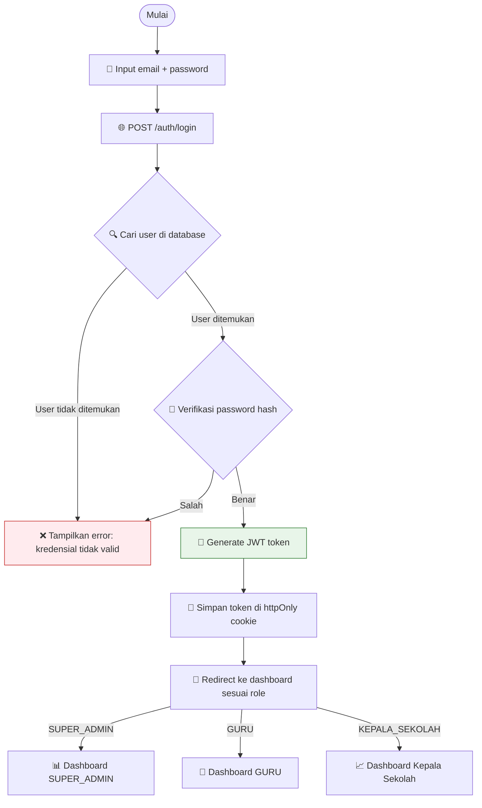
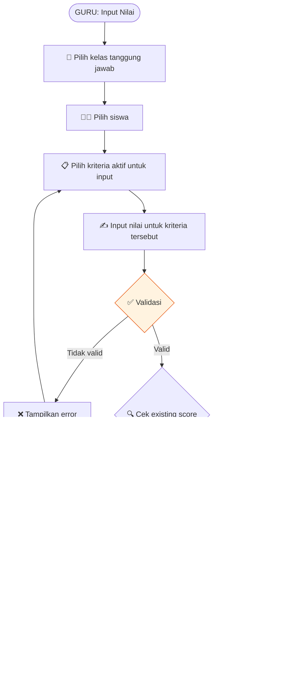
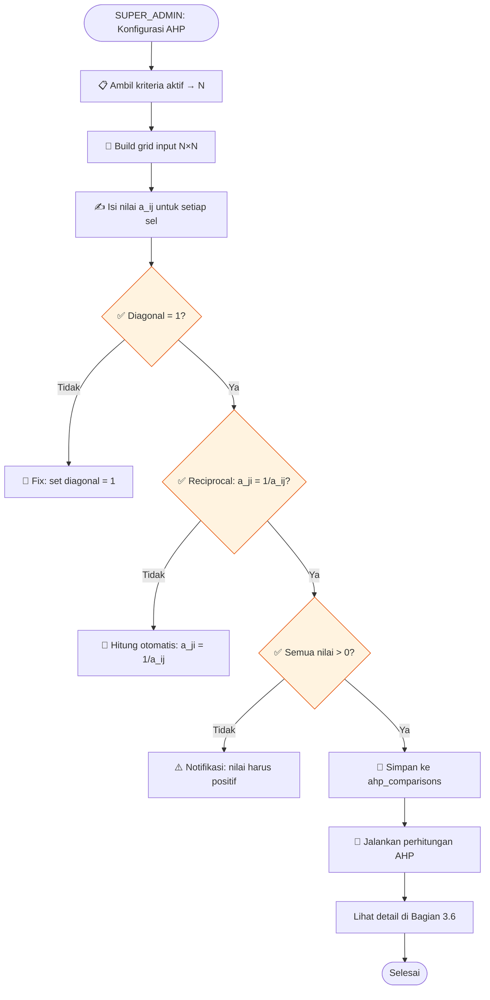

# RANCANGAN SISTEM
## 3. FLOWCHART SISTEM

### 3.1 Diagram Alur Utama Sistem

Flowchart berikut menggambarkan alur end-to-end sistem mulai dari autentikasi hingga laporan PDF.

```mermaid
flowchart TD
    Start([Mulai]) --> Login[🔐 Login: email + password]
    Login --> AuthCheck{Validasi Kredensial}
    AuthCheck -->|Gagal| Login
    AuthCheck -->|Berhasil| RoleDetect{🕵️ Deteksi Role}
    
    RoleDetect -->|SUPER_ADMIN| AdminFlow[📊 Alur SUPER_ADMIN]
    RoleDetect -->|GURU| GuruFlow[📝 Alur GURU Wali Kelas]
    RoleDetect -->|KEPALA_SEKOLAH| KepalaFlow[📈 Alur KEPALA SEKOLAH]
    
    AdminFlow --> AdminMenu{📋 Pilihan Menu}
    AdminMenu -->|Manajemen Data| AdminData[CRUD: Pengguna, Kelas, Siswa, Kriteria]
    AdminMenu -->|Konfigurasi AHP| AdminAHP[Input Matriks Perbandingan N×N]
    AdminMenu -->|Jalankan Perhitungan| AdminCalc[Hitung AHP & TOPSIS]
    AdminMenu -->|Lihat Laporan| AdminReport[Lihat Hasil & Log Audit]
    
    GuruFlow --> GuruMenu{📋 Pilihan Menu}
    GuruMenu -->|Input Nilai| GuruInput[Input Nilai Siswa{per Kriteria}]
    GuruMenu -->|Lihat Kelas| GuruView[Lihat Kelas & Siswa]
    
    KepalaFlow --> KepalaMenu{📋 Pilihan Menu}
    KepalaMenu -->|Lihat Ranking| KepalaView[🏆 Tampilkan Ranking Siswa]
    KepalaMenu -->|Cetak PDF| KepalaPDF[🖨️ Cetak Laporan PDF + KOP Placeholder]
    
    AdminData --> AdminAHP
    AdminAHP --> AHPValidate{✅ Validasi Matriks?}
    AHPValidate -->|Tidak Valid| AdminAHP
    AHPValidate -->|Valid| AHPCalculate[🧮 Hitung AHP: Bobot, CI, CR, RI]
    AHPCalculate --> CRCheck{CR ≤ 0.10?}
    CRCheck -->|Tidak| ReviseAHP[⚠️ Notifikasi: Matrix tidak konsisten]
    ReviseAHP --> AdminAHP
    CRCheck -->|Ya| SaveAHP[💾 Simpan Bobot ke ahp_calculations]
    SaveAHP --> GuruInput
    GuruInput --> ScoreSave{✅ Simpan Nilai?}
    ScoreSave -->|Gagal| GuruInput
    ScoreSave -->|Berhasil| AdminCalc
    AdminCalc --> TOPSISCalculate[🧮 Hitung TOPSIS: Matriks, Normalisasi, Solusi Ideal, Ranking]
    TOPSISCalculate --> SaveResult[💾 Simpan Hasil + Snapshot ke topsis_calculations]
    SaveResult --> KepalaView
    KepalaView --> KepalaPDF
    KepalaPDF --> End([Selesai])
```

### 3.2 Flowchart Login dan Authorization



### 3.3 Flowchart Alur SUPER_ADMIN

```mermaid
flowchart TD
    Start([SUPER_ADMIN Login]) --> Dashboard[📊 Dashboard SUPER_ADMIN]
    Dashboard --> Menu{📋 Menu Administrasi}
    
    Menu -->|Manajemen Pengguna| UserCRUD[👥 CRUD Pengguna]
    UserCRUD --> CreateUser[➕ Tambah User Baru]
    CreateUser --> AssignRole{🎭 Assign Role}
    AssignRole -->|SUPER_ADMIN| SaveAdmin[💾 Simpan]
    AssignRole -->|GURU| SaveGuru[💾 Simpan]
    AssignRole -->|KEPALA_SEKOLAH| SaveKepala[💾 Simpan]
    
    Menu -->|Manajemen Kelas| ClassCRUD[🏫 CRUD Kelas]
    ClassCRUD --> AddClass[➕ Tambah Kelas Baru]
    AddClass --> AssignWali{👨‍🏫 Assign Wali Kelas}
    AssignWali --> SaveClass[💾 Simpan Class]
    
    Menu -->|Manajemen Siswa| StudentCRUD[👨‍🎓 CRUD Siswa]
    StudentCRUD --> AddStudent[➕ Tambah Siswa]
    AddStudent --> SaveStudent[💾 Simpan Siswa]
    
    Menu -->|Manajemen Kriteria| CriteriaCRUD[📋 CRUD Kriteria Dinamis]
    CriteriaCRUD --> AddCriteria[➕ Tambah Kriteria]
    AddCriteria --> SetType{🎯 Tipe: BENEFIT / COST}
    SetType --> SaveCriteria[💾 Simpan Kriteria]
    SaveCriteria --> ActiveCriteria{✅ Aktifkan/Nonaktifkan}
    
    Menu -->|Input Matriks AHP| AHPInput[🔄 Input Pairwise Comparison N×N]
    AHPInput --> BuildMatrix[📐 Build Matriks N×N dari database]
    BuildMatrix --> InputPairs[✍️ Input nilai a_ij untuk setiap pasangan]
    InputPairs --> ValidateMatrix{✅ Validasi: diagonal=1, reciprocal, positif}
    ValidateMatrix -->|Gagal| AHPInput
    ValidateMatrix -->|Lulus| CalculateAHP[🧮 Hitung AHP]
    CalculateAHP --> CalcBobot[🎯 Hitung Priority Vector Bobot w]
    CalcBobot --> CalcLambda[📐 Hitung λ max]
    CalcLambda --> CalcCI[🎯 Hitung CI = (λ_max - N)/(N-1)]
    CalcCI --> CalcRI[📋 Pilih RI berdasarkan N]
    CalcRI --> CalcCR[🎯 Hitung CR = CI/RI]
    CalcCR --> CheckCR{CR ≤ 0.10?}
    CheckCR -->|TIDAK| ShowInvalid[⚠️ Notifikasi: CR > 0.10, matrix tidak konsisten]
    CheckCR -->|YA| SaveAHPResult[💾 Simpan ke ahp_calculations: weight_vector, CI, CR, RI, is_valid=true]
    ShowInvalid --> AHPInput
    SaveAHPResult --> Dashboard
    
    Menu -->|Jalankan Perhitungan| RunCalc[🚀 Jalankan AHP & TOPSIS]
    RunCalc --> CalculateTOPSIS[🧮 Hitung TOPSIS]
    CalculateTOPSIS --> CalcFlow[Lihat detail di Bagian 3.6]
    CalcFlow --> SaveResult[💾 Simpan ke topsis_calculations]
    SaveResult --> Dashboard
    
    Menu -->|Lihat Laporan| ViewReport[📊 Lihat Hasil & Log Audit]
    ViewReport --> ViewAHP[📈 Lihat Bobot AHP, CI, CR]
    ViewReport --> ViewTOPSIS[📊 Lihat Ranking TOPSIS]
    ViewReport --> ViewAudit[🪵 Lihat Log Audit]
    
    style CheckCR fill:#fff3e0,stroke:#e65100
    style ShowInvalid fill:#ffebee,stroke:#c62828
    style SaveAHPResult fill:#e8f5e9,stroke:#2e7d32
```

### 3.4 Flowchart Alur GURU (Wali Kelas)

```mermaid
flowchart TD
    Start([GURU Login]) --> Dashboard[📝 Dashboard GURU]
    Dashboard --> CheckClass{🔍 Cek kelas yang menjadi tanggung jawab}
    CheckClass -->|Belum ada kelas| NoClass[⚠️ Notifikasi: Belum ditugaskan kelas]
    CheckClass -->|Ada kelas| ViewClass[🏫 Tampilkan kelas dan siswa]
    
    ViewClass --> ListStudents[👨‍🎓 Daftar Siswa Kelas]
    ListStudents --> SelectStudent[👆 Pilih siswa]
    SelectStudent --> InputScore[📊 Input Nilai per Kriteria]
    
    InputScore --> ShowCriteria[📋 Tampilkan kriteria aktif + tipe]
    ShowCriteria --> FillValues[✍️ Isi nilai untuk setiap kriteria]
    FillValues --> ValidateInput{✅ Validasi Input}
    ValidateInput -->|Tidak Valid| ShowError[❌ Tampilkan error: range, format, dll.]
    ValidateInput -->|Valid| CheckDuplicate{🔍 Cek duplikat}
    CheckDuplicate -->|Sudah ada| UpdateScore[✏️ Update nilai (dengan audit trail)]
    CheckDuplicate -->|Belum ada| CreateScore[➕ Buat nilai baru]
    UpdateScore --> SaveScore
    CreateScore --> SaveScore
    SaveScore --> CreateAudit[🪵 Buat audit log: details (record perubahan)]
    CreateAudit --> SaveDB[💾 Simpan ke database]
    SaveDB --> SuccessMsg[✅ Notifikasi: Nilai tersimpan]
    SuccessMsg --> ListStudents
    
    style ValidateInput fill:#fff3e0,stroke:#e65100
    style ShowError fill:#ffebee,stroke:#c62828
    style SuccessMsg fill:#e8f5e9,stroke:#2e7d32
```

### 3.5 Flowchart Alur KEPALA SEKOLAH

```mermaid
flowchart TD
    Start([KEPALA_SEKOLAH Login]) --> Dashboard[📈 Dashboard Kepala Sekolah]
    Dashboard --> ViewRanking{📊 Lihat Ranking}
    ViewRanking --> ShowRanking[🏆 Tampilkan ranking siswa dari hasil TOPSIS terakhir]
    ShowRanking --> ClickStudent{👆 Klik siswa?}
    ClickStudent -->|Ya| DetailSiswa[📋 Tampilkan detail nilai per kriteria]
    ClickStudent -->|Tidak| ContinueView
    DetailSiswa --> Dashboard
    ContinueView --> ViewAHP{📈 Lihat Hasil AHP}
    ViewAHP --> ShowAHP[📊 Tampilkan: bobot kriteria, CI, CR, status valid]
    ShowAHP --> Dashboard
    ContinueView --> ViewTOPSIS{📊 Lihat Detail TOPSIS}
    ViewTOPSIS --> ShowTOPSIS[📈 Tampilkan: matriks keputusan, normalisasi, solusi ideal, jarak, V_i]
    ShowTOPSIS --> Dashboard
    ContinueView --> PrintPDF{🖨️ Cetak Laporan PDF}
    PrintPDF --> RequestPDF[🌐 Request /reports/ranking?periodId=X]
    RequestPDF --> GenPDF[📄 Generate PDF dengan template]
    GenPDF --> PDFContent[Isi PDF:
        - KOP Surat (placeholder)
        - Identitas laporan
        - Tabel ranking
        - Hasil perhitungan
        - Ruang tanda tangan
    ]
    PDFContent --> DownloadPDF[💾 Download/tampilkan PDF]
    DownloadPDF --> End([Selesai])
    
    style PrintPDF fill:#e8f5e9,stroke:#2e7d32
```

### 3.6 Flowchart Perhitungan AHP (Dinamis N×N)

```mermaid
flowchart TD
    Start([Mulai Perhitungan AHP]) --> GetCriteria[📋 Ambil kriteria aktif dari database → N kriteria]
    GetCriteria --> BuildMatrix[📐 Build matriks N×N di runtime]
    BuildMatrix --> FillDiagonal[✅ Fill diagonal dengan 1 (a_ii = 1)]
    FillDiagonal --> FillPairs[✍️ Fill a_ij dari ahp_comparisons]
    FillPairs --> FillReciprocal[🔄 Fill a_ji = 1/a_ij (reciprocal)]
    FillReciprocal --> Validate{✅ Validasi matriks}
    Validate -->|Gagal| ErrorBuild[❌ Error: matriks tidak valid]
    Validate -->|Lulus| Normalize[📐 Normalisasi matriks: n_ij = a_ij / Σ(a_kj)]
    Normalize --> CalcWeight[🎯 Hitung Priority Vector: w_i = (Σ n_ij)/N]
    CalcWeight --> CalcLambda[📐 Hitung λ_max = (Σ(λw_i / w_i))/N]
    CalcLambda --> CalcCI[🎯 Hitung CI = (λ_max - N)/(N-1)]
    CalcCI --> SelectRI[📋 Pilih RI dari tabel berdasarkan N]
    SelectRI --> CalcCR[🎯 Hitung CR = CI / RI]
    CalcCR --> CheckCR{CR ≤ 0.10?}
    CheckCR -->|Tidak| ShowError[❌ Tampilkan error: CR > 0.10, matrix tidak konsisten]
    CheckCR -->|Ya| SaveResult[💾 Simpan ke ahp_calculations]
    SaveResult --> End([Selesai])
    
    style CheckCR fill:#fff3e0,stroke:#e65100
    style ErrorBuild fill:#ffebee,stroke:#c62828
    style SaveResult fill:#e8f5e9,stroke:#2e7d32
```

### 3.7 Flowchart Perhitungan TOPSIS (Dinamis M×N)

```mermaid
flowchart TD
    Start([Mulai Perhitungan TOPSIS]) --> GetActiveCriteria[📋 Ambil kriteria aktif + type dari database → N]
    GetActiveCriteria --> GetAHP[🔑 Ambil bobot AHP dari ahp_calculations → N bobot]
    GetAHP --> GetScores[📊 Ambil nilai siswa dari scores → M siswa × N kriteria]
    GetScores --> CheckMissing{❌ Cek missing value}
    CheckMissing -->|Ada| ExcludeMissing[⚠️ Eksklusi siswa dengan missing value]
    ExcludeMissing --> Continue
    CheckMissing -->|Tidak ada| Continue[✅ Lanjut]
    Continue --> BuildMatrixX[📐 Build Matriks Keputusan X (M×N)]
    BuildMatrixX --> Normalize[📐 Normalisasi Vektor: r_ij = x_ij / sqrt(Σ(x_kj²))]
    Normalize --> Weighted[📐 Matriks Terbobot: v_ij = r_ij × w_j]
    Weighted --> DetermineIdeal[🎯 Tentukan Solusi Ideal A+ dan A-]
    DetermineIdeal --> CalcDistances[📐 Hitung Jarak: D+ dan D- per siswa]
    CalcDistances --> CalcVi[🎯 Hitung Nilai Preferensi: V_i = D- / (D+ + D-)]
    CalcVi --> Ranking[📊 Ranking berdasarkan V_i descending]
    Ranking --> SaveResult[💾 Simpan snapshot semua matriks + ranking ke topsis_calculations]
    SaveResult --> End([Selesai])
    
    style CheckMissing fill:#fff3e0,stroke:#e65100
    style SaveResult fill:#e8f5e9,stroke:#2e7d32
```

### 3.8 Flowchart Input Nilai oleh GURU



### 3.9 Flowchart Konfigurasi AHP Dinamis N×N oleh SUPER_ADMIN



### 3.10 Flowchart Pencetakan Laporan PDF

```mermaid
flowchart TD
    Start([KEPALA_SEKOLAH: Cetak PDF]) --> SelectPeriod{📅 Pilih periode akademik}
    SelectPeriod --> RequestReport[🌐 GET /reports/ranking?periodId=X]
    RequestReport --> AuthCheck{✅ Cek role KEPALA_SEKOLAH?}
    AuthCheck -->|Tidak| Deny[❌ 403 Forbidden]
    AuthCheck -->|Ya| FetchData[📊 Fetch data dari database]
    FetchData --> GetRanking[📊 Get ranking siswa dari topsis_calculations]
    GetRanking --> GetDetails[📋 Get detail: bobot AHP, CI, CR, solusi ideal, jarak, V_i]
    GetDetails --> GeneratePDF[📄 Generate PDF dengan template]
    GeneratePDF --> PDFContent[Isi PDF:
        - KOP Surat (placeholder teks/logo dummy)
        - Judul laporan
        - Identitas: nama sekolah, periode, tanggal
        - Tabel ranking: no, nama siswa, nilai per kriteria, V_i, ranking
        - Hasil AHP: bobot, CI, CR, status
        - Hasil TOPSIS: solusi ideal A+, A-, jarak D+, D-
        - Ruang tanda tangan
    ]
    PDFContent --> ReturnPDF[🌐 Return PDF buffer ke frontend]
    ReturnPDF --> Download[💾 Download/tampilkan PDF]
    Download --> End([Selesai])
    
    style AuthCheck fill:#fff3e0,stroke:#e65100
    style Deny fill:#ffebee,stroke:#c62828
```

### 3.11 Catatan Penting

1. **AHP Dinamis:** Seluruh perhitungan AHP bersifat dinamis berdasarkan N kriteria aktif dari database. Tidak ada hard-code untuk 4 kriteria.

2. **TOPSIS Dinamis:** Jumlah alternatif (M) dan kriteria (N) ditentukan saat runtime dari data siswa dan kriteria aktif.

3. **Validasi CR:** Hanya perhitungan AHP dengan CR ≤ 0.10 yang dianggap valid dan dapat digunakan untuk TOPSIS.

4. **Missing Value:** Siswa dengan missing value untuk kriteria aktif tidak dimasukkan ke perhitungan TOPSIS.

5. **KOP Surat:** Laporan PDF menggunakan placeholder KOP surat. Logo resmi sekolah tidak dimasukkan ke repository publik.

6. **RBAC:** Setiap alur hanya dapat diakses oleh pengguna dengan role yang sesuai.

---

*Dokumen ini merupakan Bagian 3 dari RANCANGAN_SISTEM.md yang dibuat secara bertahap. Sumber referensi utama: FINAL_DISCOVERY_AND_ARCHITECTURE_REVIEW.md.*
