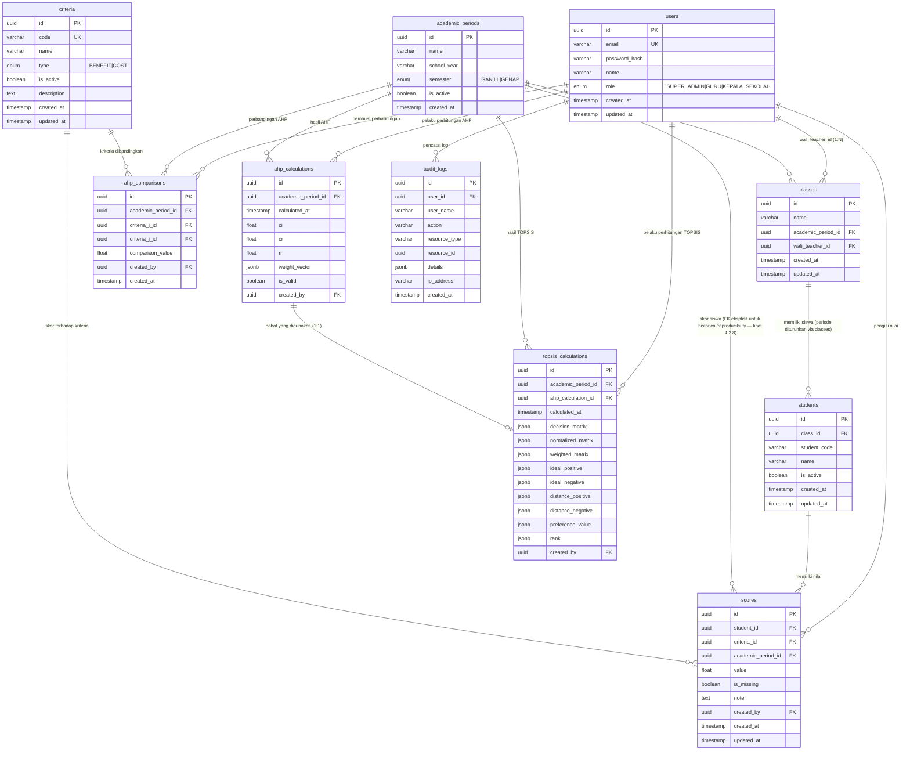

# RANCANGAN SISTEM
## 4. SPESIFIKASI BASIS DATA

### 4.1 Desain Basis Data Secara Umum

Basis data menggunakan PostgreSQL 16 dengan Prisma ORM. Seluruh tabel menggunakan UUID sebagai primary key (kecuali disebutkan lain). Timestamp `created_at` dan `updated_at` diatur secara otomatis oleh Prisma. Enum digunakan untuk field dengan nilai terbatas (role, tipe kriteria, semester). JSONB digunakan untuk menyimpan data dinamis seperti bobot AHP dan matriks perhitungan TOPSIS.

Prinsip desain:
- Normalized hingga 3NF untuk menghindari redundansi
- Setiap tabel memiliki primary key (UUID)
- Foreign key digunakan untuk hubungan antar entitas
- Constraint (UNIQUE, NOT NULL, CHECK) diterapkan sesuai kebutuhan bisnis
- JSONB digunakan untuk menyimpan data dinamis (bobot, matriks, ranking)

### 4.2 ERD dan Relasi Tabel

#### Diagram Relasi (ERD)

#### 4.2.1 Tabel `users`

| Nama Kolom | Tipe Data | Nullable | Default | PK | FK | Constraint | Keterangan |
|------------|-----------|----------|---------|----|----|------------|------------|
| id | UUID | NOT NULL | gen_random_uuid() | ✓ | — | PK | Identifier unik pengguna |
| email | VARCHAR(255) | NOT NULL | — | — | — | UK, NOT NULL | Email untuk login |
| password_hash | VARCHAR(255) | NOT NULL | — | — | — | NOT NULL | Hash password (bcrypt/argon2) |
| name | VARCHAR(255) | NOT NULL | — | — | — | NOT NULL | Nama lengkap |
| role | VARCHAR(50) | NOT NULL | — | — | — | CHECK (SUPER_ADMIN/GURU/KEPALA_SEKOLAH) | Role pengguna |
| created_at | TIMESTAMP | NOT NULL | NOW() | — | — | — | Waktu pencatatan |
| updated_at | TIMESTAMP | NOT NULL | NOW() | — | — | — | Waktu pembaruan terakhir |

**Keterangan:** Tabel pengguna dengan 3 role tetap. Email harus unik.

#### 4.2.2 Tabel `academic_periods`

| Nama Kolom | Tipe Data | Nullable | Default | PK | FK | Constraint | Keterangan |
|------------|-----------|----------|---------|----|----|------------|------------|
| id | UUID | NOT NULL | gen_random_uuid() | ✓ | — | PK | Identifier periode |
| name | VARCHAR(255) | NOT NULL | — | — | — | NOT NULL | Nama periode (misal: "2024/2025 Genap") |
| school_year | VARCHAR(50) | NOT NULL | — | — | — | NOT NULL | Tahun ajaran |
| semester | VARCHAR(10) | NOT NULL | — | — | — | CHECK (GANJIL/GENAP) | Semester |
| is_active | BOOLEAN | NOT NULL | false | — | — | — | Status aktif/tidak |
| created_at | TIMESTAMP | NOT NULL | NOW() | — | — | — | Waktu pencatatan |

**Keterangan:** Menentukan periode akademik. Seluruh data siswa, nilai, dan perhitungan dikaitkan dengan periode tertentu.

#### 4.2.3 Tabel `classes`

| Nama Kolom | Tipe Data | Nullable | Default | PK | FK | Constraint | Keterangan |
|------------|-----------|----------|---------|----|----|------------|------------|
| id | UUID | NOT NULL | gen_random_uuid() | ✓ | — | PK | Identifier kelas |
| name | VARCHAR(100) | NOT NULL | — | — | — | NOT NULL | Nama kelas |
| academic_period_id | UUID | NOT NULL | — | — | ✓ | FK ke academic_periods.id, NOT NULL | Periode akademik |
| wali_teacher_id | UUID | NOT NULL | — | — | ✓ | FK ke users.id (role=GURU), NOT NULL | Wali kelas |
| created_at | TIMESTAMP | NOT NULL | NOW() | — | — | — | Waktu pencatatan |
| updated_at | TIMESTAMP | NOT NULL | NOW() | — | — | — | Waktu pembaruan terakhir |

**Constraint:** UNIQUE (name, academic_period_id)

**Keterangan:** Kelas adalah unit organisasi siswa dalam satu periode. Setiap kelas memiliki satu wali kelas.

#### 4.2.4 Tabel `students`

| Nama Kolom | Tipe Data | Nullable | Default | PK | FK | Constraint | Keterangan |
|------------|-----------|----------|---------|----|----|------------|------------|
| id | UUID | NOT NULL | gen_random_uuid() | ✓ | — | PK | Identifier siswa |
| class_id | UUID | NOT NULL | — | — | ✓ | FK ke classes.id, NOT NULL | Kelas siswa |
| student_code | VARCHAR(50) | NULL | — | — | — | — | Kode anonim (bukan NIS asli) |
| name | VARCHAR(255) | NOT NULL | — | — | — | NOT NULL | Nama siswa (anonymized di repo publik) |
| is_active | BOOLEAN | NOT NULL | true | — | — | — | Status aktif/tidak aktif |
| created_at | TIMESTAMP | NOT NULL | NOW() | — | — | — | Waktu pencatatan |
| updated_at | TIMESTAMP | NOT NULL | NOW() | — | — | — | Waktu pembaruan terakhir |

**Constraint:** UNIQUE (class_id, student_code)

**Keterangan:** Siswa adalah alternatif dalam perhitungan TOPSIS. Periode akademik siswa ditentukan melalui `classes.academic_period_id`. `student_code` digunakan sebagai identifier manusia-baca-baca, bukan NIS asli.

#### 4.2.5 Tabel `criteria`

| Nama Kolom | Tipe Data | Nullable | Default | PK | FK | Constraint | Keterangan |
|------------|-----------|----------|---------|----|----|------------|------------|
| id | UUID | NOT NULL | gen_random_uuid() | ✓ | — | PK | Identifier kriteria |
| code | VARCHAR(10) | NOT NULL | — | — | — | UK, NOT NULL | Kode kriteria (misal: C1, C2) |
| name | VARCHAR(255) | NOT NULL | — | — | — | NOT NULL | Nama kriteria |
| type | VARCHAR(10) | NOT NULL | — | — | — | CHECK (BENEFIT/COST), NOT NULL | Tipe kriteria |
| is_active | BOOLEAN | NOT NULL | true | — | — | — | Status aktif/tidak aktif |
| description | TEXT | NULL | NULL | — | — | — | Keterangan tambahan |
| created_at | TIMESTAMP | NOT NULL | NOW() | — | — | — | Waktu pencatatan |
| updated_at | TIMESTAMP | NOT NULL | NOW() | — | — | — | Waktu pembaruan terakhir |

**Keterangan:** Kriteria adalah aspek penilaian. Dapat di-nonaktifkan tanpa menghapus dari database.

#### 4.2.6 Tabel `ahp_comparisons`

| Nama Kolom | Tipe Data | Nullable | Default | PK | FK | Constraint | Keterangan |
|------------|-----------|----------|---------|----|----|------------|------------|
| id | UUID | NOT NULL | gen_random_uuid() | ✓ | — | PK | Identifier perbandingan |
| academic_period_id | UUID | NOT NULL | — | — | ✓ | FK ke academic_periods.id, NOT NULL | Periode akademik |
| criteria_i_id | UUID | NOT NULL | — | — | ✓ | FK ke criteria.id, NOT NULL | Kriteria pertama |
| criteria_j_id | UUID | NOT NULL | — | — | ✓ | FK ke criteria.id, NOT NULL | Kriteria kedua |
| comparison_value | FLOAT | NOT NULL | — | — | — | NOT NULL, > 0 | Nilai perbandingan a_ij (skala 1–9 atau kompromi) |
| created_by | UUID | NOT NULL | — | — | ✓ | FK ke users.id, NOT NULL | Pengguna yang memasukkan |
| created_at | TIMESTAMP | NOT NULL | NOW() | — | — | — | Waktu pencatatan |

**Constraint:** UNIQUE (academic_period_id, criteria_i_id, criteria_j_id)

**Keterangan:** Menyimpan nilai perbandingan berpasangan a_ij untuk matriks AHP N×N. a_ii (diagonal) tidak disimpan karena selalu 1. a_ji dihitung sebagai 1/a_ij saat runtime.

#### 4.2.7 Tabel `ahp_calculations`

| Nama Kolom | Tipe Data | Nullable | Default | PK | FK | Constraint | Keterangan |
|------------|-----------|----------|---------|----|----|------------|------------|
| id | UUID | NOT NULL | gen_random_uuid() | ✓ | — | PK | Identifier perhitungan |
| academic_period_id | UUID | NOT NULL | — | — | ✓ | FK ke academic_periods.id, NOT NULL | Periode akademik |
| calculated_at | TIMESTAMP | NOT NULL | NOW() | — | — | — | Waktu perhitungan |
| ci | FLOAT | NOT NULL | — | — | — | NOT NULL | Consistency Index |
| cr | FLOAT | NOT NULL | — | — | — | NOT NULL | Consistency Ratio |
| ri | FLOAT | NOT NULL | — | — | — | NOT NULL | Random Index |
| weight_vector | JSONB | NOT NULL | — | — | — | NOT NULL | { "C1": 0.4, "C2": 0.3, ... } |
| is_valid | BOOLEAN | NOT NULL | false | — | — | — | Apakah CR ≤ 0.10 |
| created_by | UUID | NOT NULL | — | — | ✓ | FK ke users.id, NOT NULL | Pengguna yang melakukan perhitungan |

**Keterangan:** Hasil perhitungan AHP. `weight_vector` berisi bobot setiap kriteria dalam format JSONB.

#### 4.2.8 Tabel `scores`

| Nama Kolom | Tipe Data | Nullable | Default | PK | FK | Constraint | Keterangan |
|------------|-----------|----------|---------|----|----|------------|------------|
| id | UUID | NOT NULL | gen_random_uuid() | ✓ | — | PK | Identifier skor |
| student_id | UUID | NOT NULL | — | — | ✓ | FK ke students.id, NOT NULL | Siswa |
| criteria_id | UUID | NOT NULL | — | — | ✓ | FK ke criteria.id, NOT NULL | Kriteria |
| academic_period_id | UUID | NOT NULL | — | — | ✓ | FK ke academic_periods.id, NOT NULL | Periode akademik |
| value | FLOAT | NOT NULL | — | — | — | NOT NULL | Nilai siswa untuk kriteria |
| is_missing | BOOLEAN | NOT NULL | false | — | — | — | Apakah data tidak lengkap |
| note | TEXT | NULL | NULL | — | — | — | Keterangan |
| created_by | UUID | NOT NULL | — | — | ✓ | FK ke users.id, NOT NULL | Guru yang memasukkan |
| created_at | TIMESTAMP | NOT NULL | NOW() | — | — | — | Waktu pencatatan |
| updated_at | TIMESTAMP | NOT NULL | NOW() | — | — | — | Waktu pembaruan terakhir |

**Constraint:** UNIQUE (student_id, criteria_id, academic_period_id)

**Keterangan:** `is_missing = true` artinya nilai tidak diinput dan TIDAK ikut dalam perhitungan TOPSIS. `is_missing = false` dan `value = 0` artinya siswa mendapat nilai 0 (bukan missing).

Catatan desain: `scores.academic_period_id` sengaja dipertahankan sebagai FK eksplisit (bukan hanya diturunkan dari `students.class_id → classes.academic_period_id`) karena:

- Nilai yang dimasukkan perlu dikaitkan secara eksplisit dengan periode akademik di mana nilai tersebut asli direkam, terlepas dari apakah siswa berpindah kelas di periode berikutnya.
- Jika siswa berpindah kelas antar-periode, `class_id` di tabel `students` akan berubah mengikuti periode baru, namun nilai lama tetap harus merujuk ke periode lama untuk konsistensi historis.
- Skenario remedial atau penilaian khusus yang perlu dicatat pada periode tertentu juga membutuhkan eksplisititas ini.
- Dengan menyimpan `academic_period_id` secara eksplisit di `scores`, setiap baris nilai memiliki konteks periode yang utuh dan tidak bergantung pada keadaan `class_id` pada saat query.

Keputusan ini adalah desain untuk historical data dan reproducibility, bukan oversight. Relasi ke `academic_periods` tetap diperlukan untuk query yang difilter berdasarkan periode (misalnya "tampilkan semua nilai periode Genap 2024/2025").

#### 4.2.9 Tabel `topsis_calculations`

| Nama Kolom | Tipe Data | Nullable | Default | PK | FK | Constraint | Keterangan |
|------------|-----------|----------|---------|----|----|------------|------------|
| id | UUID | NOT NULL | gen_random_uuid() | ✓ | — | PK | Identifier perhitungan |
| academic_period_id | UUID | NOT NULL | — | — | ✓ | FK ke academic_periods.id, NOT NULL | Periode akademik |
| ahp_calculation_id | UUID | NOT NULL | — | — | ✓ | FK ke ahp_calculations.id, NOT NULL | Perhitungan AHP yang digunakan |
| calculated_at | TIMESTAMP | NOT NULL | NOW() | — | — | — | Waktu perhitungan |
| decision_matrix | JSONB | NULL | NULL | — | — | — | Matriks keputusan X (M×N) |
| normalized_matrix | JSONB | NULL | NULL | — | — | — | Matriks ternormalisasi R (M×N) |
| weighted_matrix | JSONB | NULL | NULL | — | — | — | Matriks terbobot V (M×N) |
| ideal_positive | JSONB | NULL | NULL | — | — | — | Solusi ideal positif A+ |
| ideal_negative | JSONB | NULL | NULL | — | — | — | Solusi ideal negatif A- |
| distance_positive | JSONB | NULL | NULL | — | — | — | Jarak D+ per siswa |
| distance_negative | JSONB | NULL | NULL | — | — | — | Jarak D- per siswa |
| preference_value | JSONB | NULL | NULL | — | — | — | Nilai preferensi V_i per siswa |
| rank | JSONB | NULL | NULL | — | — | — | Ranking { student_code: rank } |
| created_by | UUID | NOT NULL | — | — | ✓ | FK ke users.id, NOT NULL | Pengguna yang melakukan perhitungan |

**Constraint:** UNIQUE (academic_period_id, ahp_calculation_id)

**Keterangan:** Snapshot lengkap semua matriks dan hasil perhitungan TOPSIS untuk reproducibility.

#### 4.2.10 Tabel `audit_logs`

|| Nama Kolom | Tipe Data | Nullable | Default | PK | FK | Constraint | Keterangan |
|------------|-----------|----------|---------|----|----|------------|------------|
| id | UUID | NOT NULL | gen_random_uuid() | ✓ | — | PK | Identifier log |
| user_id | UUID | NOT NULL | — | — | ✓ | FK ke users.id, NOT NULL | Pengguna yang melakukan aksi |
| user_name | VARCHAR(255) | NOT NULL | — | — | — | — | Nama pengguna penyusun log |
| action | VARCHAR(100) | NOT NULL | — | — | — | NOT NULL | Tipe aksi (misalnya LOGIN, LOGOUT, CREATE, UPDATE, DELETE) |
| resource_type | VARCHAR(50) | NOT NULL | — | — | — | NOT NULL | Tipe entitas sumber aksi (misalnya USER, CLASS, STUDENT, CRITERIA, AHP_CALCULATION, TOPSIS_CALCULATION) |
| resource_id | UUID | NULL | — | — | — | — | Identifier entitas spesifik yang terkait (jika ada) |
| details | JSONB | NULL | — | — | — | — | Detail tambahan atau payload aksi (tersimpan sebagai JSON, tidak menyimpan secret atau password) |
| ip_address | VARCHAR(45) | NULL | — | — | — | — | Alamat IP pengirim request (untuk keperluan audit keamanan) |
| created_at | TIMESTAMP | NOT NULL | NOW() | — | — | — | Waktu pencatatan log |

**Constraint:** FK ke users.id, indeks pada created_at dan user_id untuk query audit yang efisien.

**Keterangan:** Riwayat semua perubahan dan aktivitas penting di sistem. Memungkinkan audit trail, verifikasi siapa yang melakukan perubahan, dan investigasi keamanan. Tidak menyimpan password, token, atau secret dalam kolom details.

### 4.3 Kardinalitas dan Relasi

| Hubungan | Kardinalitas | Alasan |
|----------|--------------|--------|
| users → classes (wali_teacher_id) | 1:N | Satu guru bisa menjadi wali beberapa kelas |
| users → audit_logs | 1:N | Satu pengguna membuat banyak log |
| users → ahp_comparisons | 1:N | Satu pengguna membuat banyak perbandingan |
| users → ahp_calculations | 1:N | Satu pengguna melakukan banyak perhitungan AHP |
| users → topsis_calculations | 1:N | Satu pengguna melakukan banyak perhitungan TOPSIS |
| users → scores | 1:N | Satu pengguna memasukkan banyak nilai |
|| academic_periods → classes | 1:N | Satu periode memiliki banyak kelas |
|| classes → students | 1:N | Satu kelas memiliki banyak siswa. Periode akademik siswa diturunkan dari `classes.academic_period_id` (tidak ada kolom `academic_period_id` di `students`). |
|| students → scores | 1:N | Satu siswa memiliki banyak nilai (per kriteria) |
| criteria → ahp_comparisons | N:M (via 2 FK) | Matriks perbandingan N×N: N×(N-1) baris |
| criteria → scores | 1:N | Satu kriteria dinilai oleh banyak siswa |
| ahp_calculations → topsis_calculations | 1:1 | Satu hasil AHP digunakan untuk satu run TOPSIS |

### 4.4 Normalisasi

#### 4.4.1 1NF

**Tabel relasional utama** (`users`, `academic_periods`, `classes`, `students`, `criteria`, `ahp_comparisons`, `scores`) semuanya memenuhi 1NF secara ketat karena:

- Setiap kolom berisi nilai atomik (tidak ada array atau struct di dalam satu sel)
- Setiap baris diidentifikasi dengan primary key yang unik

**Tabel dengan JSONB** (`ahp_calculations`, `topsis_calculations`, `audit_logs`) **tidak memenuhi 1NF secara ketat** karena kolom JSONB bukan tipe atomik secara tradisional. JSONB digunakan di sini sebagai **pengecualian praktis** untuk menyimpan:

- **Snapshot hasil perhitungan AHP/TOPSIS** (`ahp_calculations.weight_vector`, dan 9 kolom snapshot di `topsis_calculations`)
- **Payload audit yang bersifat semi-structured** (`audit_logs.details`)

JSONB **bukan** digunakan sebagai pengganti relasi utama atau untuk data yang membutuhkan FK/constraint relasional. Tabel relasional utama tetap memenuhi 1NF secara ketat. Lihat Bagian 5 untuk dokumentasi lengkap tentang pengecualian ini.

Alasan penggunaan JSONB tetap dipertahankan:

- Struktur data dinamis (jumlah kriteria dan siswa berbeda-beda)
- Snapshot yang lengkap diperlukan untuk reproducibility dan audit hasil perhitungan
- Memecah JSONB menjadi tabel-tabel terpisah akan menambah kompleksitas tanpa manfaat signifikan untuk kebutuhan saat ini, namun tetap memungkinkan migrasi di masa depan jika kebutuhan query meningkat

#### 4.4.2 2NF

Semua tabel memenuhi 2NF:
- Tabel dengan primary key tunggal (UUID) otomatis memenuhi 2NF
- Tabel `scores` dengan composite unique key (student_id, criteria_id, academic_period_id): semua atribut non-key bergantung pada seluruh key, bukan sebagian
- Tabel `ahp_comparisons` dengan composite unique key: semua atribut non-key bergantung pada seluruh key

#### 4.4.3 3NF

Semua tabel memenuhi 3NF:
- Tidak ada transitive dependency
- Nama kelas tidak disimpan di tabel `students` (hanya class_id)
- Nama siswa tidak disimpan di tabel `scores` (hanya student_id)
- Nama kriteria tidak disimpan di tabel `ahp_comparisons` atau `scores` (hanya criteria_id)

### 4.5 Integritas Data

#### Constraint yang diterapkan

| Tabel | Constraint | Tujuan |
|-------|------------|--------|
| users | UNIQUE (email) | Mencegah duplikat akun |
| users | CHECK (role IN (...)) | Memastikan hanya role yang diizinkan |
| classes | UNIQUE (name, academic_period_id) | Mencegah duplikat kelas dalam satu periode |
| students | UNIQUE (class_id, student_code) | Mencegah duplikat siswa dalam satu kelas |
| criteria | UNIQUE (code) | Kode kriteria harus unik |
| ahp_comparisons | UNIQUE (academic_period_id, criteria_i_id, criteria_j_id) | Satu pasang kriteria hanya punya satu nilai perbandingan per periode |
| ahp_comparisons | CHECK (comparison_value > 0) | Nilai perbandingan harus positif |
| scores | UNIQUE (student_id, criteria_id, academic_period_id) | Satu siswa tidak punya dua nilai untuk satu kriteria di satu periode |
| topsis_calculations | UNIQUE (academic_period_id, ahp_calculation_id) | Satu hasil AHP hanya punya satu hasil TOPSIS per periode |

#### Aturan Bisnis Tambahan

1. **Missing value vs nilai 0:**
   - `is_missing = true`: nilai tidak diinput, TIDAK ikut dalam perhitungan TOPSIS
   - `is_missing = false` dan `value = 0`: siswa mendapat nilai 0, diikutkan dalam perhitungan

2. **Kriteria nonaktif:** Hanya kriteria dengan `is_active = true` yang digunakan dalam perhitungan AHP dan TOPSIS.

3. **Validasi AHP:** Jika CR > 0.10, hasil perhitungan tidak valid dan tidak boleh digunakan untuk TOPSIS.

4. **Isolasi data GURU:** Query untuk mengambil siswa dan nilai harus difilter berdasarkan kelas yang menjadi tanggung jawab GURU (melalui `wali_teacher_id` di tabel `classes`).

5. **Reproducibility:** Hasil perhitungan TOPSIS menyimpan snapshot semua matriks dalam JSONB sehingga dapat diverifikasi ulang kapan saja.

---

*Dokumen ini merupakan Bagian 4 dari RANCANGAN_SISTEM.md yang dibuat secara bertahap. Sumber referensi utama: FINAL_DISCOVERY_AND_ARCHITECTURE_REVIEW.md.*
