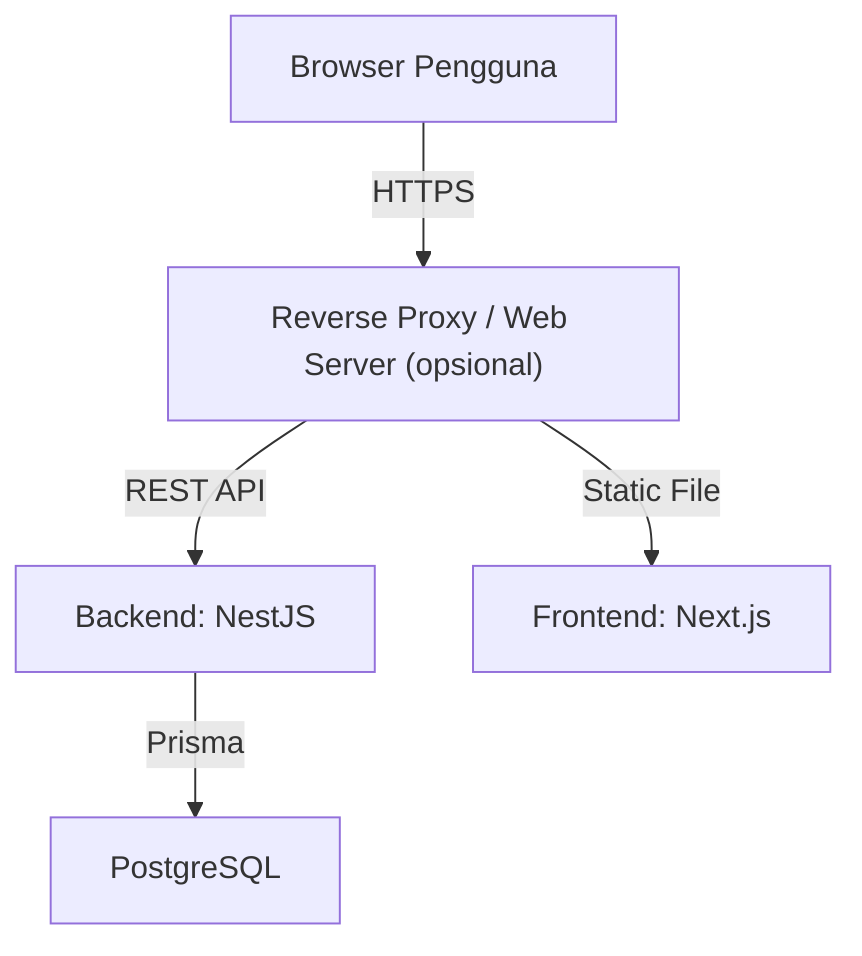

# RANCANGAN SISTEM
## 12. PERANCANGAN DEPLOYMENT DAN INFRASTRUKTUR SISTEM

### 12.1 Tujuan Deployment

Bagian ini mendokumentasikan rancangan deployment dan infrastruktur untuk Sistem Penunjang Keputusan (SPK) AHP-TOPSIS berbasis website pada SMK Jaya Buana. Dokumen ini bersifat **rancangan**, bukan laporan deployment yang sudah dilakukan. Tujuannya adalah:

1. Menjelaskan arsitektur infrastruktur yang mendukung stack teknologi yang sudah ditetapkan (Next.js, NestJS, PostgreSQL, Prisma).
2. Mendokumentasikan komponen deployment utama dan opsional.
3. Mendokumentasikan keamanan deployment: HTTPS, cookie httpOnly, secret management, proteksi database, firewall, rate limiting.
4. Mendokumentasikan alur request di environment production.
5. Mendokumentasikan strategi deployment dan update.
6. Mendokumentasikan checklist deployment dan risiko mitigasi.

Deployment harus tetap mengikuti aturan RBAC dan isolasi data GURU yang sudah dirancang di Bagian 8, 9, dan 11. Tidak ada perubahan pada aturan hak akses, ownership data, atau keamanan karena deployment.

### 12.2 Arsitektur Deployment

#### 12.2.1 Pola Deployment

Sistem menggunakan pola deployment client-server dengan pembatasan akses:

- **Client (browser pengguna):** Mengakses aplikasi melalui HTTPS. Token JWT disimpan di httpOnly cookie (bukan localStorage/sessionStorage) sesuai Bagian 9.
- **Layanan frontend:** Menyajikan aplikasi Next.js kepada pengguna.
- **Layanan backend:** NestJS menjalankan REST API dan logika bisnis.
- **Database PostgreSQL:** Menyimpan seluruh data sistem. Menggunakan Prisma ORM. Database tidak diekspos ke public internet.
- **Reverse proxy / web server (opsional):** Dapat digunakan untuk SSL termination, routing, dan proteksi tambahan. Bukan persyaratan wajib, tetapi direkomendasikan.

#### 12.2.2 Diagram Arsitektur Deployment (Rancangan)



**Keterangan diagram:**
- Reverse proxy adalah opsional dan dapat diganti/dilewatkan sesuai infrastruktur yang tersedia.
- Database hanya diakses oleh backend melalui Prisma, bukan dari client atau frontend.
- Client hanya berinteraksi dengan frontend dan backend melalui HTTPS.

### 12.3 Komponen Deployment

#### 12.3.1 Komponen Wajib

| Komponen | Keterangan |
|----------|------------|
| Frontend (Next.js) | Antarmuka pengguna, role-based routing, manajemen UI per role. |
| Backend (NestJS) | REST API, logika bisnis, validasi DTO, perhitungan AHP/TOPSIS, RBAC, guards. |
| Database (PostgreSQL) | Penyimpanan data, relasi, integritas, backup. |
| Prisma ORM | Abstraksi database, migrasi, query type-safe. |
| HTTPS | Enkripsi komunikasi antara client dan server. |

#### 12.3.2 Komponen Opsional / Contoh

Komponen berikut adalah opsional atau contoh. Dokumentasikan sebagai opsi yang dapat dipertimbangkan, bukan sebagai ketentuan deployment yang harus ada.

- **Reverse proxy / web server:** Nginx, Traefik, atau services sejenis. Dapat digunakan untuk SSL termination, load balancing, dan routing.
- **Load balancer:** Jika deployment mensyaratkan multiple instansi backend. Contoh: cloud load balancer atau Nginx.
- **Object storage:** Untuk menyimpan file laporan PDF jika tidak disimpan di filesystem lokal.
- **Redis atau cache:** Opsional, untuk fitur seperti session caching, rate limiting, atau performa.
- **Queue / worker:** Opsional, untuk tugas background seperti generate PDF asynchronous.
- **Container orchestration:** Jika deployment menggunakan orkestrasi container selain docker-compose sederhana.

### 12.4 Deployment Frontend Next.js

#### 12.4.1 Mode Deployment Next.js

Next.js dapat di-deploy dalam beberapa mode. Dokumentasi ini membahas dua mode utama:

1. **Mode standalone / Node.js runtime (SSR/SSG):**
   - Next.js memerlukan Node.js runtime untuk SSR (Server-Side Rendering) dan SSG (Static Site Generation) dengan revalidation.
   - Frontend dan backend dapat berjalan di satu server atau dipisah.
   - Ini adalah mode yang umum untuk aplikasi Next.js yang membutuhkan API routes, SSR, dan dinamisme.

2. **Mode static export (`next export` atau `output: 'export'`):**
   - Hanya menghasilkan file statis HTML/CSS/JS tanpa Node.js runtime.
   - Tidak dapat menjalankan SSR atau API routes di frontend.
   - Jika dipilih, API tetap harus dipisah ke backend NestJS.
   - Mode ini tidak direkomendasikan jika aplikasi membutuhkan dinamisme sisi server yang signifikan.

#### 12.4.2 Cookie dan HTTP-only

Frontend Next.js tidak harus mengelola token JWT di sisi JavaScript. Token disimpan di httpOnly cookie (diset oleh backend) dan dikirim browser secara otomatis saat request ke backend. Ini berarti frontend tidak perlu menyimpan atau membaca token secara manual, dan risiko 노출 melalui JavaScript/XSS berkurang (sesuai Bagian 9).

#### 12.4.3 Static Asset

- Asset statis (CSS, JavaScript, gambar, favicon) di-serve oleh Next.js atau reverse proxy.
- Logo placeholder (teks "SMK Jaya Buana" atau icon kartun) digunakan untuk aplikasi (bukan logo resmi sekolah yang sensitif). Dokumentasi ini tidak menyimpan atau memasukkan logo resmi sekolah. Aset asli logo (`logo-smk-jayabuana.png`) tersedia untuk frontend jika diperlukan.
- File sensitif tidak boleh termasuk dalam build atau static asset.

#### 12.4.4 Pembagian Frontend dan Backend

Frontend dan backend dapat di-deploy:

- **Dalam satu server:** Frontend dan backend berjalan di server yang sama, dipisah oleh port atau proses.
- **Dalam server terpisah:** Frontend di satu server, backend di server lain (baik dalam satu provider atau berbeda).
- **Atau dengan container:** Setiap layanan dalam container terpisah.

Pilihan bergantung pada infrastruktur yang tersedia dan kebutuhan. Dokumen ini tidak membatasi pilihan tertentu, selama komunikasi melalui REST API dan HTTPS tetap terjaga.

### 12.5 Deployment Backend NestJS

#### 12.5.1 Jalur Deployment

Backend NestJS dapat di-deploy dengan beberapa pendekatan:

1. **Process manager (contoh: PM2):**
   - Backend berjalan sebagai process di server.
   - PM2 dapat digunakan untuk manajemen proses, restart, dan monitoring dasar.
2. **Docker container:**
   - Backend dibungkus dalam Docker container dan dijalankan melalui docker-compose atau orchestrator.
   - Lihat Bagian 12.10 untuk rancangan penggunaan container.
3. **Platform as a Service (PaaS) atau cloud service:**
   - Backend di-deploy ke platform hosting yang mendukung Node.js.
   - Pilihan ini bersifat contoh dan tidak dibatasi oleh dokumen ini.

#### 12.5.2 Build dan Start

Proses deployment backend umumnya melibatkan:

1. **Install dependency:** `npm install` atau perintah sejenis.
2. **Build:** `npm run build` menghasilkan output production.
3. **Migrasi database:** `npx prisma migrate deploy` atau perintah migrasi yang setara.
4. **Start:** Menjalankan proses backend (misal: `node dist/main` atau perintah start dari package.json).
5. **Health check:** Backend dapat digunakan dengan mekanisme health check untuk verifikasi siap.

#### 12.5.3 API dan Base URL

Backend menyediakan REST API dengan base URL yang dikonfigurasi melalui environment variable. Frontend mengakses backend melalui base URL ini. Contoh:

- Base URL: `https://api.example.com` atau `https://domain.com/api`
- Konfigurasi melalui environment variable, bukan hard-code di source.

#### 12.5.4 Persistensi dan Statelessness

Backend dirancang stateless dari sisi aplikasi (token JWT tidak disimpan di memory backend untuk session tracking utama; token divalidasi via signature). Statelessness membantu scaling jika diperlukan. Data persistensi berada di database.

### 12.6 Deployment PostgreSQL

#### 12.6.1 Penempatan Database

Database PostgreSQL digunakan untuk penyimpanan data sistem. Database harus:

- **Tidak diekspos ke public internet:** Hanya dapat diakses oleh backend (dan administrasi terbatas jika perlu).
- **Akses terkontrol:** Koneksi hanya dari host yang diizinkan (misalnya IP backend, internal network, atau tunneling).
- **Proteksi kredensial:** Kredensial database disimpan di environment variable atau secret manager, bukan di source code atau file yang mudah diakses.

#### 12.6.2 Koneksi Database

Backend menggunakan Prisma Client untuk koneksi ke PostgreSQL melalui connection string yang disimpan di environment variable (`DATABASE_URL`). Connection string tidak boleh dikodekan di source code atau dikomit.

#### 12.6.3 Ketersediaan dan Durabilitas

- Database harus memiliki mekanisme backup dan recovery (lihat 12.12).
- Jika menggunakan managed database service, fitur backup dan high availability dapat disediakan oleh provider.
- Jika self-hosted, backup dan monitoring harus dikelola secara manual atau dengan tools tambahan.

#### 12.6.4 Prisma dalam Deployment

- Prisma schema digunakan untuk mendefinisikan struktur database.
- Migrasi dijalankan saat deployment awal dan pada perubahan schema.
- `prisma generate` dilakukan saat build atau saat schema berubah.
- Prisma Client digunakan di backend untuk query.

### 12.7 Reverse Proxy

#### 12.7.1 Penggunaan Reverse Proxy (Opsional)

Reverse proxy dapat digunakan untuk:

1. **SSL termination:** Mengelola HTTPS dan certificate, sehingga backend tidak perlu mengelola SSL langsung.
2. **Routing:** Memisahkan traffic frontend dan backend berdasarkan path.
3. **Load balancing:** Jika backend dijalankan di multiple instansi.
4. **Proteksi tambahan:** Menyediakan rate limiting, blocking, atau header security tambahan.
5. **Serve static file:** Menyajikan asset frontend jika frontend di-deploy sebagai static files.

Reverse proxy **bukan persyaratan wajib**. Sistem tetap dapat berjalan tanpa reverse proxy jika setiap layanan dapat diakses sesuai kebutuhan. Namun, penggunaan reverse proxy direkomendasikan untuk produksi karena manfaat keamanan dan operasional.

#### 12.7.2 Contoh Konfigurasi Routing (Tidak Final)

Sebagai rancangan contoh, reverse proxy dapat mengarahkan:

- Permintaan ke `/` atau path frontend → ke frontend Next.js.
- Permintaan ke `/api/*` → ke backend NestJS.
- Path khusus untuk login/logout/refresh → tetap melalui backend (cookie handling).

Konfigurasi ini bersifat contoh dan dapat disesuaikan dengan kebutuhan lingkungan deployment.

#### 12.7.3 SSL Termination di Reverse Proxy

Jika reverse proxy digunakan untuk SSL termination:

- Certificate SSL dipasang di reverse proxy.
- Komunikasi antara reverse proxy dan backend dapat HTTP (internal) atau HTTPS (jika diinginkan enkripsi end-to-end).
- Cookie yang dikirim oleh backend ke client melalui reverse proxy tetap harus mengikuti atribut sesuai Bagian 9 (HttpOnly, Secure, SameSite).

### 12.8 Domain dan HTTPS

#### 12.8.1 Domain

Domain digunakan untuk mengakses aplikasi dari client. Domain bersifat contoh dan dapat disesuaikan dengan domain yang dimiliki atau disewa oleh institusi. Contoh:

- `https://spk.smkjayabuana.sch.id`
- Atau domain lain yang tersedia

Domain tidak boleh diasumsikan sebagai domain resmi yang sudah dipakai dalam rancangan ini. Konfigurasi DNS, domain, dan certificate harus diselesaikan sesuai dengan fasilitas yang tersedia.

#### 12.8.2 HTTPS

HTTPS wajib digunakan di production:

- Komunikasi antara client dan server dienkripsi.
- Cookie Secure flag hanya di-set melalui HTTPS.
- Form login dan seluruh request sensitif harus lewat HTTPS.
- Redirect HTTP ke HTTPS harus dikonfigurasi jika diperlukan.

#### 12.8.3 Sertifikat SSL

- Sertifikat SSL dapat diperoleh dari provider (misalnya Let's Encrypt atau penyedia SSL komersial).
- Sertifikat harus valid, tidak kedaluwarsa, dan terkonfigurasi dengan benar.
- Penyegaran otomatis (jika tersedia) dapat digunakan untuk memperpanjang sertifikat.

### 12.9 Environment Variables

#### 12.9.1 Variabel yang Perlu Dikonfigurasi

Environment variable digunakan untuk konfigurasi yang bergantung pada environment dan yang bersifat sensitif. Contoh variabel yang relevan:

- `DATABASE_URL`: connection string PostgreSQL untuk Prisma.
- `JWT_ACCESS_SECRET` atau `JWT_SECRET`: secret untuk menandatangani access token.
- `JWT_REFRESH_SECRET`: secret untuk refresh token (boleh sama atau berbeda dengan access token secret).
- `COOKIE_DOMAIN`: domain untuk cookie (misalnya `.domain.com` atau `localhost`).
- `COOKIE_SECURE`: apakah cookie Secure diaktifkan (true untuk production).
- `API_BASE_URL`: URL backend untuk frontend (jika frontend perlu konfigurasi).
- `NODE_ENV`: environment (development, production, dll.).
- `PORT`: port yang listen oleh backend (jika diperlukan).
- Variabel lain yang dibutuhkan aplikasi.

#### 12.9.2 Secret Management

- **Seluruh secret wajib disimpan di environment variable atau secret manager, bukan di source code.**
- Secret tidak boleh dikodekan di file konfigurasi yang dapat diakses secara luas.
- Secret tidak boleh mengikuti source code ke version control.
- File `.env` tidak boleh di-commit ke repository.
- File `.env.example` dapat berisi placeholder untuk dokumentasi, bukan nilai aktual.
- Secret management (misalnya AWS Secrets Manager, HashiCorp Vault, atau fitur secret dari provider) direkomendasikan untuk production.

#### 12.9.3 Konfigurasi Frontend

Frontend dapat menggunakan environment variable untuk:

- Base URL backend.
- Konfigurasi yang tidak sensitif.

Frontend tidak boleh menggunakan environment variable untuk secret yang harus tetap di backend (seperti JWT secret atau connection string database).

### 12.10 Docker / Containerization

#### 12.10.1 Penggunaan Container (Opsional)

Container dapat digunakan untuk deployment backend dan database. Penggunaan container adalah pilihan rancangan, bukan kewajiban. Jika digunakan, manfaatnya antara lain:

- Kemudahan environment configuration.
- Isolasi layanan.
- Konsistensi deployment di lingkungan berbeda.
- Kemudahan skalabilitas (jika diperlukan).

#### 12.10.2 Contoh Struktur Docker Compose (Rancangan)

Berikut adalah contoh rancangan penggunaan docker-compose untuk development atau deployment. Struktur ini **bukan ketentuan mutlak** dan dapat disesuaikan dengan project yang sebenarnya.

```yaml
version: '3.8'

services:
  db:
    image: postgres:16-alpine
    restart: unless-stopped
    environment:
      POSTGRES_USER: ${DB_USER}
      POSTGRES_PASSWORD: ${DB_PASSWORD}
      POSTGRES_DB: ${DB_NAME}
    volumes:
      - db_data:/var/lib/postgresql/data
    networks:
      - internal
    # Database tidak diekspos ke host/publik.

  backend:
    build:
      context: ./backend
      dockerfile: Dockerfile
    restart: unless-stopped
    environment:
      DATABASE_URL: postgresql://${DB_USER}:${DB_PASSWORD}@db:5432/${DB_NAME}
      JWT_ACCESS_SECRET: ${JWT_ACCESS_SECRET}
      JWT_REFRESH_SECRET: ${JWT_REFRESH_SECRET}
      COOKIE_DOMAIN: ${COOKIE_DOMAIN}
      NODE_ENV: ${NODE_ENV:-production}
    depends_on:
      - db
    networks:
      - internal
      - proxy

  frontend:
    build:
      context: ./frontend
      dockerfile: Dockerfile
    restart: unless-stopped
    networks:
      - proxy

networks:
  internal:
    internal: true
  proxy:

volumes:
  db_data:
```

**Catatan penting:**
- Nama service (`db`, `backend`, `frontend`) dan path build (`./backend`, `./frontend`) adalah contoh. Sesuaikan dengan struktur project yang sebenarnya.
- Database tidak diekspos ke jaringan publik (hanya internal).
- Backend dapat mengakses database melalui internal network.
- Secret (seperti `JWT_ACCESS_SECRET`, `DB_PASSWORD`) harus disediakan dari environment host atau secret manager, bukan dari file yang di-commit.
- Nilai `${...}` adalah contoh referensi environment variable yang perlu disediakan dari luar.

#### 12.10.3 Prisma dalam Container

Jika backend berjalan dalam container:

- Prisma generate dan migrasi dapat dijalankan dalam container atau sebagai entrypoint.
- Database connection harus menggunakan hostname/localhost sesuai jaringan container (misalnya `db` jika menggunakan docker-compose seperti di atas).
- Volume database harus diatur agar persistensi data terjaga.

### 12.11 Network dan Port

#### 12.11.1 Port yang Relevan

| Komponen | Port | Keterangan |
|----------|------|------------|
| Frontend Next.js (development) | 3000 | Default development server Next.js. |
| Backend NestJS (development) | 3001 atau port lain | Port backend API. |
| PostgreSQL | 5432 | Port default PostgreSQL. |
| Reverse proxy (HTTPS) | 443 | Port HTTPS untuk public access. |
| Reverse proxy (HTTP redirect) | 80 | Port HTTP untuk redirect ke HTTPS. |

**Keterangan:**
- Port di atas adalah contoh umum. Port dapat disesuaikan.
- Database port (5432) tidak boleh terbuka untuk public.
- Backend port dapat di-close dari public jika di-front oleh reverse proxy.
- Frontend port jika di-deploy sebagai standalone server juga dapat dilindungi di belakang reverse proxy.

#### 12.11.2 Firewall

Firewall direkomendasikan untuk:

- Membatasi akses database dari host yang diizinkan saja.
- Membatasi akses SSH ke host/admin tertentu.
- Membiarkan traffic HTTPS (443) untuk public (jika diperlukan).
- Membatasi port lain yang tidak perlu.

Firewall bersifat opsional namun direkomendasikan untuk production.

#### 12.11.3 Isolasi Layanan

- Backend harus dapat berkomunikasi dengan database, tetapi tidak sebaliknya.
- Frontend tidak boleh berkomunikasi langsung dengan database.
- Reverse proxy (jika ada) menjadi point masuk untuk client, dan hanya mengarahkan ke layanan yang diizinkan.

### 12.12 Backup dan Recovery

#### 12.12.1 Jenis Backup

1. **Database backup:**
   - Backup data PostgreSQL secara berkala (misalnya dengan `pg_dump` atau fitur backup dari provider).
   - Frequency backup dapat disesuaikan dengan kebutuhan (misalnya harian, atau lebih sering untuk data yang berubah cepat).
2. **File backup:**
   - Jika file tertentu disimpan di server (misalnya file laporan PDF, konfigurasi, dll.), file tersebut juga perlu di-backup.
3. **Konfigurasi dan secret:**
   - Konfigurasi deployment dan secret harus terdokumentasi dan tersimpan dengan aman (atau di secret manager).
   - Backup secret harus diamankan dan tidak termuat di log atau file yang tidak dilindungi.

#### 12.12.2 Penyimpanan Backup

- Backup disimpan di lokasi yang terpisah dari database/server utama (jika memungkinkan).
- Backup disarankan dienkripsi.
- Akses ke backup dibatasi dan diamankan.

#### 12.12.3 Testing Recovery

- Prosedur recovery harus di-test secara berkala untuk memastikan backup dapat dipulihkan.
- Recovery time dan data loss tolerance dapat didokumentasikan sebagai tujuan (jika relevan).

### 12.13 Logging dan Monitoring

#### 12.13.1 Logging

Backend NestJS dapat menggabungkan logging untuk:

- Request dan response (tanpa menyertakan data sensitif seperti password, token, atau data pribadi).
- Error dan exception.
- Aktivitas login/logout dan kegagalan autentikasi.
- Perubahan data penting (sinkron dengan audit log database jika dimplementasikan).

Logging harus:

- Tidak mencatat secret, password, token JWT, atau data sensitif.
- Menggunakan level log yang sesuai (misalnya info, warn, error).
- Mudah dikumpulkan dan dipantau.

#### 12.13.2 Monitoring Dasar

Monitoring dapat mencakup:

- Ketersediaan layanan (uptime).
- Error rate dan response time.
- Kapasitas resource (CPU, memori, disk, koneksi database).
- Kegagalan login berulang (potensi brute force).
- Status kesehatan backend (health check).

Alat monitoring dapat berupa:

- Tools bawaan server atau provider.
- Monitoring services eksternal (contoh: uptime checker, cloud monitoring, APM).
- Log aggregation jika tersedia.

Monitoring adalah rancangan dasar, bukan ketentuan tools tertentu.

### 12.14 Keamanan Deployment

#### 12.14.1 Secret dan Environment Variable

Sesi ini mengulang dan menekankan keamanan secret:

- **Secret tidak boleh di-commit ke repository.**
- **Secret tidak boleh dikodekan di source code.**
- **Secret disimpan di environment variable atau secret manager.**
- **File `.env` tidak boleh di-commit.**
- **Secret harus diamankan dan dirotasi jika memungkinkan.**

#### 12.14.2 HTTPS dan Cookie

Sesuai Bagian 9:

- HTTPS wajib di production.
- Cookie access dan refresh token harus HttpOnly, Secure (di production), dan SameSite sesuai (Lax atau Strict berdasarkan kebutuhan).
- Domain cookie harus sesuai dengan domain aplikasi.
- Redirect HTTP ke HTTPS.

#### 12.14.3 Proteksi Backend

- JWT authentication: token divalidasi melalui guards.
- RBAC: guards memeriksa role (SUPER_ADMIN, GURU, KEPALA_SEKOLAH).
- Ownership check: guards/backend memvalidasi ownership GURU melalui `classes.wali_teacher_id` (FK ke users.id) dan/atau claim `owned_class_ids` dari JWT. GURU hanya mengakses data yang berkaitan dengan kelas yang menjadi tanggung jawabnya (lihat Bagian 9 dan 11).
- Validasi DTO: semua input melalui validasi class-validator.
- Error handling: error tidak membocorkan stack trace atau informasi sensitif.

#### 12.14.4 Proteksi Database

- Database tidak diekspos ke public internet.
- Koneksi ke database hanya dari backend (atau admin yang diizinkan).
- Kredensial database disimpan di environment variable/secret manager.
- Enkripsi koneksi database (SSL/TLS) jika tersedia.

#### 12.14.5 Rate Limiting

Rate limiting direkomendasikan untuk:

- Endpoint autentikasi (login, refresh) untuk mencegah brute force.
- Endpoint lain yang rentan abuse (opsional).

Rate limiting dapat diimplementasikan di backend (contoh: `@nestjs/throttler`) atau di reverse proxy/firewall.

#### 12.14.6 CORS

CORS harus dikonfigurasi di backend:

- Hanya origin yang diizinkan yang dapat mengakses API.
- Origin harus dikonfigurasi melalui environment variable atau konfigurasi, bukan di-hard-code dalam cara yang tidak fleksibel.
- Tidak boleh mengizinkan origin `*` untuk production.

#### 12.14.7 Update Keamanan Berkala

- Security patch untuk sistem operasi, runtime (Node.js), dependency, dan tools lainnya harus diupdate secara berkala.
- Dependency audit (misalnya `npm audit`) direkomendasikan untuk mendeteksi kerentanan.

### 12.15 Alur Request Production

#### 12.15.1 Alur Request Login

1. Client mengirim request POST ke endpoint login (melalui HTTPS, melalui reverse proxy jika ada).
2. Backend menerima request, memvalidasi credential.
3. Jika valid, backend menghasilkan access token dan refresh token.
4. Backend me-set cookie httpOnly untuk access dan refresh token (Secure, SameSite, Domain sesuai konfigurasi).
5. Backend mengembalikan response (user object tanpa token di body).
6. Client (browser) menerima cookie dan akan mengirim cookie tersebut secara otomatis untuk request selanjutnya.

#### 12.15.2 Alur Request Resource Terproteksi

1. Client mengirim request ke endpoint terproteksi (misalnya `/api/topsis/ranking`).
2. Request sampai ke backend (melalui reverse proxy jika ada).
3. Backend memverifikasi cookie JWT (JwtAuthGuard).
4. Backend memverifikasi role dan ownership jika diperlukan (RolesGuard, OwnershipGuard).
5. Jika tidak punya akses, backend mengembalikan error 403 atau yang sesuai.
6. Jika punya akses, backend memproses request melalui service, berinteraksi dengan database melalui Prisma, dan mengembalikan response.

#### 12.15.3 Alur Perhitungan AHP

1. SUPER_ADMIN mengirim request `POST /api/ahp/calculate` untuk periode tertentu.
2. Backend memverifikasi JWT, role (hanya SUPER_ADMIN yang boleh), dan data yang diperlukan.
3. Backend membaca kriteria aktif, comparisons dari database.
4. Backend membangun matriks dinamis N×N, melakukan normalisasi, menghitung bobot, λmax, CI, CR, dan RI.
5. Backend menyimpan hasil ke `ahp_calculations` (termasuk weight_vector, ci, cr, ri, is_valid).
6. Backend mengembalikan response hasil perhitungan.

#### 12.15.4 Alur Perhitungan TOPSIS

1. SUPER_ADMIN mengirim request `POST /api/topsis/calculate` untuk periode tertentu (dan memilih AHP calculation yang valid).
2. Backend memverifikasi JWT, role, dan ketersediaan AHP calculation yang valid (CR ≤ 0,10).
3. Backend membaca siswa dengan nilai lengkap dan kriteria aktif.
4. Backend membangun matriks keputusan M×N, melakukan normalisasi, pembobotan dengan bobot AHP, menghitung solusi ideal positif/negatif, jarak D+ dan D-, dan nilai preferensi Vi.
5. Backend menyimpan hasil ke `topsis_calculations` (termasuk snapshot matriks dan ranking).
6. Backend mengembalikan response hasil perhitungan dan ranking.

#### 12.15.5 Alur Generate Laporan PDF

1. KEPALA_SEKOLAH atau SUPER_ADMIN mengirim request `POST /api/reports/generate`.
2. Backend memverifikasi JWT, role, dan data yang diperlukan.
- Backend membuat file PDF menggunakan KOP resmi instansi yang tersedia sebagai aset statis (`kop-header-jayabuana.png` dan `kop-footer-jayabuana.png`).
4. Backend menyimpan file PDF dan meta-data ke database/storage.
5. Backend mengembalikan response (report_id, download_url, status).
6. Client dapat mengunduh file PDF melalui endpoint download yang terproteksi.

### 12.16 Deployment dan Update

#### 12.16.1 Tahap Deployment Awal

Rancangan tahap deployment awal:

1. **Persiapan infrastruktur:**
   - Server atau environment hosting.
   - Database siap (PostgreSQL).
   - Domain, HTTPS, dan firewall dikonfigurasi.

2. **Persiapan secret dan environment:**
   - Semua secret di-environment variable atau secret manager.
   - File `.env` tidak di-commit.
   - `.env.example` tersedia sebagai template.

3. **Database:**
   - Jalankan migrasi Prisma (`prisma migrate deploy`).
   - Pastikan schema sesuai dengan rancangan.

4. **Deploy backend:**
   - Build backend.
   - Jalankan migrasi Prisma jika diperlukan.
   - Jalankan backend (PM2, Docker, atau cara lain).

5. **Deploy frontend:**
   - Build frontend.
   - Deploy ke server/reverse proxy/static hosting.
   - Pastikan frontend dapat berkomunikasi dengan backend (base URL benar).

6. **Testing pasca-deployment:**
   - Verifikasi HTTPS berfungsi.
   - Verifikasi cookie httpOnly, Secure, SameSite.
   - Verifikasi login/logout, RBAC, isolasi data, perhitungan AHP/TOPSIS, dan fitur lain sesuai (lihat juga Bagian 11).

#### 12.16.2 Strategi Update

- **Update dependensi:** Lakukan update sec(update package, audit keamanan).
- **Update aplikasi:** Deploy versi baru frontend/backend sesuai strategi (misalnya replace, rolling update, atau blue-green jika tersedia).
- **Update database:** Jalankan migrasi dengan hati-hati, ada backup sebelum migration.
- **Rollback:** Siapkan rencana rollback jika deploy gagal (backup versi sebelumnya, migrasi rollback, atau restore dari backup).
- **Dokumentasi:** Setiap perubahan deployment didokumentasikan.

### 12.17 Development vs Production Environment

#### 12.17.1 Perbedaan Utama

| Aspek | Development | Production |
|-------|-------------|------------|
| HTTPS | Boleh tidak ada (localhost HTTP) | Wajib |
| Cookie Secure | Boleh false | True |
| Debug mode | Boleh aktif | Sebaikan nonaktif |
| Log detail | Bisa lebih verbose | Dibatasi, tanpa data sensitif |
| Database | Bisa database development (lokal) | Database tersedia, proteksi ketat |
| Secret | Bisa di `.env` lokal (untuk testing) | Harus di lingkungan terproteksi / secret manager |
| Backup | Tidak wajib | Wajib |

#### 12.17.2 Konfigurasi Environment

- Gunakan environment variable untuk membedakan environment (`NODE_ENV` atau variabel lain).
- Pastikan configuration production berbeda dari development (terutama terkait HTTPS, cookie Secure, secret, dan logging).

### 12.18 Checklist Deployment

#### 12.18.1 Checklist Sebelum Deployment

- [ ] Semua secret dikonfigurasi di environment variable atau secret manager (bukan di source code).
- [ ] File `.env` tidak akan di-commit.
- [ ] `.env.example` tersedia sebagai template (dengan placeholder).
- [ ] Database siap, connection string benar.
- [ ] Domain, HTTPS, sertifikat SSL siap.
- [ ] Firewall / aturan akses siap (database tidak public, port backend terbatasi).
- [ ] Prisma migration test di lingkungan yang sesuai.
- [ ] Build frontend dan backend menghasilkan artefak production.
- [ ] Konfigurasi CORS di backend (hanya origin diizinkan).
- [ ] Konfigurasi cookie (HttpOnly, Secure, SameSite, Domain).
- [ ] Konfigurasi rate limiting (jika diimplementasikan).
- [ ] Testing RBAC, isolasi GURU, login/logout sudah dilakukan di testing (Bagian 11).

#### 12.18.2 Checklist Setelah Deployment

- [ ] Aplikasi dapat diakses melalui HTTPS.
- [ ] Cookie httpOnly, Secure, SameSite dapat diverifikasi.
- [ ] Login_logout berfungsi dengan cookie.
- [ ] RBAC berfungsi: SUPER_ADMIN, GURU, KEPALA_SEKOLAH hanya mengakses sesuai role.
- [ ] Isolasi data GURU berfungsi (backend enforcement).
- [ ] Perhitungan AHP (dinamis N kriteria, CR) berfungsi.
- [ ] Perhitungan TOPSIS (dinamis M siswa, N kriteria, benefit/cost) berfungsi.
- [ ] Ranking dan laporan PDF berfungsi (jika fitur digunakan).
- [ ] Audit log berfungsi (jika diimplementasikan).
- [ ] Error message tidak membocorkan informasi sensitif.
- [ ] Logging dan monitoring berjalan (jika diimplementasikan).
- [ ] Backup database dijadwalkan/terkonfigurasi.

### 12.19 Risiko dan Mitigasi

#### 12.19.1 Risiko Deployment dan Mitigasi

| Risiko | Mitigasi |
|--------|----------|
| Secret bocor (ter-commit, ter-log, atau tidak aman) | Gunakan environment variable/secret manager, jangan commit secret, audit source dan log. |
| SSL certificate kedaluwarsa atau bermasalah | Monitoring, renewal otomatis jika tersedia, pencekan expiry. |
| Database loss / corruption | Backup berkala, testing recovery, koneksi database terenkripsi jika tersedia, isolasi database. |
| Akses tidak sah ke API | RBAC, ownership check, validasi JWT, rate limiting, CORS. |
| XSS / CSRF | HttpOnly cookie, SameSite, CSRF token (jika diperlukan), escaping output, validasi input. |
| Kerentanan dependency | Audit dependency, update patch, monitoring keamanan. |
| Deployment失敗 atau perubahan yang merusak | Backup sebelum deploy, staging/test deployment, rollback plan. |
| Ketidaksesuaian antara rancangan dan implementasi | Testing (Bagian 11), code review, dokumentasi sinkron. |
| Menuanggapi resource / kegagalan performa | Monitoring, skalabilitas jika diperlukan, optimasi query. |
| Kehilangan akses administrasi | Administrasi akses yang terkontrol, uptime dukungan, dokumentasi prosedur darurat. |

#### 12.19.2 Mitigasi Umum

- Seluruh secret dikelola di luar source code.
- Database tidak diekspos ke public.
- HTTPS wajib di production.
- Cookie diatur sesuai Bagian 9.
- RBAC dan isolasi data GURU tetap berjalan di production (sesuai Bagian 9 dan 11).
- Backup dan monitoring diaktifkan (sesuai ketersediaan).

### 12.20 Ringkasan

Bagian ini mendokumentasikan rancangan deployment dan infrastruktur untuk SPK AHP-TOPSIS berbasis website. Dokumen mencakup:

- Arsitektur deployment (frontend, backend, database, reverse proxy opsional).
- Komponen deployment utama dan opsional.
- Deployment frontend Next.js (mode SSR/SSG vs static export, cookie httpOnly).
- Deployment backend NestJS (build, run, API base URL, statelessness).
- Deployment PostgreSQL (proteksi, koneksi, Prisma, backup).
- Reverse proxy (opsional, routing, SSL termination).
- Domain dan HTTPS (wajib di production, sertifikat SSL).
- Environment variables dan secret management.
- Docker / containerization (contoh rancangan, bukan ketentuan mutlak).
- Network dan port (database tidak public, firewall direkomendasikan).
- Backup dan recovery.
- Logging dan monitoring dasar.
- Keamanan deployment (secret, HTTPS, cookie, backend proteksi, database, rate limiting, CORS, audit dependency).
- Alur request production (login, resource terproteksi, AHP, TOPSIS, PDF).
- Deployment dan update (tahap awal, update, rollback).
- Development vs production environment.
- Checklist deployment (sebelum dan setelah).
- Risiko dan mitigasi deployment.

Deployment harus tetap mengikuti aturan RBAC dan isolasi data GURU yang sudah dirancang, serta keamanan cookie dan secret sesuai Bagian 8, 9, dan 11. Dokumen ini bersifat rancangan dan tidak mengklaim bahwa deployment sudah dilakukan.

---

*Dokumen ini merupakan Bagian 12 dari RANCANGAN_SISTEM.md. Sumber referensi: Bagian 1–11, FINAL_DISCOVERY_AND_ARCHITECTURE_REVIEW.md, dan requirement proyek.*
